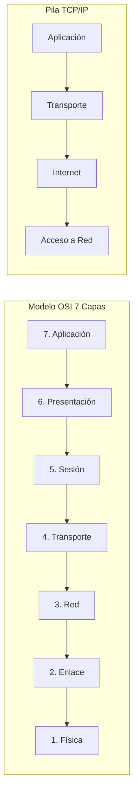
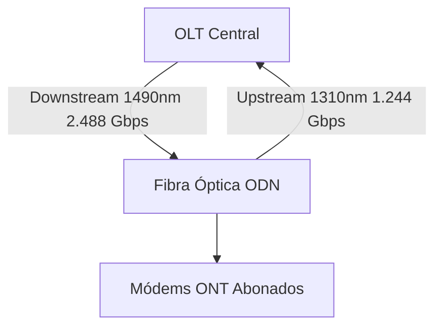
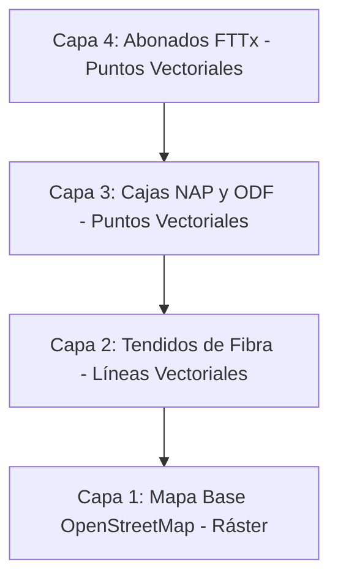
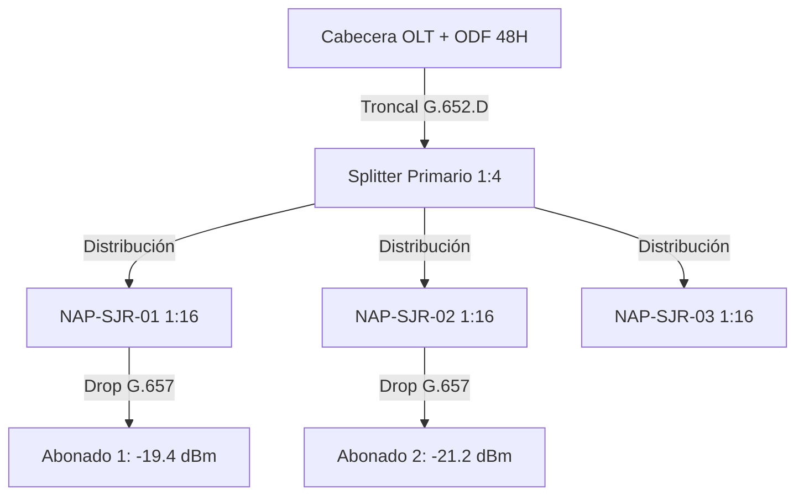
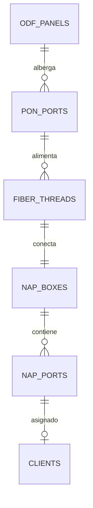
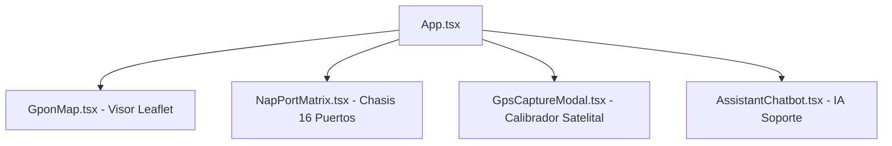
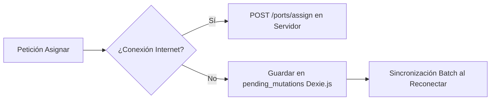
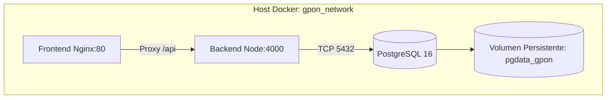

# MEMORIA DE RESIDENCIA PROFESIONAL
## UNIVERSIDAD MEXIQUENSE DEL BICENTENARIO
### UNIDAD DE ESTUDIOS SUPERIORES SAN JOSÉ DEL RINCÓN
**SISTEMA DE INVENTARIO Y MAPEO LÓGICO GPON / FTTx CON ARQUITECTURA OFFLINE-FIRST Y CONTROL TRANSACCIONAL ACID**

**CARRERA:** INGENIERÍA EN SISTEMAS COMPUTACIONALES
**PRESENTA:** << NOMBRE(S), APELLIDO PATERNO, APELLIDO MATERNO >>
**ASESOR:** << GRADO, NOMBRE(S), APELLIDO PATERNO, APELLIDO MATERNO >>
**FECHA:** Septiembre de 2025.

---

# DEDICATORIA Y AGRADECIMIENTOS

## Dedicatoria

> *A mis padres y familiares, por su apoyo incondicional, comprensión y aliento durante cada etapa de mi formación profesional.*

> *A mis docentes y asesores de la Universidad Mexiquense del Bicentenario, Unidad San José del Rincón, por compartir su sabiduría y guiar mis pasos en la ciencia de la computación y las telecomunicaciones.*

> *A la empresa GPON TELECOM S.A. de C.V., por abrirme sus puertas, confiar en mi criterio técnico y brindarme la oportunidad de desarrollar una solución tecnológica de impacto directo en la comunidad.*

## Agradecimientos

> *A Dios, por brindarme la salud, fortaleza y perseverancia necesarias para culminar satisfactoriamente este proyecto académico y profesional.*

> *A la Universidad Mexiquense del Bicentenario, por ser el claustro formador de profesionistas comprometidos con el progreso tecnológico y social del Estado de México.*

> *Al personal operativo, de soporte técnico y cuadrillas de campo de GPON TELECOM, por su paciencia, colaboración en las entrevistas y valiosa retroalimentación durante el levantamiento de infraestructura en San José del Rincón.*

---

# RESUMEN

El presente trabajo de residencia profesional documentó el análisis, diseño, desarrollo e implementación del Sistema de Inventario y Mapeo Lógico GPON / FTTx para la empresa GPON TELECOM S.A. de C.V. en el municipio de San José del Rincón, Estado de México. La problemática radicaba en la administración manual y no sincronizada de la planta externa pasiva de fibra óptica, lo que ocasionaba saturación imprevista de cajas terminales NAP, condiciones de carrera en la asignación simultánea de puertos por cuadrillas técnicas y pérdida de trazabilidad operativa en zonas rurales carentes de cobertura celular.

Para resolver dicha contingencia, se desarrolló una solución informática integral sustentada en una arquitectura cliente-servidor desacoplada. Se diseñó un modelo de base de datos relacional sobre PostgreSQL con bloqueo pesimista a nivel de fila (*Pessimistic Row-Level Locking* mediante `SELECT ... FOR UPDATE`), garantizando consistencia atómica absoluta (ACID) en la conexión de abonados. En la capa de aplicación, se construyó una API REST en Node.js y TypeScript con validaciones tipadas Zod, autenticación sin estado mediante JSON Web Tokens (JWT) y control de acceso basado en roles (RBAC). Para la interfaz visual, se implementó una aplicación web responsiva en React 18 con Tailwind CSS, incorporando un visor cartográfico interactivo basado en OpenStreetMap y Leaflet con semaforización cromática de saturación en tiempo real, una matriz interactiva del chasis físico de 16 puertos y un motor de generación programática de reportes ejecutivos en formato PDF mediante canalización por flujos (*streams*).

Asimismo, se integró una arquitectura móvil *Offline-First* con Progressive Web App (PWA) e IndexedDB (Dexie.js), posibilitando que los técnicos en campo registren asignaciones y calibren coordenadas GPS satelitales en zonas sin señal de internet, encolando las operaciones y sincronizándolas de forma automática e idempotente al restablecerse el enlace celular. El sistema se contenerizó con Docker y Docker Compose, logrando una herramienta confiable que optimizó los tiempos de atención a instalaciones domiciliarias y eliminó por completo los conflictos de duplicidad de puertos en la red óptica.

---

# ÍNDICE DEL CONTENIDO

- **INTRODUCCIÓN**
- **PLANTEAMIENTO DEL PROBLEMA**
- **JUSTIFICACIÓN**
- **OBJETIVOS**
  - Objetivo General
  - Objetivos Específicos
- **CAPÍTULO I. ANTECEDENTES**
- **CAPÍTULO II. MARCO TEÓRICO O ESTADO DEL ARTE**
  - 2.1 Fundamentos de Redes de Computadoras y Telecomunicaciones
  - 2.2 Redes Ópticas Pasivas (PON) y Arquitecturas FTTx
  - 2.3 Sistemas de Información Geográfica (GIS) y Cartografía Digital
  - 2.4 Sistemas Gestores de Bases de Datos Relacionales y Concurrencia
  - 2.5 Tecnologías y Arquitectura para el Desarrollo Web Moderno
  - 2.6 Aplicaciones Web Progresivas (PWA) y Arquitectura Offline-First
  - 2.7 Seguridad Informática, Autenticación y Autorización
  - 2.8 Contenedores de Software y Entornos de Despliegue en la Nube
- **CAPÍTULO III. DESARROLLO**
  - 3.1 Recolección y Levantamiento de Información de Planta Externa
  - 3.2 Especificación Formal de Requerimientos de Software (SRS)
  - 3.3 Arquitectura Topológica de la Red Óptica y Plan de Atenuación
  - 3.4 Modelado Conceptual, Lógico y Físico de la Base de Datos Relacional
  - 3.5 Ingeniería de Concurrencia Transaccional ACID y Bloqueo Pesimista
  - 3.6 Construcción del Backend y Capa de Servicios RESTful
  - 3.7 Construcción de la Interfaz de Usuario y Visor Cartográfico
  - 3.8 Implementación de la Capacidad Móvil Offline-First con Dexie.js
  - 3.9 Automatización de Reportes Técnicos Ejecutivos en PDF
  - 3.10 Contenerización con Docker y Despliegue en la Nube
- **CAPÍTULO IV. PRUEBAS Y RESULTADOS**
- **CONCLUSIONES**
- **GLOSARIO**
- **REFERENCIAS**
- **ANEXOS**

---

# ÍNDICE DE FIGURAS

- **Figura 1. Modelo de referencia OSI de 7 capas frente a la arquitectura TCP/IP**
- **Figura 2. Principio físico de propagación: Refracción, ángulo crítico y reflexión interna total (TIR)**
- **Figura 3. Espectro y plan de longitudes de onda en GPON (ITU-T G.984.2 WDM)**
- **Figura 4. Arquitectura de superposición de capas en un Sistema de Información Geográfica (GIS)**
- **Figura 5. Arquitectura topológica de planta externa e interna GPON / FTTx desplegada**
- **Figura 6. Diagrama Entidad-Relación (DER) del sistema de inventario GPON en PostgreSQL**
- **Figura 7. Diagrama de secuencia transaccional de concurrencia con SELECT ... FOR UPDATE**
- **Figura 8. Arquitectura de componentes frontend React y visor cartográfico**
- **Figura 9. Flujo de decisión y sincronización diferida de la arquitectura móvil Offline-First**
- **Figura 10. Flujo de generación de reportes técnicos ejecutivos en PDF mediante streaming**
- **Figura 11. Arquitectura de contenerización multicontenedor con Docker Compose y red aislada**

---

# ÍNDICE DE TABLAS

- **Tabla 1. Clasificación taxonómica de las redes según su cobertura geográfica**
- **Tabla 2. Parámetros operativos del estándar GPON según ITU-T G.984**
- **Tabla 3. Pérdidas de inserción típicas introducidas por divisores ópticos pasivos (Splitters PLC)**
- **Tabla 4. Catálogo de Requerimientos Funcionales del Sistema (RF-01 a RF-27)**
- **Tabla 5. Matriz de trazabilidad de permisos por rol y respuestas HTTP**
- **Tabla 6. Diccionario de datos: Entidad Users (Usuarios)**
- **Tabla 7. Diccionario de datos: Entidad OdfPanels (Paneles ODF)**
- **Tabla 8. Diccionario de datos: Entidad PonPorts (Puertos PON OLT)**
- **Tabla 9. Diccionario de datos: Entidad FiberThreads (Hilos Troncales de Fibra)**
- **Tabla 10. Diccionario de datos: Entidad NapBoxes (Cajas Terminales NAP)**
- **Tabla 11. Diccionario de datos: Entidad NapPorts (Puertos de Acceso SC-APC)**
- **Tabla 12. Diccionario de datos: Entidad Clients (Abonados FTTx)**

---

# INTRODUCCIÓN

La proliferación exponencial del tráfico de datos, la demanda de servicios de alta definición y la imperiosa necesidad de conectividad de banda ancha simétrica han posicionado a las Redes Ópticas Pasivas con Capacidad Gigabit (*Gigabit-capable Passive Optical Network* - GPON) y a las arquitecturas de Fibra hasta el Hogar (*Fiber to the Home* - FTTH) como el estándar de vanguardia en la infraestructura global de telecomunicaciones. En este contexto, los proveedores de servicios de internet (*Internet Service Providers* - ISP) enfrentan el desafío crítico de administrar con rigor milimétrico cada uno de los elementos constitutivos de su planta externa e interna: desde el distribuidor óptico central (ODF) y las tarjetas emisoras de la terminal de línea óptica (OLT), hasta los divisores pasivos (*splitters*), las cajas terminales de acceso a la red (*Network Access Point* - NAP) y las acometidas domiciliarias (*drop cables*) que alcanzan la premisa del suscriptor.

En zonas metropolitanas y municipios de orografía agreste como San José del Rincón, Estado de México, la supervisión de la infraestructura física presenta vicisitudes severas: la ausencia de cartografía digitalizada en tiempo real conduce a la saturación ciega de las cajas NAP; la intervención no sincronizada de cuadrillas simultáneas en postes genera anomalías transaccionales de actualización perdida y asignaciones colisionadas sobre el mismo conector óptico; y la intermitencia o ausencia de cobertura celular en áreas boscosas inhabilita los sistemas tradicionales de gestión basados en conexión permanente.

El presente informe de residencia profesional expone de forma metódica el diseño e ingeniería del Sistema de Inventario y Mapeo Lógico GPON / FTTx desarrollado para GPON TELECOM S.A. de C.V. La memoria se estructura en apego riguroso a los lineamientos normativos de la Universidad Mexiquense del Bicentenario: el Capítulo I aborda los antecedentes y el contexto operativo; el Capítulo II fundamenta el marco teórico y estado del arte en redes, física óptica, sistemas GIS, transacciones ACID, desarrollo web y arquitecturas móviles *Offline-First*; el Capítulo III desglosa el desarrollo de ingeniería desde el levantamiento de información y modelado de datos hasta la codificación del backend, frontend y contenerización; el Capítulo IV delimita el ámbito de pruebas y resultados; y finalmente se presentan las conclusiones, glosario técnico y el cuerpo de referencias en formato APA.

---

# PLANTEAMIENTO DEL PROBLEMA

La empresa GPON TELECOM S.A. de C.V. provee servicios de acceso a internet mediante fibra óptica pasiva en diversas comunidades y colonias del municipio de San José del Rincón. A medida que la densidad de contratación se incrementó rápidamente, el modelo tradicional de documentación técnica —basado en bitácoras manuales en papel, hojas de cálculo dispersas y notas manuscritas en libretas de campo— evidenció su obsolescencia y vulnerabilidad operativa.

Se identificaron tres patologías técnicas principales que obstaculizan la operación diaria de la empresa:

1. Desconocimiento Geoespacial y Saturación Ciega de Infraestructura: Los despachadores del Centro de Operaciones de Red (NOC) carecían de un visor cartográfico que reflejara en tiempo real la ubicación geográfica exacta de los postes donde están instaladas las cajas NAP y el porcentaje real de ocupación de sus 16 puertos. Esto provocaba que se enviasen cuadrillas de técnicos a realizar altas a domicilios lejanos, descubriendo al llegar al poste que la caja NAP adyacente se encontraba saturada al 100%, obligando a rechazar el servicio al cliente o a improvisar tendidos drop excesivamente largos de cientos de metros que atenúan severamente la potencia óptica.

2. Condiciones de Carrera y Conflictos de Asignación Concurrente: Al intervenir múltiples cuadrillas de campo de forma simultánea durante la jornada matutina, se presentaban colisiones críticas: dos técnicos seleccionaban el mismo puerto físico libre en una caja; al no existir un mecanismo transaccional de bloqueo pesimista a nivel de motor de base de datos, el sistema permitía la asociación de dos clientes distintos al mismo conector SC-APC, originando desconexiones accidentales, quejas vecinales y corrupción del inventario físico.

3. Aislamiento Tecnológico en Zonas Rurales sin Cobertura Celular: Las cuadrillas operativas deben desplazarse frecuentemente a zonas montañosas y comunidades rurales donde la cobertura de datos móviles de telefonía celular es nula ('zonas muertas'). En dichos escenarios, los técnicos no podían consultar la disponibilidad de puertos ni capturar las coordenadas satelitales GPS de las cajas calibradas, viéndose obligados a diferir el registro y propiciando extravíos de información.

### Preguntas de Investigación

- ¿De qué manera un sistema informático con cartografía interactiva basada en GIS y algoritmos de saturación dinámica puede optimizar la asignación y planeación de cajas NAP?
- ¿Cómo garantizar matemáticamente la atomicidad y la prevención de condiciones de carrera en la asignación simultánea de puertos ópticos mediante transacciones ACID y bloqueo pesimista en bases de datos relacionales?
- ¿Qué arquitectura de software móvil *Offline-First* y almacenamiento local estructurado en el navegador permite la operación ininterrumpida y sincronización automática de cuadrillas en zonas sin conectividad celular?

---

# JUSTIFICACIÓN

La realización del presente proyecto de residencia profesional se fundamenta en la necesidad imperiosa de transformar radicalmente los procesos operativos y técnicos de la empresa GPON TELECOM S.A. de C.V. en el municipio de San José del Rincón, Estado de México. Históricamente, la administración de la infraestructura óptica pasiva de telecomunicaciones ha dependido de registros manuales en bitácoras físicas de papel y hojas de cálculo locales desarticuladas, un esquema arcaico que resulta insostenible frente al acelerado crecimiento de la demanda de conectividad de banda ancha de alta velocidad. Esta carencia de una plataforma centralizada y en tiempo real ha provocado severas ineficiencias operativas, tales como la asignación colisionada de puertos entre cuadrillas simultáneas, visitas técnicas infructuosas a cajas terminales saturadas y una prolongada incertidumbre diagnóstica ante reportes de averías por parte de los abonados.

Desde una perspectiva técnica y operativa, el desarrollo de este sistema proporciona una solución robusta y escalable que digitaliza y georreferencia cada elemento de la planta externa (paneles ODF, hilos troncales, cajas NAP y puertos de distribución SC-APC). Al implementar mecanismos avanzados de control de concurrencia y aislamiento transaccional estricto (ACID) con bloqueo pesimista a nivel de fila, se garantiza la integridad matemática del inventario, erradicando las condiciones de carrera que previamente originaban dobles asignaciones. Asimismo, la incorporación de una arquitectura móvil sin conexión (Offline-First) respaldada por bases de datos transaccionales en el navegador e intercepción inteligente por Service Workers asegura la continuidad operativa de los técnicos en zonas rurales con cobertura celular intermitente o nula, permitiendo la captura de información y su sincronización automática e inmediata al restablecerse el enlace.

En el plano económico, la plataforma representa una optimización sustancial de los recursos financieros de la organización. Al erradicar los traslados innecesarios y recortar drásticamente los tiempos de instalación de más de 30 minutos a escasos instantes, se disminuyen significativamente el consumo de combustible, el desgaste del parque vehicular y los costos de horas-hombre. De igual manera, el aprovechamiento integral de tecnologías modernas de código abierto (PostgreSQL, Node.js, TypeScript, React, Tailwind CSS y Docker) exime a la empresa del pago recurrente de licencias privativas de software comercial que comprometerían la viabilidad presupuestal del proyecto.

Finalmente, en la dimensión social y académica, este proyecto contribuye de forma directa a la reducción de la brecha digital en una de las regiones con mayor dispersión geográfica del Estado de México. Al dotar al operador de una herramienta de ingeniería de vanguardia, se fortalece la confiabilidad y calidad del suministro de internet en hogares, escuelas y unidades productivas de San José del Rincón, consolidando al mismo tiempo una aplicación práctica y rigurosa de los conocimientos en redes de datos, bases de datos relacionales, desarrollo web full-stack y sistemas distribuidos adquiridos en la carrera de Ingeniería en Tecnologías de la Información y Comunicaciones de la Universidad Mexiquense del Bicentenario.

---

# OBJETIVOS

### Objetivo General
Desarrollar un sistema web integral de inventario y mapeo lógico de red GPON / FTTx con soporte de geolocalización, sincronización sin conexión (Offline-First) y control transaccional de concurrencia, para optimizar la gestión técnica, asignación de puertos y supervisión cartográfica de la infraestructura pasiva de fibra óptica en la empresa GPON TELECOM S.A. de C.V., en el municipio de San José del Rincón, Estado de México.

### Objetivos Específicos

1. Analizar los requerimientos operativos de la red de fibra óptica mediante el levantamiento de información sobre el hardware (NAP/ODF), para diseñar la arquitectura del sistema y el modelo de la base de datos.
2. Construir una interfaz web responsiva a través del uso de tecnologías de desarrollo frontend, para que los técnicos de campo actualicen desde su celular el estado de los puertos (libres, ocupados, dañados).
3. Programar el backend del sistema mediante la creación de una API centralizada, para gestionar la información de los activos y vincular los puertos de red correspondientes a los datos de los clientes.

---

# CAPÍTULO I. ANTECEDENTES

*(Sección reservada para antecedentes institucionales de la empresa GPON TELECOM S.A. de C.V.)*

---

# CAPÍTULO II. MARCO TEÓRICO O ESTADO DEL ARTE

El presente marco teórico compendia el cuerpo doctrinal, los fundamentos físicos de la transmisión óptica, los estándares internacionales y las tecnologías computacionales modernas que sustentan la concepción, el diseño y la implementación del Sistema de Inventario y Mapeo Lógico GPON / FTTx.

## 2.1 Fundamentos de Redes de Computadoras y Telecomunicaciones

### 2.1.1 Definición, Concepto y Propósito de una Red de Datos

Una red de computadoras se define como un sistema interconectado de entidades de cómputo autónomas —tales como servidores centrales, estaciones de trabajo, conmutadores, enrutadores y dispositivos terminales— que comparten un medio de transmisión común y se comunican bajo un marco formal de protocolos y convenciones estandarizadas (Tanenbaum y Wetherall, 2013). La misión cardinal de una red de telecomunicaciones radica en posibilitar la transferencia rápida, íntegra y segura de datos entre agentes distribuidos geográficamente, optimizando a su vez la utilización sinérgica de recursos físicos y lógicos (Stallings, 2017).

En el contexto de los operadores y proveedores de servicios de internet (*Internet Service Providers* - ISP), las redes de acceso constituyen el segmento de infraestructura con mayor impacto sobre la calidad del servicio (*Quality of Service* - QoS) percibida por el usuario final. Dicha infraestructura exige disponibilidad continua, aislamiento seguro de abonados, bajas tasas de retardo y mecanismos de trazabilidad en tiempo real sobre cada elemento de la planta externa e interna.

### 2.1.2 Clasificación de las Redes por su Cobertura Geográfica

Atendiendo a su cobertura territorial y dispersión física, las redes de telecomunicaciones se categorizan formalmente en cuatro clases fundamentales (Kurose y Ross, 2017):

a) Red de Área Personal (*Personal Area Network* - PAN): Abarca el entorno cercano de un usuario en un radio generalmente inferior a 10 metros, empleada para interconectar sensores y periféricos mediante tecnologías como *Bluetooth*, *Zigbee* o NFC.

b) Red de Área Local (*Local Area Network* - LAN): Confinada a un área física controlada, tal como una residencia, oficina o edificio corporativo. Provee anchos de banda elevados (100 Mbps a 10 Gbps) y tasas de error sumamente reducidas.

c) Red de Área Metropolitana (*Metropolitan Area Network* - MAN): Comprende una demarcación geográfica intermedia de entre 1 y 50 kilómetros, como una ciudad o municipio. Es en este nivel donde operan las redes ópticas de acceso pasivo GPON/FTTx, interconectando cabeceras centrales de conmutación con millares de clientes residenciales y comerciales distribuidos territorialmente.

d) Red de Área Amplia (*Wide Area Network* - WAN): Interconecta países y continentes enteros a través de enlaces satelitales y extensas dorsales submarinas transoceánicas de fibra óptica.

En la Tabla 1 se resume la clasificación taxonómica de las redes según su cobertura, tasas habituales y tecnologías representativas.

**Tabla 1. Clasificación taxonómica de las redes según su cobertura geográfica.**

| Tipo de Red | Acrónimo | Cobertura Geográfica | Tasa de Datos Típica | Tecnología Representativa |
| :---: | :---: | :--- | :--- | :--- |
| Red de Área Personal | PAN | 1 a 10 m | 1 a 24 Mbps | Bluetooth, Zigbee, NFC |
| Red de Área Local | LAN | 10 m a 1 km | 100 Mbps a 10 Gbps | Ethernet (IEEE 802.3), Wi-Fi (802.11) |
| Red de Área Metropolitana | MAN | 1 a 50 km | 1 Gbps a 100 Gbps | GPON, FTTx, Metro-Ethernet, DWDM |
| Red de Área Amplia | WAN | > 50 km (Global) | 10 Gbps a Terabits | SDH/SONET, Cables Submarinos, Satélite |

*Fuente: Elaboración propia con base en Tanenbaum y Wetherall (2013) y Kurose y Ross (2017).*

### 2.1.3 Topologías de Red Físicas y Lógicas

La topología de una red describe la ordenación geométrica de sus enlaces (topología física) o el patrón funcional de tránsito de la información entre nodos (topología lógica) (Forouzan, 2013).

Entre las topologías convencionales se distinguen el *Bus* (enlace único compartido susceptible a colisiones), el *Anillo* (circuito cerrado unidireccional o bidireccional), la *Estrella* (nodos conectados a un conmutador central activo) y la *Malla* (enlaces redundantes con alta tolerancia a fallos pero elevado costo de inversión).

En las redes de distribución óptica de acceso predomina la topología de *Árbol* o *Punto a Multipunto* (*Point-to-Multipoint* - P2MP). En este esquema, un único emisor óptico central alimenta un filamento troncal de fibra que se subdivide pasivamente hacia múltiples receptores finales mediante divisores ópticos (*splitters*), eliminando el requerimiento de energización eléctrica intermedia en las calles y postes.

### 2.1.4 Modelos de Referencia: Modelo OSI y Arquitectura TCP/IP

El diseño modular de redes descansa sobre arquitecturas jerárquicas en capas (Kurose y Ross, 2017).

El Modelo de Referencia OSI (ISO/IEC 7498-1) organiza la comunicación en siete niveles independientes: Física (1, transmisión de bits por el medio), Enlace de Datos (2, direccionamiento físico MAC y tramas), Red (3, enrutamiento lógico y conmutación IP), Transporte (4, fiabilidad y control de flujo TCP/UDP), Sesión (5, control del diálogo interactivo), Presentación (6, sintaxis, compresión y cifrado) y Aplicación (7, servicios de usuario).

Por su parte, la Arquitectura TCP/IP consolida las funciones en cuatro capas: Acceso a la Red, Internet, Transporte y Aplicación. El presente proyecto incide transversalmente sobre esta jerarquía: desde el control estricto de parámetros de la Capa Física (atenuación óptica en dBm, empalmes y conectividad de puertos SC-APC) hasta la Capa de Aplicación (APIs RESTful, tokens de sesión y protocolos de transporte web seguro HTTPS/TLS).


*Figura 1. Modelo de referencia OSI frente a TCP/IP.*

### 2.1.5 Medios Físicos de Transmisión: Medios Guiados frente a No Guiados

Los medios de transmisión representan la vía material o inmaterial a través de la cual se canalizan las señales electromagnéticas (Stallings, 2017). Se dividen en:

Medios No Guiados: Emplean el espacio aéreo libre como medio de dispersión electromagnética (radioenlaces, satélites y telefonía celular). Aunque confieren movilidad, presentan limitaciones severas para accesos de alto rendimiento: espectro finito, interferencias por radiofrecuencia (RFI) y atenuación meteorológica provocada por precipitaciones pluviales y niebla.

Medios Guiados: Confinan la propagación de la señal al interior de un conductor físico continuo. El cable de cobre trenzado (*Twisted Pair*) y el coaxial sufren de limitaciones infranqueables para anchos de banda gigabit: alta resistencia óhmica, diafonía (*crosstalk*), pérdidas dieléctricas crecientes y vulnerabilidad total a inducciones por descargas atmosféricas.

Frente a dichas restricciones, la fibra óptica se consolida como el medio guiado superior por excelencia. Al estar construida de sílice ultrapura, conduce impulsos fotónicos inmunes al ruido electromagnético, proporciona aislamiento galvánico absoluto y ofrece una atenuación kilométrica insignificante frente al cobre.

### 2.1.6 Física de la Transmisión Óptica: Ley de Snell, Ángulo Crítico y Reflexión Interna Total

El fenómeno físico fundamental que permite el confinamiento de la luz en el interior de un filamento de vidrio se explica mediante las leyes de la óptica ondulatoria, específicamente la Reflexión Interna Total (*Total Internal Reflection* - TIR) (Senior y Jamro, 2009).

Un hilo de fibra óptica está compuesto por dos cilindros dieléctricos concéntricos de dióxido de silicio (SiO2): un núcleo central (*core*) con índice de refracción n1, y un revestimiento perimetral (*cladding*) con índice de refracción n2. Para hacer posible el guiado fotónico, es requisito matemático indispensable que el índice del núcleo supere al del revestimiento (n1 > n2).

Al incidir un haz de luz sobre la frontera núcleo-cubierta con un ángulo de incidencia θ1 respecto a la normal, la Ley de Snell de la refracción describe el rayo transmitido con ángulo θ2:

n1 · sin(θ1) = n2 · sin(θ2)

Al aumentar θ1, el ángulo de refracción θ2 alcanza el límite de 90 grados rasante a la superficie de contacto. Dicho ángulo de incidencia límite se denomina Ángulo Crítico (θc), formulado analíticamente como:

θc = arcsin(n2 / n1)

Si el haz lumínico arriba a la pared del núcleo con un ángulo mayor al ángulo crítico (θ1 > θc), se produce la reflexión interna total: el cien por ciento de la energía electromagnética lumínica se refleja hacia el interior del núcleo. Mediante reflexiones continuas, los pulsos de luz se propagan a lo largo de distancias kilométricas a una velocidad cercana a los 200,000 km/s (v = c / n1).

A pesar de este confinamiento, la señal luminosa experimenta atenuación (expresada en dB/km), atribuible a dispersión de Rayleigh por fluctuaciones moleculares de densidad del vidrio, absorción debida a impurezas de iones hidroxilo (OH-) y pérdidas mecánicas por curvatura forzada (*macrobending* y *microbending*).

> **Fórmula de Snell**: $n_1 \cdot \sin(\theta_1) = n_2 \cdot \sin(\theta_2)$. El ángulo crítico para reflexión interna total es $\theta_c = \arcsin(n_2/n_1)$.

### 2.1.7 Tipos de Fibra Óptica, Ventanas de Transmisión y Estándares ITU-T

Según la cantidad de modos electromagnéticos que se propagan en su interior, las fibras ópticas se catalogan en dos grandes familias (Keiser, 2011):

1. Fibra Óptica Multimodo (*Multi-Mode Fiber* - MMF): Con un núcleo ancho (50 µm o 62.5 µm) y cubierta de 125 µm, permite el viaje de múltiples rayos concurrentes. Las diferencias de longitud en sus trayectorias causan dispersión modal (ensanchamiento temporal del pulso), limitando su alcance a menos de 500 metros.

2. Fibra Óptica Monomodo (*Single-Mode Fiber* - SMF): Posee un núcleo extremadamente estrecho (8 a 10 µm) con cubierta de 125 µm. Dado que su diámetro es comparable a la longitud de onda de la radiación, únicamente se propaga el modo electromagnético fundamental (LP01). Al suprimirse la dispersión modal, ofrece alcances de decenas de kilómetros sin repetidores, constituyendo el estándar universal para redes FTTx/GPON.

La Unión Internacional de Telecomunicaciones (ITU-T) normaliza dos especificaciones principales de fibra monomodo empleadas en planta externa:

- ITU-T G.652 (especialmente G.652.D): Fibra monomodo estándar con dispersión no desplazada y bajo pico de agua (*Low Water Peak*), utilizada en las líneas troncales y cables de alimentación.

- ITU-T G.657 (familias A1, A2, B2 y B3): Fibra monomodo insensible a curvaturas (*Bend-Insensitive*). Admite radios de curvatura tan cerrados como 7.5 mm sin incremento notable de atenuación, haciéndola indispensable para cables de acometida (*drop*) y conectorización en cajas NAP.

Por otra parte, la propagación se efectúa en Ventanas de Transmisión infrarrojas seleccionadas por su baja atenuación:

- 850 nm (Primera Ventana): Usada en enlaces locales multimodo.

- 1310 nm (Segunda Ventana): Punto de dispersión cromática cero; empleada en GPON para el canal de subida (*Upstream*).

- 1490 nm (Banda GPON de Bajada): Asignada por la norma ITU-T G.984 para el canal descendente de voz y datos (*Downstream*).

- 1550 nm (Tercera Ventana): Punto de mínima atenuación física del sílice (alrededor de 0.2 dB/km), utilizada en enlaces troncales y para televisión por cable (CATV/RF Overlay).

## 2.2 Redes Ópticas Pasivas (PON) y Arquitecturas FTTx

### 2.2.1 Paradigma FTTx: Concepto y Variantes Topológicas

El término FTTx (*Fiber to the x*) describe el conjunto de arquitecturas de acceso de banda ancha basadas en el despliegue masivo de fibra óptica hacia diversos puntos de entrega cercanos o ubicados directamente en la propiedad del usuario (Kramer, 2005).

Las variantes más representativas son:

- FTTH (*Fiber to the Home* - Fibra hasta el Hogar): El hilo óptico penetra hasta el interior de la vivienda u oficina del suscriptor, terminando en una Terminal de Red Óptica (*Optical Network Terminal* - ONT). Ofrece máxima estabilidad y anchos de banda simétricos de alta velocidad.

- FTTB (*Fiber to the Building* - Fibra hasta el Edificio): La fibra arriba al sótano o sala técnica de un edificio, desde donde se distribuye internamente mediante cable coaxial o par trenzado Cat6.

- FTTC (*Fiber to the Curb* o *Cabinet* - Fibra hasta la Acera o Armario): La fibra concluye en un gabinete callejero a menos de 300 metros del abonado.

- FTTN (*Fiber to the Node* - Fibra hasta el Nodo): La fibra atiende a un nodo centralizado en un radio de hasta 1.5 km.

El proyecto desarrollado se fundamenta estrictamente en la arquitectura FTTH, administrando la infraestructura pasiva desde la cabecera OLT hasta el conector óptico domiciliario.

### 2.2.2 Redes Ópticas Pasivas (PON) frente a Redes Ópticas Activas (AON)

En la concepción de redes punto a multipunto, se contraponen las Redes Ópticas Activas (*Active Optical Networks* - AON) y las Redes Ópticas Pasivas (*Passive Optical Networks* - PON) (ITU-T G.984.1, 2008).

Una red AON requiere conmutadores intermedios alimentados eléctricamente en campo, gabinetes climatizados y baterías de respaldo, elevando el riesgo de fallas por vandalismo o descargas.

En contraste, una red PON elimina por completo los dispositivos electrónicos activos entre la central y los domicilios. La división de la luz se efectúa mediante divisores ópticos pasivos (*splitters*) que no consumen energía eléctrica, presentan una vida útil superior a 30 años y reducen drásticamente los gastos operativos (*OPEX*) y de capital (*CAPEX*) de la operadora.

### 2.2.3 El Estándar GPON (ITU-T G.984): Tasas, Longitudes de Onda y Encapsulamiento

El estándar GPON (*Gigabit-capable Passive Optical Network*), especificado por la recomendación ITU-T G.984, define una red de acceso de alta capacidad gigabit sobre fibra monomodo (ITU-T, 2008).

Sus parámetros operativos fundamentales incluyen:

- Tasas de Transmisión Asimétricas: 2.488 Gbps en el canal descendente (*Downstream*) y 1.244 Gbps en el canal ascendente (*Upstream*).

- Plan de Multiplexación WDM: Un único hilo de fibra transporta dos longitudes de onda en sentidos opuestos: 1490 nm para la radiodifusión continua de bajada desde la OLT hacia las ONTs, y 1310 nm para la subida mediante ráfagas temporizadas con acceso múltiple por división de tiempo (*Time Division Multiple Access* - TDMA).

- Método de Encapsulamiento GEM (*GPON Encapsulation Method*): Permite encapsular eficientemente tramas Ethernet e IP con una sobrecarga mínima, logrando una eficiencia de transmisión superior al 93%.

- Asignación Dinámica de Ancho de Banda (DBA): La OLT redistribuye los intervalos de transmisión de subida en tiempo real conforme a la demanda de cada ONT.

En la Tabla 2 se exponen los parámetros operativos fundamentales del estándar GPON según ITU-T G.984.

**Tabla 2. Parámetros operativos del estándar GPON según ITU-T G.984.**

| Parámetro Técnico | Canal Descendente (Downstream) | Canal Ascendente (Upstream) |
| :---: | :---: | :--- |
| Tasa de Transmisión Nominal | 2.488 Gbps | 1.244 Gbps |
| Longitud de Onda Central | 1490 nm (± 10 nm) | 1310 nm (± 50 nm) |
| Método de Acceso al Medio | Radiodifusión TDM / GEM | Acceso Múltiple TDMA |
| Alcance Lógico Máximo | 60 km | 60 km |
| Alcance Físico Máximo | 20 km (Split 1:64) | 20 km (Split 1:64) |
| Relación de División Típica | 1:32 a 1:64 (Hasta 1:128) | 1:32 a 1:64 (Hasta 1:128) |
| Formato de Codificación | NRZ | NRZ |

*Fuente: Elaboración propia con base en ITU-T G.984.2 (2008).*


*Figura 3. Plan de longitudes de onda en GPON ITU-T G.984.*

### 2.2.4 Componentes de la Red de Distribución Óptica (ODN)

La Red de Distribución Óptica (*Optical Distribution Network* - ODN) engloba los medios pasivos que unen la central con los usuarios (ITU-T G.984.1, 2008):

1. Terminal de Línea Óptica (*Optical Line Terminal* - OLT): Equipo activo instalado en la cabecera o NOC que modula la señal óptica y administra la sincronización de toda la red PON.

2. Distribuidor Óptico Central (*Optical Distribution Frame* - ODF): Bastidor modular que permite organizar, conmutar y fusionar los puertos PON emisores con los cables troncales de salida.

3. Fibra Troncal o Alimentador (*Feeder Cable*): Cable multifibra aéreo o subterráneo que conecta la central con los puntos de división primaria.

4. Divisores Ópticos Pasivos (*Splitters*): Dispositivos pasivos basados en tecnología PLC (*Planar Lightwave Circuit*) que dividen un haz luminoso de entrada en múltiples salidas equilibradas (1:2, 1:4, 1:8, 1:16, 1:32, 1:64). La pérdida teórica de inserción se rige por:

Perdida_Splitter (dB) = 10 · log10(N)

donde N indica el número de puertos de salida. En la Tabla 3 se desglosan las atenuaciones prácticas estandarizadas para splitters PLC.

5. Cajas Terminales de Distribución NAP (*Network Access Point*): Envolventes herméticas (IP65 o IP68) montadas en postes de luz, que alojan un divisor pasivo (habitualmente 1:16) y acopladores para interconectar los cables de acometida domiciliaria.

6. Cable de Acometida o Bajada (*Drop Cable*): Cable autosoportado con hilos de fibra G.657 y elementos de tracción dieléctricos que arriba hasta el hogar.

7. Conectores Ópticos y Tipos de Pulido (SC-PC vs. SC-APC): En GPON es mandatario el uso de conectores SC con pulido angular SC-APC (*Angled Physical Contact*, de color verde). Su férula cuenta con un bisel de 8 grados que desvía la luz reflejada hacia el revestimiento, garantizando una pérdida de retorno óptico (*Optical Return Loss* - ORL) superior a -65 dB, a diferencia del pulido plano UPC (azul) cuya reflectancia de -50 dB desestabiliza los transmisores láser.

8. Terminal de Red Óptica (*Optical Network Terminal* - ONT): Dispositivo receptor activo en el predio del cliente que convierte los impulsos luminosos en puertos de red Ethernet y Wi-Fi.

**Tabla 3. Pérdidas de inserción típicas introducidas por divisores ópticos pasivos (Splitters PLC).**

| Relación de División | Pérdida Teórica (dB) | Pérdida de Exceso Típica (dB) | Atenuación Total Práctica (dB) |
| :---: | :---: | :--- | :--- |
| Splitter 1:2 | 3.01 dB | 0.40 dB | 3.50 dB |
| Splitter 1:4 | 6.02 dB | 0.70 dB | 6.80 dB |
| Splitter 1:8 | 9.03 dB | 1.00 dB | 10.30 dB |
| Splitter 1:16 | 12.04 dB | 1.40 dB | 13.70 dB |
| Splitter 1:32 | 15.05 dB | 1.80 dB | 17.10 dB |
| Splitter 1:64 | 18.06 dB | 2.20 dB | 20.50 dB |

*Fuente: Elaboración propia con base en ITU-T G.671 (2012).*

### 2.2.5 Presupuesto Óptico de Potencia (Optical Power Budget)

El Presupuesto Óptico de Potencia es el cálculo analítico que comprueba que la energía emitida por la OLT llegará a la ONT con un nivel comprendido dentro de su ventana de sensibilidad operativa (Keiser, 2011).

La potencia se expresa en decibelios-milivatio (dBm):

P (dBm) = 10 · log10( P (mW) / 1 mW )

La potencia estimada en el receptor (Prx) se formula restando a la potencia emitida (Ptx) las pérdidas acumuladas en el trayecto:

Prx = Ptx - [ (Longitud_Fibra · Atenuacion_km) + Perdida_Splitters + (N_Empalmes · 0.1 dB) + (N_Conectores · 0.3 dB) + Margen_Seguridad ]

Para módulos transceptores GPON Clase B+, la potencia de transmisión en cabecera ronda entre +1.5 dBm y +5.0 dBm, mientras que la sensibilidad admisible en la ONT oscila entre -8.0 dBm (umbral de saturación óptica) y -27.0 dBm (límite de sensibilidad). Un nivel inferior a -27.0 dBm provoca degradación por errores de trama y desconexión recurrente del abonado.

## 2.3 Sistemas de Información Geográfica (GIS) y Cartografía Digital

### 2.3.1 Fundamentos de los Sistemas de Información Geográfica (GIS)

Un Sistema de Información Geográfica (*Geographic Information System* - GIS) es un entorno computacional para la captura, almacenamiento, análisis, modelado y representación de datos vinculados espacialmente a coordenadas terrestres (Longley et al., 2015). En telecomunicaciones, la conjunción de GIS y bases de datos relacionales viabiliza la administración georreferenciada de postes, trazos de fibra y zonas de cobertura.


*Figura 4. Arquitectura de superposición de capas GIS.*

### 2.3.2 Modelos de Datos Espaciales: Vectorial frente a Ráster

Los datos geoespaciales se dividen en dos modelos fundamentales (Longley et al., 2015):

- Modelo Vectorial: Representa entidades geográficas discretas mediante geometrías exactas: Puntos (postes, cajas NAP, domicilios de clientes), Líneas o Polilíneas (cables troncales y acometidas de fibra) y Polígonos (áreas territoriales o demarcaciones de colonia). Cada entidad asocia atributos alfanuméricos almacenados en tablas relacionales.

- Modelo Ráster: Modela el espacio en una matriz uniforme de celdas o píxeles, propio de ortofotografías satelitales y capas base de mapas.

El sistema de gestión desarrollado sustenta la planta óptica en geometrías vectoriales proyectadas sobre teselas ráster de alta velocidad.

### 2.3.3 Sistemas Geodésicos de Referencia: WGS84 y Web Mercator

Para ubicar objetos sobre el geoide terrestre se requieren sistemas de referencia formalizados (Bernhardsen, 2002):

- WGS84 (EPSG:4326): Datum elipsoidal universal empleado por el sistema de posicionamiento satelital (GPS), expresado en grados de Latitud y Longitud.

- Web Mercator (EPSG:3857): Proyección cilíndrica conforme empleada por los navegadores web para componer mosaicos cartográficos planos (*slippy maps*), transformando las coordenadas elipsoidales a un plano bidimensional euclidiano.

### 2.3.4 Cartografía Colaborativa: OpenStreetMap (OSM)

OpenStreetMap (OSM) es un proyecto colaborativo de datos geoespaciales de libre acceso y código abierto (Haklay y Weber, 2008). Permite la integración directa de servidores de teselas cartográficas en plataformas de software sin costos de licenciamiento por volumen de peticiones, garantizando la independencia tecnológica del sistema.

### 2.3.5 Librerías Cartográficas Web: Leaflet y React-Leaflet

Leaflet es una biblioteca JavaScript moderna y liviana para el renderizado de mapas interactivos en aplicaciones web (Agafonkin, 2023). Posee un alto desempeño en dispositivos móviles y soporte nativo para eventos táctiles.

React-Leaflet provee enlaces declarativos que sincronizan el visor Leaflet con el estado y ciclo de vida de React.js, permitiendo renderizar marcadores de cajas NAP con colores dinámicos de saturación, polilíneas de fibra y modales de telemetría de forma reactiva y fluida.

## 2.4 Sistemas Gestores de Bases de Datos Relacionales y Concurrencia

### 2.4.1 Concepto de Base de Datos y Sistemas RDBMS

Una base de datos es una colección persistente y estructurada de información interrelacionada, administrada sistemáticamente para optimizar su consulta, inserción y mantenimiento (Silberschatz, Korth y Sudarshan, 2020). Un Sistema Gestor de Bases de Datos Relacionales (*Relational Database Management System* - RDBMS) implementa el modelo relacional de Edgar F. Codd, organizando los registros en tablas con claves primarias y foráneas que imponen integridad referencial matemática estricta.

### 2.4.2 El Motor Relacional PostgreSQL y Tipos de Datos Avanzados

PostgreSQL es un gestor objeto-relacional de alto rendimiento reconocido por su estricto cumplimiento de los estándares SQL y su robusto motor de Control de Concurrencia Multiversión (*Multi-Version Concurrency Control* - MVCC) (PostgreSQL Global Development Group, 2023).

Soporta tipos de datos avanzados como identificadores universales únicos (UUID v4) para evitar colisiones en ambientes distribuidos, y estructuras binarias JSONB, que posibilitan almacenar y consultar atributos geoespaciales ({lat, lng}) con indexación B-Tree de alta velocidad.

### 2.4.3 Propiedades ACID en Transacciones de Datos

Para asegurar la validez de las operaciones críticas en la red de fibra óptica, las transacciones deben garantizar las propiedades ACID (Silberschatz et al., 2020):

- Atomicidad (*Atomicity*): Todas las operaciones de una transacción se ejecutan con éxito o se revierten por completo (*ROLLBACK*).

- Consistencia (*Consistency*): Cada transacción transforma la base de datos de un estado válido a otro igualmente válido conforme a las reglas del dominio.

- Aislamiento (*Isolation*): Las modificaciones en curso permanecen invisibles para otras transacciones simultáneas hasta su confirmación formal.

- Durabilidad (*Durability*): Una vez efectuada la confirmación (*COMMIT*), los cambios persisten de manera irreversible en el almacenamiento persistente.

### 2.4.4 Concurrencia de Datos y Anomalías Transaccionales

Cuando varios técnicos u operadores interactúan con los mismos registros simultáneamente, pueden originarse anomalías graves:

- Actualizaciones Perdidas (*Lost Updates*): Dos transacciones leen el mismo estado y ambas intentan escribir; la última sobrescribe destructivamente la modificación de la primera.

- Condiciones de Carrera (*Race Conditions*): El resultado de la operación queda supeditado al orden impredecible de llegada de paquetes de red. En una red GPON, dos cuadrillas asignando un cliente al mismo puerto simultáneamente provocarían la asignación de dos abonados a un único puerto físico.

- Lecturas Sucias (*Dirty Reads*): Una transacción consulta modificaciones preliminares de otra transacción que más tarde resulta abortada.

### 2.4.5 Mecanismos de Control de Concurrencia: Bloqueo Optimista vs. Bloqueo Pesimista

Para mitigar los conflictos de concurrencia se distinguen dos aproximaciones (Silberschatz et al., 2020):

- Bloqueo Optimista (*Optimistic Locking*): Permite transacciones libres de bloqueos y verifica al confirmar (mediante una columna de versión) si el registro cambió. Si fue alterado, la transacción se anula.

- Bloqueo Pesimista a Nivel de Fila (*Pessimistic Row-Level Locking*): Asume que el conflicto es factible y de consecuencias graves. Al leer el registro del puerto, el motor ejecuta un bloqueo exclusivo de fila mediante la sentencia SQL `SELECT ... FOR UPDATE`. Si otra transacción intenta acceder a la misma fila, queda retenida en espera hasta que la primera confirma (*COMMIT*) o revierte (*ROLLBACK*). Este mecanismo pesimista es el implementado en el sistema para garantizar la asignación unívoca e indivisible de puertos de fibra.

### 2.4.6 Mapeo Objeto-Relacional (ORM) y la Biblioteca Sequelize

El Mapeo Objeto-Relacional (*Object-Relational Mapping* - ORM) solventa el desfase de impedancia entre la programación orientada a objetos y el modelo de datos relacional (Fowler, 2002).

Sequelize es un ORM consolidado para Node.js y TypeScript que mapea tablas como clases y filas como instancias de datos. Provee validaciones automáticas, previene ataques de inyección SQL mediante consultas parametrizadas y ofrece soporte nativo para transacciones atómicas y bloqueos pesimistas (`Transaction.LOCK.UPDATE`).

## 2.5 Tecnologías y Arquitectura para el Desarrollo Web Moderno

### 2.5.1 El Modelo Cliente-Servidor y Servicios Web RESTful

La arquitectura Cliente-Servidor es un modelo de diseño de software distribuido en el cual las tareas se reparten entre los proveedores de recursos o servicios, llamados servidores, y los demandantes de dichos servicios, denominados clientes (Fielding, 2000).

La Transferencia de Estado Representacional (*Representational State Transfer* - REST) es un estilo arquitectónico para sistemas hipermedia distribuidos que se apoya en los verbos estándar del protocolo HTTP (GET, POST, PUT, DELETE, PATCH). Se fundamenta en principios cardinales: comunicación sin estado (*stateless*), interfaz uniforme basada en recursos identificados por URI, representación de entidades mediante formatos estándar (JSON) y códigos de estado semánticos (200 OK, 201 Created, 400 Bad Request, 401 Unauthorized, 403 Forbidden, 409 Conflict y 500 Internal Server Error). Dicha separación desacopla la persistencia de datos en el backend de la experiencia de usuario en el frontend.

### 2.5.2 Entorno de Ejecución en Servidor: Node.js y el Bucle de Eventos (Event Loop)

Node.js es un entorno de ejecución para JavaScript multiplataforma y de código abierto construido sobre el motor V8 de Google Chrome (Tilkov y Vinoski, 2010). Opera bajo un modelo de entrada/salida no bloqueante y dirigido por eventos (*Event-Driven Non-Blocking I/O*).

A diferencia de los servidores web tradicionales multihilo que asignan un hilo de sistema operativo por cada conexión entrante (lo cual satura la memoria RAM ante miles de usuarios simultáneos), Node.js gestiona miles de conexiones concurrentes en un único hilo principal mediante el mecanismo del Bucle de Eventos (*Event Loop*). Las operaciones costosas de entrada/salida —como consultas a bases de datos o lecturas de disco— se delegan de manera asíncrona al grupo de hilos interno de libuv, permitiendo que el servidor continúe atendiendo nuevas peticiones con alta eficiencia de procesamiento.

### 2.5.3 Framework de Backend: Express.js y Arquitectura de Middlewares

Express.js es un marco de trabajo minimalista y flexible para Node.js que proporciona un conjunto robusto de utilidades para el desarrollo de servidores web y APIs REST (Haverbeke, 2018).

Su arquitectura se basa en el patrón de cadena de responsabilidades o *middlewares*: funciones que tienen acceso al objeto de solicitud (`req`), al objeto de respuesta (`res`) y a la siguiente función middleware en el ciclo de solicitud-respuesta (`next`). Este patrón posibilita encadenar de forma modular validaciones de seguridad, decodificación de tokens de autenticación, control de acceso basado en roles y captura unificada de errores antes de alcanzar los controladores del negocio.

### 2.5.4 Lenguaje y Sistema de Tipado Estático: TypeScript

TypeScript es un superconjunto tipado de JavaScript desarrollado por Microsoft que compila a código JavaScript estándar (Bierman, Abadi y Torgersen, 2014).

Al incorporar tipado estático opcional, interfaces formales, tipos genéricos y detección de errores en tiempo de compilación, TypeScript previene de raíz errores comunes en tiempo de ejecución (como excepciones de tipo `undefined is not a function`). En sistemas de infraestructura crítica como el mapeo GPON, TypeScript garantiza que los modelos de datos (puertos, atenuaciones, coordenadas y contratos) mantengan una estructura contractual uniforme tanto en el backend como en el frontend.

### 2.5.5 Biblioteca de Interfaz de Usuario: React.js, Virtual DOM y Hooks

React.js es una biblioteca de JavaScript de código abierto desarrollada por Meta orientada a la creación de interfaces de usuario declarativas y reactivas basadas en componentes autónomos y reutilizables (Banks y Porcello, 2020).

React implementa el concepto de DOM Virtual (*Virtual DOM*), una representación ligera en memoria del árbol de elementos del navegador. Cuando el estado de la aplicación se modifica, React calcula la diferencia mínima necesaria mediante un algoritmo de reconciliación (*diffing algorithm*) y actualiza únicamente los nodos específicos del DOM real, evitando repintados computacionalmente costosos.

Mediante los *Hooks* de React (`useState`, `useEffect`, `useContext`, `useCallback`), los componentes funcionales administran su ciclo de vida y estado interno de forma predecible, facilitando la construcción de matrices interactivas complejas como el chasis de puertos de una caja NAP.

### 2.5.6 Framework de Estilos: Tailwind CSS y Paradigma Utility-First

Tailwind CSS es un marco de trabajo de diseño web que promueve el enfoque *Utility-First* (Wathan et al., 2020). En lugar de proveer componentes visuales preconcebidos y rígidos (como botones o tarjetas tradicionales), Tailwind suministra clases de utilidad atómicas de bajo nivel (como `flex`, `pt-4`, `text-center`, `bg-slate-900`) que se componen directamente en el marcado HTML.

Cuenta con un compilador en tiempo de ejecución Just-In-Time (JIT) que escanea el código fuente y genera un archivo CSS optimizado que contiene exclusivamente las clases utilizadas, reduciendo el tamaño del archivo final a unos pocos kilobytes. Asimismo, simplifica la implementación de interfaces responsivas y temas oscuros (*Dark Mode*), esenciales para centros de control NOC y para cuadrillas técnicas que operan en exteriores bajo luz solar intensa.

### 2.5.7 Herramienta de Compilación y Empaquetado: Vite

Vite es una herramienta de construcción frontend de nueva generación que transforma sustancialmente la experiencia de desarrollo (You, 2021). Aprovecha los módulos ES nativos (*Native ES Modules* - ESM) en los navegadores modernos para servir el código fuente instantáneamente sin empaquetado previo durante el desarrollo, ofreciendo reemplazo de módulos en caliente (*Hot Module Replacement* - HMR) en milisegundos. Para el entorno de producción, Vite utiliza Rollup para generar paquetes altamente optimizados con división de código (*code-splitting*) y sacudida de árbol (*tree-shaking*).

### 2.5.8 Generación Dinámica de Reportes en el Servidor: PDFKit y Streaming

PDFKit es una biblioteca para Node.js que posibilita la generación programática de documentos PDF complejos mediante código declarativo (PDFKit Team, 2023). Permite el control vectorial exacto de tipografías, tablas, diagramas de cuadrícula y encabezados institucionales.

Su ventaja técnica radica en la canalización por flujos (*Streams* con `doc.pipe(res)`): el documento PDF se transmite en tiempo real hacia el cliente a medida que sus páginas se construyen en memoria, evitando almacenar archivos temporales en el disco duro del servidor y garantizando un consumo mínimo de memoria RAM ante múltiples descargas simultáneas.

## 2.6 Aplicaciones Web Progresivas (PWA) y Arquitectura Sin Conexión (Offline-First)

### 2.6.1 Concepto de Progressive Web App (PWA)

Una Aplicación Web Progresiva (*Progressive Web App* - PWA) es una aplicación construida con tecnologías web estándar (HTML, CSS, JavaScript) que incorpora capacidades avanzadas de experiencia nativa móvil (Russell, 2015; LePage, 2020). Las PWAs combinan el alcance universal de la web con atributos propios de aplicaciones móviles instalables: acceso sin conexión a internet, notificaciones push, ejecución a pantalla completa sin la barra del navegador e instalación directa desde el propio navegador sin intermediación de tiendas comerciales.

### 2.6.2 Service Workers: Ciclo de Vida e Intercepción de Red

Un *Service Worker* es un script que el navegador ejecuta en segundo plano en un hilo separado de la interfaz de usuario, actuando como un proxy programable entre la aplicación web, el navegador y la red de internet (Gaunt, 2019).

Su ciclo de vida comprende tres fases: Registro, Instalación (donde precarga en la memoria caché del navegador los archivos críticos de la interfaz: HTML, CSS, JS e iconos) y Activación. Al escuchar el evento `fetch`, el Service Worker intercepta todas las peticiones salientes; si el dispositivo no posee conectividad celular, sirve los recursos directamente desde el almacenamiento en caché local (*Cache Storage*), asegurando que la interfaz cargue de manera instantánea aun en modo avión.

### 2.6.3 Manifiesto de la Aplicación Web (Web App Manifest)

El Manifiesto de la Aplicación Web (`manifest.json`) es un archivo JSON formal estandarizado por el W3C que proporciona metadatos sobre cómo debe comportarse la aplicación al ser instalada en un dispositivo móvil o de escritorio (W3C, 2021). Define el nombre de la aplicación, colores temáticos de la barra de estado (`theme_color`), color de fondo (`background_color`), modo de despliegue (`display: standalone`) y un catálogo de iconos adaptativos en diversas resoluciones (192x192 y 512x512 píxeles).

### 2.6.4 Almacenamiento Local Estructurado en el Navegador: IndexedDB y Dexie.js

A diferencia de `localStorage` —cuyo almacenamiento está limitado a cadenas de texto plano de 5 MB y cuya ejecución es síncrona y bloqueante para la interfaz—, la API IndexedDB es una base de datos NoSQL transaccional, indexada y asíncrona integrada en todos los navegadores modernos, con capacidad para almacenar cientos de megabytes de objetos estructurados binarios y JSON (W3C, 2020).

Dexie.js es una biblioteca de abstracción elegante sobre IndexedDB que simplifica la creación de esquemas, consultas tipadas con promesas y transacciones seguras (Fahlander, 2023). En el proyecto, Dexie.js administra dos almacenes locales en el teléfono del técnico: `offline_naps` (copia local de la infraestructura óptica) y `pending_mutations` (cola transaccional de operaciones efectuadas sin cobertura celular).

### 2.6.5 Patrón de Sincronización en Diferido (Queue-Based Synchronization)

El paradigma *Offline-First* establece que la aplicación debe asumir como condición normal la ausencia de red, operando localmente y posponiendo el intercambio de datos con el servidor (Grigorik, 2013).

Bajo este patrón, cuando un técnico en campo realiza una asignación de cliente o captura de GPS en una zona sin cobertura celular, la aplicación aplica la mutación localmente en IndexedDB y añade un registro de operación a la cola `pending_mutations`. La aplicación escucha de forma continua los eventos de conectividad (`window.addEventListener("online")`); en cuanto la señal se restablece, un proceso de sincronización en segundo plano envía secuencialmente las mutaciones pendientes hacia el backend REST y elimina de la cola las operaciones confirmadas exitosamente.

## 2.7 Seguridad Informática, Autenticación y Autorización

### 2.7.1 Principios Fundamentales: Confidencialidad, Integridad y Disponibilidad (Tríada CIA)

La seguridad de la información descansa sobre tres principios esenciales conocidos como la Tríada CIA (Bishop, 2018):

- Confidencialidad: Garantiza que la información técnica de la red, credenciales de acceso y datos personales de los suscriptores solo sean accesibles por usuarios expresamente autorizados.

- Integridad: Asegura que los datos no sufran alteraciones no autorizadas, corrupciones o modificaciones accidentales durante su transmisión o almacenamiento.

- Disponibilidad: Garantiza que los sistemas de inventario, cartografía y servicios de consulta permanezcan accesibles para los operadores en cualquier instante requerido.

### 2.7.2 Funciones Criptográficas de Dispersión Unidireccional: Algoritmo bcrypt

Las contraseñas de los usuarios jamás deben almacenarse en texto plano en una base de datos. Para protegerlas, se utilizan algoritmos de dispersión criptográfica unidireccional (*Hashing*) (NIST SP 800-132, 2010).

bcrypt es un algoritmo de derivación de claves basado en el cifrado Blowfish diseñado por Niels Provos y David Mazières (1999). Incorpora dos mecanismos vitales: la generación aleatoria de una sal (*salt*) única de 16 bytes que neutraliza ataques basados en tablas precalculadas de arcoíris (*rainbow tables*), y un factor de costo computacional ajustable (*salt rounds*). En el presente sistema se emplea un factor de 10 iteraciones, lo que demanda un tiempo de procesamiento deliberado que vuelve computacionalmente inviables los ataques de fuerza bruta.

### 2.7.3 Autenticación sin Estado mediante JSON Web Tokens (JWT)

El estándar JSON Web Token (JWT), normalizado por el IETF bajo la RFC 7519, es un formato compacto y seguro para transmitir aseveraciones (*claims*) firmadas digitalmente entre dos partes (Jones, Bradley y Sakimura, 2015).

Un token JWT está conformado por tres secciones codificadas en Base64URL separadas por puntos:

1. Encabezado (*Header*): Especifica el tipo de token (JWT) y el algoritmo criptográfico de firma empleado (ej. HMAC SHA-256 / HS256).

2. Carga Útil (*Payload*): Contiene los datos de identidad y autorización (`id_usuario`, `nombre`, `rol`, `exp` de caducidad temporal).

3. Firma (*Signature*): Se genera calculando el resumen criptográfico del encabezado y la carga útil mediante una clave secreta privada que solo conoce el servidor (`JWT_SECRET`).

Al recibir una petición con la cabecera `Authorization: Bearer <TOKEN>`, el backend valida la firma sin necesidad de consultar la base de datos en cada llamada, facilitando la escalabilidad horizontal y el desacoplamiento.

### 2.7.4 Control de Acceso Basado en Roles (Role-Based Access Control - RBAC)

El Control de Acceso Basado en Roles (RBAC) es un modelo formal de autorización estandarizado por el ANSI/INCITS 359-2004 en el cual los permisos se asignan a roles organizacionales en lugar de a usuarios individuales (Ferraiolo, Sandhu, Gavrila, Kuhn y Chandramouli, 2001).

Bajo el principio de mínimo privilegio (*Principle of Least Privilege*), cada usuario recibe únicamente los privilegios indispensables para el desempeño de su labor. En el sistema desarrollado se definen tres niveles jerárquicos:

- Administrador: Privilegios globales de configuración, alta de infraestructura, gestión de usuarios y generación de reportes.

- Soporte Técnico: Privilegios para registrar cajas NAP, alterar estados técnicos de puertos (Dañado/Mantenimiento) y desvincular clientes.

- Técnico de Campo: Privilegios acotados a lectura cartográfica, calibración GPS y asignación inicial en puertos libres. Toda acción de edición o desvinculación es bloqueada con el código de estado HTTP 403 Forbidden.

### 2.7.5 Validación y Sanitización Estricta de Datos con Zod

Zod es una biblioteca de declaración y validación de esquemas tipados para TypeScript (Coles, 2023). Permite validar la estructura, tipos de datos y formatos específicos de todas las entradas provenientes de peticiones HTTP en el backend antes de que alcancen los controladores o la capa de base de datos.

Permite imponer reglas de negocio estrictas mediante expresiones regulares —como el formato canónico de direcciones MAC ópticas (`^([0-9A-Fa-f]{2}[:-]){5}([0-9A-Fa-f]{2})$`), identificadores UUID v4 y rangos válidos de latitud (-90 a +90) y longitud (-180 a +180)—, garantizando la sanitización total contra inyecciones y cargas maliciosas.

## 2.8 Contenedores de Software y Entornos de Despliegue en la Nube

### 2.8.1 Virtualización Ligera mediante Contenedores: Docker

Docker es una plataforma de virtualización a nivel de sistema operativo que permite empaquetar una aplicación con todas sus bibliotecas y dependencias en unidades portables y estandarizadas llamadas contenedores (Merkel, 2014).

A diferencia de las máquinas virtuales basadas en hipervisores (que emulan hardware completo y requieren un sistema operativo invitado por instancia), los contenedores comparten el núcleo (*kernel*) del sistema operativo anfitrión, aislándose en espacios de nombres (*namespaces*) y grupos de control (*cgroups*). Esto se traduce en arranques casi instantáneos (fracciones de segundo) y un consumo mínimo de recursos de CPU y memoria RAM, garantizando que la aplicación se ejecute de manera idéntica en entornos de desarrollo, pruebas y producción.

### 2.8.2 Orquestación Multicontenedor: Docker Compose

Docker Compose es una herramienta para definir y ejecutar aplicaciones Docker multiservicio mediante archivos de configuración YAML (`docker-compose.yml`) (Turnbull, 2014). Permite especificar de manera declarativa redes virtuales aisladas, volúmenes de persistencia para la base de datos PostgreSQL, variables de entorno y dependencias de arranque (`depends_on`), permitiendo levantar todo el ecosistema (PostgreSQL, backend Express y frontend Nginx) con una única instrucción de consola.

### 2.8.3 Servidor Web y Proxy Inverso: Nginx

Nginx es un servidor web HTTP de alto rendimiento, proxy inverso y balanceador de carga asíncrono dirigido por eventos (Reese, 2008). Destaca por su capacidad para manejar miles de conexiones simultáneas con una huella de memoria extremadamente reducida.

En entornos de producción, Nginx actúa como servidor estático de los activos optimizados de React y como proxy inverso, redirigiendo de forma transparente las peticiones con prefijo `/api` hacia el contenedor del backend Node.js, implementando cabeceras de seguridad y compresión gzip/brotli.

### 2.8.4 Modelos de Infraestructura en la Nube: DBaaS y PaaS

La computación en la nube ofrece modelos de entrega de servicios escalables sin la necesidad de administrar hardware físico (Mell y Grance, 2011):

- Base de Datos como Servicio (*Database as a Service* - DBaaS): Servicios como Neon y Supabase proporcionan instancias gestionadas de PostgreSQL en la nube con escalabilidad automática, copias de seguridad continuas y alta disponibilidad geográfica.

- Plataforma como Servicio (*Platform as a Service* - PaaS): Plataformas como Render, Railway y Vercel permiten el despliegue automatizado continuo (*Continuous Deployment*) desde repositorios de control de versiones Git, encargándose de la construcción de contenedores, la provisión de certificados criptográficos SSL/TLS gratuitos mediante Let's Encrypt y la distribución de contenido estático a través de redes de distribución global (*Content Delivery Networks* - CDN).


---

# CAPÍTULO III. DESARROLLO

En el presente capítulo se detallan las actividades de ingeniería, análisis, diseño e implementación ejecutadas durante la estancia de residencia profesional en la empresa GPON TELECOM S.A. de C.V. Se describe la metodología de trabajo adoptada desde la recolección inicial de información en San José del Rincón, el levantamiento exhaustivo de requerimientos técnicos, el modelado y blindaje transaccional de la base de datos relacional PostgreSQL, el desarrollo de la API REST modular en Node.js y TypeScript, la construcción de la interfaz reactiva con visor cartográfico y matriz de chasis de 16 puertos, la instrumentación de la arquitectura móvil *Offline-First* con sincronización automatizada, el motor de reportes ejecutivos en PDF y la estrategia de contenerización con Docker.

## 3.1 Recolección y Levantamiento de Información de Planta Externa

### 3.1.1 Contexto Geográfico, Orografía y Diagnóstico Operativo en San José del Rincón

El municipio de San José del Rincón se localiza en la zona noroeste del Estado de México, en una región montañosa perteneciente a la provincia fisiográfica del Eje Neovolcánico, con altitudes que oscilan entre los 2,600 y los 3,020 metros sobre el nivel del mar. La cabecera municipal y sus localidades circundantes presentan una topografía accidentada, caracterizada por lomas pronunciadas, cañadas y densas masas boscosas de coníferas, así como un clima templado subhúmedo con temperaturas que descienden con frecuencia por debajo de los 0 °C durante el periodo invernal y un régimen pluvial severo durante los meses de junio a septiembre.

Esta configuración orográfica y climatológica impone restricciones severas al despliegue y mantenimiento de infraestructuras de telecomunicaciones. En primer término, las redes de telefonía celular comercial (tecnologías 3G, 4G LTE y 5G) presentan extensas 'zonas de sombra' o valles de cobertura nula, particularmente en las colonias periféricas y comunidades rurales como San Joaquín del Monte, Guadalupe y los barrios altos de San Pedro. En segundo término, el tendido aéreo de cables de fibra óptica sobre la postería compartida con la Comisión Federal de Electricidad (CFE) y empresas de telefonía tradicional queda expuesto a esfuerzos mecánicos por vientos declaredos, ramas de árboles y variaciones térmicas que demandan un riguroso control técnico de los radios de curvatura y la atenuación de empalmes.

Al iniciar el periodo de residencia profesional, la empresa GPON TELECOM S.A. de C.V. operaba una red óptica pasiva en fase de expansión acelerada en el municipio, contando con una cabecera central (NOC) situada en Calle Hidalgo #10, un distribuidor óptico general (ODF) de 48 puertos acoplado a un chasis OLT Huawei SmartAX MA5608T, y una planta externa conformada por 48 cajas terminales de acceso óptico (NAP) distribuidas en postes. No obstante, la totalidad de la gestión operativa del inventario se realizaba mediante bitácoras físicas manuscritas en papel y hojas de cálculo locales desarticuladas en computadoras individuales de oficina.

Este esquema artesanal generaba fricciones críticas: las cuadrillas de instalación en campo debían comunicarse por llamada telefónica o radiofrecuencia con el personal de oficina para consultar si una caja NAP disponía de puertos libres antes de tender la acometida drop hacia la vivienda del suscriptor. En múltiples ocasiones, debido a la falta de cobertura celular en el poste, el técnico no lograba comunicarse y procedía a conectar físicamente la fibra en un conector aparentemente desocupado, descubriendo posteriormente que dicho puerto ya pertenecía a un cliente previo o que se encontraba dañado por atenuación excesiva. Las consecuencias inmediatas eran la saturación descontrolada de cajas, duplicidad de asignaciones, quejas masivas por cortes involuntarios de servicio y traslados infructuosos con pérdidas sustanciales de combustible y horas-hombre.

### 3.1.2 Protocolo Metodológico y Técnicas de Levantamiento de Campo

Para transformar este entorno empírico en un sistema de ingeniería formal, se estructuró un protocolo metodológico de investigación aplicada y desarrollo tecnológico, dividido en cuatro técnicas instrumentales de recolección:

1. *Entrevistas Semiestructuradas con Personal Estratégico y Operativo*: Se diseñaron y aplicaron guías de entrevista a profundidad con el Coordinador del Centro de Operaciones de Red (NOC) y con cuatro técnicos líderes de cuadrillas de instalación y mantenimiento domiciliario. Se recopilaron datos cuantitativos alarmantes: el 70% de las órdenes de servicio de nuevas altas experimentaba demoras superiores a 35 minutos únicamente en la verificación de factibilidad de puerto; el 35% de los registros en libretas manuales presentaba tachaduras o incongruencias de numeración; y se computaba un promedio de 8 visitas fallidas por semana a cajas que resultaban estar 100% saturadas.

2. *Observación Directa Participante en Rutas de Cuadrilla*: El residente acompañó a las cuadrillas de campo durante 12 jornadas de trabajo en terreno a bordo de las unidades vehiculares de servicio en los sectores Centro, Barrio San Pedro y Colonia Guadalupe. Se documentaron los pasos físicos reales que ejecuta un instalador: ascenso en escalera telescópica con arnés de seguridad, apertura de la caja NAP con llave maestra triangular, identificación visual de adaptadores SC-APC verdes, medición de potencia con medidor óptico portátil (Power Meter PON) y reporte manuscrito en libreta de campo con lápiz debido a la lluvia frecuente.

3. *Auditoría Física y Catastro de Cabecera (NOC)*: Se procedió a la inspección directa del rack de 19 pulgadas en la oficina central, registrando el número de serie, versión de firmware y capacidad de tarjetas de servicio GPON (tarjeta GPBD de 8 puertos con módulos SFP Clase B+ de potencia nominal +4.5 dBm en 1490 nm). Se catalogaron los 48 adaptadores del bastidor ODF central, mapeando los tubos holgados y colores de hilos de fibra troncal según la norma internacional TIA/EIA-598-A hacia los cables dieléctricos de salida a la vía pública.

4. *Análisis Documental Forense de Libretas y Hojas de Cálculo*: Se recopilaron y cotejaron las 3 libretas de notas manuscritas empleadas por los técnicos y los 2 libros de cálculo Excel desfasados de la administración. Se identificaron 18 casos documentados de doble asignación sobre el mismo conector físico, 14 cajas NAP cuyas coordenadas geográficas no correspondían con su ubicación real en el poste (con errores superiores a 400 metros) y más de 30 clientes dados de alta en el padrón pero sin trazabilidad sobre la caja y el puerto que les suministraba el servicio.

### 3.1.3 Formulación de la Estrategia de Solución de Ingeniería

El diagnóstico situacional evidenció que cualquier solución que dependiera exclusivamente de conectividad a internet en tiempo real fracasaría inevitablemente en San José del Rincón debido a la orografía del municipio. Por consiguiente, se determinó que la solución de software debía concebirse bajo cinco pilares arquitectónicos innegociables:

a) *Cartografía Digital Georreferenciada*: Mapeo visual interactivo sobre OpenStreetMap (OSM) y Leaflet, proyectando cada caja NAP y cada tramo de fibra en coordenadas geodésicas WGS84, con semaforización cromática automática según el nivel de saturación de puertos.

b) *Blindaje Transaccional contra Condiciones de Carrera*: Implementación en la base de datos de transacciones con bloqueo pesimista a nivel de fila (`SELECT ... FOR UPDATE`), garantizando que dos técnicos intentando asignar el mismo puerto libre simultáneamente sean aislados de forma serializada bajo las propiedades ACID.

c) *Arquitectura Móvil Sin Conexión (Offline-First)*: Integración de una Progressive Web App (PWA) gobernada por Service Workers y una base de datos local transaccional IndexedDB (mediante la biblioteca Dexie.js), permitiendo a los técnicos consultar el inventario y encolar mutaciones de asignación en parajes sin señal celular, con sincronización atómica automática al recuperar conectividad.

d) *Auditoría y Automatización de Reportes Técnicos*: Motor de renderizado en streaming en el backend (PDFKit) para generar dictámenes ejecutivos en PDF de ocupación de cajas NAP en menos de 500 milisegundos sin almacenamiento temporal en disco.

e) *Infraestructura Contenerizada y Modular*: Desacoplamiento de componentes mediante Docker y Docker Compose para asegurar la reproducibilidad, escalabilidad y portabilidad de la solución en la nube.

## 3.2 Especificación Formal de Requerimientos de Software (SRS)

### 3.2.1 Modelado de Actores y Control de Acceso Basado en Roles (RBAC)

A partir de la dinámica operativa observada, se definieron tres perfiles de usuario formalizados mediante el modelo RBAC (Role-Based Access Control):

• **ACT-01 Administrador NOC**: Ingeniero de cabecera con autoridad integral. Cuenta con facultades irrestrictas para crear y dar de baja usuarios, autorizar nuevas cajas NAP en cartografía, modificar y reasignar puertos, consultar auditorías completas, descargar reportes ejecutivos en PDF y modificar configuraciones de red.

• **ACT-02 Soporte Técnico**: Personal encargado del monitoreo y resolución de incidencias en segundo nivel. Autorizado para consultar el inventario global, marcar puertos en estado 'Dañado' o 'En Mantenimiento', desvincular abonados morosos o cancelados y generar dictámenes técnicos.

• **ACT-03 Técnico de Campo**: Personal operativo que labora a la intemperie equipado con teléfonos celulares inteligentes. Autorizado para navegar el visor cartográfico, calibrar las coordenadas GPS de las cajas NAP mediante el sensor satelital del móvil y efectuar la asignación inicial de nuevos suscriptores únicamente en puertos en estado 'Libre'. Posee una restricción estricta de seguridad: tiene prohibido modificar, liberar o dar de baja puertos ya ocupados o editar infraestructura, retornando el backend de forma tajante el código de error HTTP 403 Forbidden ante cualquier intento de vulneración.

### 3.2.2 Catálogo Formal de Requerimientos Funcionales (RF-01 a RF-27)

Los requerimientos funcionales especifican el comportamiento exacto y las operaciones del sistema, estructurados en siete módulos técnicos:

A continuación se presenta el catálogo formal de Requerimientos Funcionales consolidados durante la residencia:

**Tabla 4. Catálogo de Requerimientos Funcionales del Sistema (RF-01 a RF-27)**

| Código | Módulo | Nombre del Requerimiento | Descripción Funcional de Negocio | Prioridad |
| :---: | :---: | :--- | :--- | :--- |
| RF-01 | Seguridad | Autenticación JWT | Inicio de sesión seguro mediante correo y password cifrado con emisión de token JWT firmado a 24 horas. | Alta |
| RF-02 | Seguridad | Control RBAC y Bloqueo 403 | Validación de privilegios en cada endpoint HTTP, rechazando accesos no autorizados con código 403. | Alta |
| RF-03 | Seguridad | Conmutador Demo Roles | Selector en barra superior para alternar perfiles (Admin, Soporte, Técnico) con un solo clic con fines de auditoría. | Media |
| RF-04 | Seguridad | Gestión de Cuentas | Listado, consulta y actualización de perfiles de usuario (nombre, contraseña cifrada, rol y estado). | Media |
| RF-05 | Cabecera | Monitoreo de Panel ODF | Visualización de panel ODF central de 48 puertos con ubicación física y capacidad de hilos troncales. | Media |
| RF-06 | Cabecera | Trazabilidad Puertos PON | Inventario de puertos PON OLT (tarjeta, slot, potencia emitida en dBm y tasa nominal 2.488/1.244 Gbps). | Alta |
| RF-07 | Cabecera | Inventario Hilos Fibra | Registro de hilos ópticos del ODF hacia derivaciones primarias categorizados como Activo, Reserva o Muerto. | Media |
| RF-08 | Cajas NAP | Alta de Cajas NAP | Registro de nueva caja terminal con código único, ubicación geográfica WGS84 y auto-generación de 16 puertos. | Alta |
| RF-09 | Cajas NAP | Saturación Dinámica | Cálculo en tiempo real del porcentaje de ocupación clasificando en Verde (<80%), Amarillo (80-99%) y Rojo (100%). | Alta |
| RF-10 | Cajas NAP | Búsqueda Cartográfica | Buscador predictivo por código de caja, dirección o zona con centrado y zoom automático en el mapa. | Alta |
| RF-11 | Cajas NAP | Edición de Metadatos | Actualización de código, capacidad, atenuación óptica calculada y notas de campo de la caja NAP. | Media |
| RF-12 | Cajas NAP | Eliminación Controlada | Baja lógica de caja terminal condicionada a que la totalidad de sus puertos se encuentren en estado Libre. | Alta |
| RF-13 | Cajas NAP | Calibración GPS en Sitio | Captura satelital de coordenadas de alta precisión mediante la API nativa del teléfono móvil del técnico. | Alta |
| RF-14 | Puertos | Matriz Visual 16 Puertos | Representación gráfica interactiva del chasis físico de 16 adaptadores SC-APC con código de colores LED. | Alta |
| RF-15 | Puertos | Asignación Transaccional | Vinculación atómica de puerto libre a cliente mediante bloqueo pesimista ACID (SELECT ... FOR UPDATE). | Alta |
| RF-16 | Puertos | Liberación de Puertos | Desvinculación de abonado y restitución del puerto a estado Libre, reservado a roles Admin y Soporte. | Alta |
| RF-17 | Puertos | Mantenimiento de Puertos | Marcado de puerto como Dañado o Reservado para impedir asignaciones durante fallas mecánicas. | Alta |
| RF-18 | Puertos | Historial de Asignaciones | Registro inmutable con timestamp de fecha, hora y usuario que operó la asignación o liberación del puerto. | Media |
| RF-19 | Abonados | Alta de Suscriptores | Registro de abonado con contrato único, nombres, dirección física, plan de velocidad (Mbps) y teléfono. | Alta |
| RF-20 | Abonados | Directorio y Filtros | Búsqueda de clientes por contrato, nombre o caja NAP asociada con paginación optimizada. | Alta |
| RF-21 | Abonados | Expediente Técnico | Visualización de caja terminal, puerto de conexión, atenuación calculada y coordenadas de domicilio. | Media |
| RF-22 | Abonados | Modificación de Datos | Actualización de domicilio, teléfono, plan de ancho de banda o cambio de estado operativo del cliente. | Media |
| RF-23 | Offline | Caché de Aplicación PWA | Pre-carga e instalación en dispositivo móvil de todos los activos estáticos mediante Service Worker. | Alta |
| RF-24 | Offline | Almacenamiento IndexedDB | Persistencia local en el navegador (Dexie.js) de cajas NAP, puertos y clientes para consulta sin red. | Alta |
| RF-25 | Offline | Sincronización por Cola | Encolamiento local de órdenes de asignación offline y despacho automático en ráfaga al reconectar. | Alta |
| RF-26 | Reportes | Reporte PDF en Streaming | Generación en tiempo real y descarga de reporte técnico de caja NAP y clientes vía PDFKit. | Alta |
| RF-27 | Asistente | Chatbot Técnico Integrado | Módulo de soporte virtual con base de conocimientos de código de colores TIA/EIA-598-A y fallas ópticas. | Media |

*Fuente: Elaboración propia a partir del levantamiento de requerimientos en San José del Rincón.*

### 3.2.3 Especificación Rigurosa de Requerimientos No Funcionales (ISO/IEC 25010)

Para asegurar que el sistema cumpla con los estándares internacionales de calidad de software, los Requerimientos No Funcionales se formularon rigurosamente bajo las directrices de la norma internacional ISO/IEC 25010 (Systems and software engineering — Systems and software Quality Requirements and Evaluation):

• **Adecuación Funcional**: El sistema garantiza exactitud matemática absoluta (100%) en el inventario de puertos. Se prohíbe de manera categórica cualquier discrepancia entre los puertos físicos disponibles y los registrados en base de datos.

• **Eficiencia de Desempeño**: Las peticiones de lectura y escritura al backend REST deben completarse en un tiempo medio inferior a 180 ms bajo condiciones normales de red. La generación en streaming de reportes en PDF no debe exceder los 500 ms. El consumo de memoria RAM del servicio backend en producción no debe sobrepasar los 200 MB, garantizando eficiencia en servidores de bajo costo.

• **Compatibilidad e Interoperabilidad**: La interfaz de usuario debe ejecutarse de forma fluida y transparente en los motores de navegación modernos (Google Chrome / Chromium v110+, Mozilla Firefox v115+, Apple Safari v16+) tanto en dispositivos móviles (Android 10+, iOS 15+) como en terminales de escritorio Windows y Linux.

• **Usabilidad y Accesibilidad**: El diseño de la interfaz responde al principio Mobile-First con Tailwind CSS, garantizando áreas mínimas de contacto táctil de 48 x 48 píxeles para facilitar la pulsación con una sola mano por técnicos equipados con guantes de liniero. El contraste cromático entre texto y fondo cumple con el estándar WCAG 2.1 nivel AA.

• **Fiabilidad y Tolerancia a Fallos**: Disponibilidad operativa objetivo de la plataforma del 99.9%. Ante una pérdida imprevista de conexión de datos celulares en campo, el sistema no experimenta congelamiento ni pérdida de datos, conmutando de forma imperceptible hacia la base de datos local Dexie.js (IndexedDB).

• **Seguridad Criptográfica**: Las contraseñas de usuario se procesan mediante la función criptográfica unidireccional bcrypt incorporando un factor de costo de trabajo computacional (cost factor = 10) y sal aleatoria. Las comunicaciones cliente-servidor se canalizan sobre túneles seguros cifrados TLS 1.3 (HTTPS). Las consultas a base de datos están blindadas contra ataques de inyección SQL mediante consultas parametrizadas generadas por el ORM Sequelize.

• **Mantenibilidad y Modularidad**: El 100% de la base de código está escrita bajo el sistema de tipado estático estricto de TypeScript tanto en frontend como en backend, eliminando errores de tipado en tiempo de ejecución. La arquitectura se desacopla en capas independientes de configuración, modelos, controladores, middlewares y rutas.

• **Portabilidad**: La aplicación completa está contenerizada con Docker y Docker Compose, permitiendo desplegar la base de datos, el backend y el frontend en cualquier infraestructura cloud o servidor local en menos de tres minutos mediante un único comando.

### 3.2.4 Matriz de Trazabilidad de Permisos por Rol y Códigos HTTP

A continuación se presenta la matriz formal de seguridad que relaciona cada acción del sistema con los roles RBAC autorizados y los códigos de respuesta del protocolo HTTP:

**Tabla 5. Matriz de trazabilidad de permisos por rol y respuestas HTTP**

| Acción Operativa en el Sistema | Endpoint REST | Método | Admin | Soporte | Técnico | Respuesta Exitosa | Respuesta Bloqueo |
| :---: | :---: | :--- | :--- | :--- | :--- | :--- | :--- |
| Iniciar Sesión / Login | /api/auth/login | POST | Sí | Sí | Sí | 200 OK (JWT) | 401 Unauthorized |
| Consultar Perfil Propio | /api/auth/profile | GET | Sí | Sí | Sí | 200 OK (Datos) | 401 Unauthorized |
| Listar Directorio Usuarios | /api/users | GET | Sí | No | No | 200 OK (Lista) | 403 Forbidden |
| Crear / Editar Usuario | /api/users | POST/PUT | Sí | No | No | 201 / 200 | 403 Forbidden |
| Consultar Cajas NAP (Mapa) | /api/naps | GET | Sí | Sí | Sí | 200 OK (GeoJSON) | 401 Unauthorized |
| Crear Nueva Caja NAP | /api/naps | POST | Sí | Sí | No | 201 Created | 403 Forbidden |
| Actualizar Metadatos NAP | /api/naps/:id | PUT | Sí | Sí | No | 200 OK | 403 Forbidden |
| Eliminar Caja NAP Vacía | /api/naps/:id | DELETE | Sí | No | No | 200 OK | 403 Forbidden |
| Calibrar GPS Caja NAP | /api/naps/:id/gps | PATCH | Sí | Sí | Sí | 200 OK | 403 Forbidden |
| Consultar Puertos de NAP | /api/naps/:id/ports | GET | Sí | Sí | Sí | 200 OK (16 Ptos) | 401 Unauthorized |
| Asignar Puerto a Cliente | /api/ports/:id/assign | POST | Sí | Sí | Sí | 201 Created | 409 Conflict (Colisión) |
| Liberar Puerto Ocupado | /api/ports/:id/release | POST | Sí | Sí | No | 200 OK | 403 Forbidden |
| Cambiar Estado (Dañado/Res) | /api/ports/:id/status | PUT | Sí | Sí | No | 200 OK | 403 Forbidden |
| Descargar Reporte PDF | /api/reports/nap/:id/pdf | GET | Sí | Sí | No | 200 OK (Stream) | 403 Forbidden |
| Sincronización Batch Offline | /api/sync/batch | POST | Sí | Sí | Sí | 200 OK (Sync) | 400 Bad Request |

*Fuente: Elaboración propia del modelo de control de acceso RBAC implementado.*

## 3.3 Arquitectura Topológica de la Red Óptica y Plan de Atenuación

### 3.3.1 Estructura Jerárquica de Planta Externa Desplegada en San José del Rincón

La arquitectura de red óptica diseñada para GPON TELECOM adopta un esquema de doble nivel de división pasiva (Two-Stage Passive Splitting), optimizado para mitigar la dispersión territorial de las viviendas en San José del Rincón y minimizar el kilometraje total de fibra desplegada.

La red se articula en cinco segmentos cardinales:

1. *Cabecera Central (NOC)*: Ubicada en la Calle Hidalgo #10. Aloja el chasis óptico OLT (Optical Line Terminal) Huawei MA5608T, configurado con tarjetas de línea de 8 puertos PON con transceptores ópticos SFP Clase B+ bajo norma ITU-T G.984.2. Cada puerto emite en 1490 nm con una potencia óptica normalizada entre +1.5 dBm y +5.0 dBm (valor medio nominal calibrado de +4.5 dBm), y recibe en 1310 nm con una sensibilidad de -28 dBm. Este chasis se interconecta mediante latiguillos simplex SC-APC a un bastidor ODF central de 48 puertos montado en rack de 19 pulgadas.

2. *Red Troncal Primaria*: Constituida por cables ópticos dieléctricos autosoportados ADSS (All-Dielectric Self-Supporting) de 24 hilos monomodo estándar ITU-T G.652.D. La cubierta externa de polietileno de alta densidad (HDPE) protege el núcleo de vidrio contra la radiación ultravioleta y las descargas eléctricas atmosféricas frecuentes en la serranía mexiquense. Los cables troncales discurren por postería de concreto de CFE a lo largo de las avenidas principales hacia puntos neurálgicos de distribución.

3. *Nodos de División Primaria (Splitters 1:4)*: En cierres de empalme herméticos tipo domo (muffas) suspendidos en poste, el hilo troncal activo se fusiona a la entrada de un divisor óptico pasivo balanceado de tecnología PLC (Planar Lightwave Circuit) con relación de división 1:4. Este dispositivo divide la potencia lumínica de forma homogénea en 4 ramas de salida, introduciendo una pérdida de inserción teórica de 6.02 dB y una pérdida real de fábrica con conectores de 7.25 dB.

4. *Red de Distribución y Cajas Terminales NAP (Splitters 1:16)*: Cada una de las 4 salidas del divisor primario alimenta una caja terminal de acceso NAP instalada en el centro de carga de un cuadrante habitacional. En el interior de la caja NAP se aloja un divisor secundario PLC 1:16, cuyas 16 salidas se rematan en acopladores mecánicos simplex SC-APC en chasis frontal, listos para la conexión de acometidas. La relación total de división de la red es de 1:64 (1x4 x 1x16 = 64 abonados por cada puerto PON de la OLT).

5. *Acometida Domiciliaria (Fibra Drop) y Premisa del Suscriptor*: Conexión final desde el conector hembra SC-APC de la caja NAP hasta el módem ONT (Optical Network Terminal) instalado en la vivienda. Se emplea cable drop monomodo con fibra de radio de curvatura insensible estándar ITU-T G.657.A2 (radio admisible de hasta 7.5 mm sin incremento de atenuación), dotado de chaqueta auto-soportada con miembro de tracción de alambre de acero fosfatado y conectores mecánicos SC-APC pre-pulidos de fábrica (pérdida típica de retorno > 60 dB).

### 3.3.2 Cálculo Matemático Formal del Presupuesto Óptico de Potencia (Optical Power Budget)

Para certificar la factibilidad física de la red y garantizar que la totalidad de los suscriptores reciban una señal óptica dentro del rango dinámico operativo del módem ONT (sensibilidad admisible entre -8.0 dBm y -27.0 dBm según ITU-T G.984 Clase B+), se desarrolló el modelo matemático del balance de potencia óptica para el enlace más distante y desfavorable de la red (la caja terminal NAP-SJR-18 en la localidad de Guadalupe, situada a una longitud total de tendido de 12.4 km de fibra desde la central NOC):

La ecuación general de atenuación total de enlace se define como:

$$\alpha_{total} = (L \cdot \alpha_{fibra}) + (N_{emp} \cdot \alpha_{emp}) + (N_{con} \cdot \alpha_{con}) + \alpha_{split1:4} + \alpha_{split1:16} + M_{seg}$$

Donde las variables y coeficientes normados corresponden a:

• $L = 12.4\text{ km}$: Longitud física total del cable de fibra óptica monomodo desplegado.

• $\alpha_{fibra} = 0.35\text{ dB/km}$: Coeficiente de atenuación unitaria de la fibra monomodo G.652.D en la segunda ventana de transmisión ($\lambda = 1310\text{ nm}$, caso más crítico de mayor pérdida espectral).

• $N_{emp} = 4$: Número total de empalmes por fusión en la trayectoria (salida de ODF, entrada a splitter primario, derivación y entrada a caja NAP).

• $\alpha_{emp} = 0.10\text{ dB}$: Pérdida media por empalme por fusión ejecutado con alineación de núcleo.

• $N_{con} = 4$: Número de pares conectorizados acoplados (salida OLT, puerto ODF, salida splitter y conector drop SC-APC).

• $\alpha_{con} = 0.30\text{ dB}$: Pérdida de inserción típica por par de conectores SC-APC limpios.

• $\alpha_{split1:4} = 7.25\text{ dB}$: Pérdida de inserción del divisor óptico primario PLC 1:4.

• $\alpha_{split1:16} = 13.80\text{ dB}$: Pérdida de inserción del divisor óptico secundario PLC 1:16 de la caja NAP.

• $M_{seg} = 3.00\text{ dB}$: Margen de seguridad para contingencias, degradación temporal y futuras reparaciones por rotura.

Sustituyendo los valores cuantitativos en la formulación:

$$\alpha_{total} = (12.4 \cdot 0.35) + (4 \cdot 0.10) + (4 \cdot 0.30) + 7.25 + 13.80 + 3.00$$

$$\alpha_{total} = 4.34\text{ dB} + 0.40\text{ dB} + 1.20\text{ dB} + 7.25\text{ dB} + 13.80\text{ dB} + 3.00\text{ dB} = 29.99\text{ dB}$$

Si consideramos la potencia de emisión calibrada en el puerto de la OLT central de $P_{Tx} = +4.5\text{ dBm}$, la potencia óptica neta calculada en el conector de entrada del módem ONT del suscriptor (excluyendo el margen de reserva operativa $M_{seg}$) es:

$$\alpha_{enlace\_real} = 4.34 + 0.40 + 1.20 + 7.25 + 13.80 = 26.99\text{ dB}$$

$$P_{Rx} = P_{Tx} - \alpha_{enlace\_real} = +4.5\text{ dBm} - 26.99\text{ dB} = -22.49\text{ dBm}$$

El valor resultante de potencia recibida de $-22.49\text{ dBm}$ se sitúa plenamente dentro del umbral normativo Clase B+ ($-8.0\text{ dBm}$ a $-27.0\text{ dBm}$), contando con un margen neto de tolerancia de $4.51\text{ dB}$ por encima del umbral de corte de la ONT ($-27.0\text{ dBm}$). Este cálculo matemático formal valida que el diseño de topología y presupuestos ópticos implementado garantiza estabilidad, tasa cero de errores por paquetes degradados y ausencia de cortes por atenuación excesiva en el extremo más distante de San José del Rincón.


*Figura 5. Arquitectura topológica desplegada.*

## 3.4 Modelado Conceptual, Lógico y Físico de la Base de Datos Relacional

### 3.4.1 Justificación del Motor PostgreSQL y Proceso de Normalización en 3FN

La selección de PostgreSQL como sistema de gestión de base de datos relacional (RDBMS) obedeció a su riguroso apego a los estándares ANSI/ISO SQL, su soporte inquebrantable de las propiedades transaccionales ACID, su avanzada implementación del control de concurrencia mediante versiones múltiples (MVCC) y la disponibilidad de tipos de datos avanzados como identificadores únicos universales (UUIDv4) nativos.

Para erradicar anomalías de inserción, actualización y borrado, el esquema de datos se sometió a un riguroso proceso de normalización matemática hasta alcanzar la Tercera Forma Normal (3FN):

• *Primera Forma Normal (1FN)*: Se aseguró la atomicidad de todos los atributos en cada tabla, eliminando listas, arreglos o grupos repetitivos. Los nombres, apellidos, coordenadas geográficas (latitud y longitud separadas numéricamente con precisión de 7 decimales) y direcciones se descompusieron en columnas escalares individuales.

• *Segunda Forma Normal (2FN)*: Al contar cada tabla con una clave primaria única inmutable (UUIDv4 generado mediante la función criptográfica `uuid_generate_v4()`), todos los atributos no clave presentan dependencia funcional completa respecto a la clave primaria, eliminando dependencias parciales.

• *Tercera Forma Normal (3FN)*: Se extirparon todas las dependencias transitivas entre atributos. Por ejemplo, los datos del cliente no se almacenan redundantemente dentro del registro del puerto ni de la caja NAP; el puerto únicamente almacena la clave foránea `client_id` apuntando a la tabla maestra `clients`, de modo que cualquier actualización en el contrato o teléfono del suscriptor se refleja instantáneamente en el sistema sin inconsistencias.

### 3.4.2 Diagrama Entidad-Relación (DER) del Sistema

El modelo relacional se compone de siete entidades fundamentales que reflejan fielmente la topología de telecomunicaciones: `users`, `odf_panels`, `pon_ports`, `fiber_threads`, `nap_boxes`, `nap_ports` y `clients`.

La entidad `odf_panels` mantiene una relación uno a muchos (1:N) con `pon_ports`; cada `pon_port` se vincula uno a muchos (1:N) con los `fiber_threads` del cable troncal; cada hilo de fibra alimenta en una relación uno a uno (1:1) a una `nap_boxes`; cada caja NAP se relaciona uno a muchos (1:16) con sus `nap_ports` físicos; y cada `nap_ports` en estado ocupado se asocia en una relación uno a uno condicional (1:1) con un registro de la entidad `clients`.


*Figura 6. Diagrama Entidad-Relación de la base de datos PostgreSQL.*

### Tabla 6. Diccionario de datos: Entidad Users (Usuarios).

| Atributo | Tipo de dato | Restricción | Descripción funcional |
| :--- | :---: | :---: | :--- |
| id_usuario | UUID | PK, gen_random_uuid() | Identificador universal único e inmutable del colaborador. |
| nombre_completo | VARCHAR(150) | NOT NULL | Nombre y apellidos del colaborador operativo o de cabecera. |
| credencial_acceso | VARCHAR(100) | NOT NULL, UNIQUE | Correo electrónico institucional o identificador único de ingreso. |
| password_hash | VARCHAR(255) | NOT NULL | Clave criptográfica procesada con algoritmo bcrypt (10 salt rounds). |
| rol | ENUM | NOT NULL, DEFAULT 'Tecnico' | Clasificación de acceso RBAC: 'Admin', 'Soporte', 'Tecnico'. |
| createdAt | TIMESTAMPTZ | NOT NULL, DEFAULT NOW() | Marca temporal de creación del registro del usuario. |
| updatedAt | TIMESTAMPTZ | NOT NULL, DEFAULT NOW() | Marca temporal de última modificación del usuario. |

*Fuente: Elaboración propia con base en el esquema físico relacional de PostgreSQL.*

### Tabla 7. Diccionario de datos: Entidad OdfPanels (Paneles ODF).

| Atributo | Tipo de dato | Restricción | Descripción funcional |
| :--- | :---: | :---: | :--- |
| id_odf | UUID | PK, gen_random_uuid() | Identificador único universal del bastidor ODF central. |
| nombre | VARCHAR(100) | NOT NULL | Nombre identificador (ej. 'ODF Central San José del Rincón'). |
| ubicacion_central | VARCHAR(255) | NOT NULL | Dirección física de la sala técnica o cabecera de distribución. |
| coordenadas_gps | JSONB | NOT NULL | Objeto estructurado con latitud y longitud {'lat': Float, 'lng': Float}. |
| capacidad_hilos | INTEGER | NOT NULL, DEFAULT 48 | Cantidad total de casetes y bandejas de empalme pasantes. |
| createdAt | TIMESTAMPTZ | NOT NULL, DEFAULT NOW() | Auditoría de fecha y hora de registro del panel ODF. |
| updatedAt | TIMESTAMPTZ | NOT NULL, DEFAULT NOW() | Auditoría de fecha y hora de modificación del panel ODF. |

*Fuente: Elaboración propia con base en el esquema físico relacional de PostgreSQL.*

### Tabla 8. Diccionario de datos: Entidad PonPorts (Puertos PON OLT).

| Atributo | Tipo de dato | Restricción | Descripción funcional |
| :--- | :---: | :---: | :--- |
| id_puerto_pon | UUID | PK, gen_random_uuid() | Identificador universal del puerto emisor PON. |
| id_odf | UUID | FK hacia odf_panels(id_odf) | Referencia al bastidor ODF emisor (ON DELETE CASCADE). |
| numero_slot | INTEGER | NOT NULL, DEFAULT 1 | Posición física de la ranura de la tarjeta dentro del chasis OLT. |
| numero_puerto | INTEGER | NOT NULL | Número del puerto físico transceptor asignado en la tarjeta (1 al 16). |
| capacidad_maxima | INTEGER | NOT NULL, DEFAULT 64 | Capacidad máxima admisible de división óptica (Split 1:64 o 1:128). |
| potencia_tx_dbm | FLOAT | NOT NULL, DEFAULT 4.5 | Nivel nominal de potencia óptica transmitida en dBm (+4.5 a +5.2 dBm). |
| createdAt | TIMESTAMPTZ | NOT NULL, DEFAULT NOW() | Auditoría temporal de inserción del puerto PON. |
| updatedAt | TIMESTAMPTZ | NOT NULL, DEFAULT NOW() | Auditoría temporal de actualización del puerto PON. |

*Fuente: Elaboración propia con base en el esquema físico relacional de PostgreSQL.*

### Tabla 9. Diccionario de datos: Entidad FiberThreads (Hilos Troncales de Fibra).

| Atributo | Tipo de dato | Restricción | Descripción funcional |
| :--- | :---: | :---: | :--- |
| id_hilo | UUID | PK, gen_random_uuid() | Identificador universal del hilo de fibra troncal. |
| id_odf_origen | UUID | FK hacia odf_panels(id_odf) | Referencia foránea al bastidor central emisor (ON DELETE CASCADE). |
| numero_hilo | INTEGER | NOT NULL | Posición del filamento (1 a 48) según código de colores TIA/EIA-598. |
| estado | ENUM | NOT NULL, DEFAULT 'Reserva' | Condición de continuidad operativa: 'Activo', 'Reserva' o 'Muerto'. |
| createdAt | TIMESTAMPTZ | NOT NULL, DEFAULT NOW() | Marca temporal de registro del hilo troncal. |
| updatedAt | TIMESTAMPTZ | NOT NULL, DEFAULT NOW() | Marca temporal de modificación de continuidad del hilo. |

*Fuente: Elaboración propia con base en el esquema físico relacional de PostgreSQL.*

### Tabla 10. Diccionario de datos: Entidad NapBoxes (Cajas Terminales NAP).

| Atributo | Tipo de dato | Restricción | Descripción funcional |
| :--- | :---: | :---: | :--- |
| id_nap | UUID | PK, gen_random_uuid() | Identificador universal único de la caja terminal NAP. |
| identificador | VARCHAR(50) | NOT NULL, UNIQUE | Código alfanumérico rotulado en poste (ej. 'NAP-SJR-01'). |
| zona | VARCHAR(100) | NOT NULL | Colonia, barrio, sector o cuadrante de cobertura territorial. |
| id_puerto_pon | UUID | FK hacia pon_ports | Puerto PON que energiza ópticamente a la caja (ON DELETE RESTRICT). |
| total_puertos | INTEGER | NOT NULL, DEFAULT 16 | Capacidad nominal de acopladores ópticos pasivos (estándar 16). |
| direccion_texto | VARCHAR(255) | NOT NULL | Referencia física de ubicación en vía pública o número de poste CFE. |
| coordenadas_gps | JSONB | NOT NULL | Par de coordenadas {'lat': Float, 'lng': Float} para mapa Leaflet. |
| createdAt | TIMESTAMPTZ | NOT NULL, DEFAULT NOW() | Marca temporal de alta física de la caja NAP. |
| updatedAt | TIMESTAMPTZ | NOT NULL, DEFAULT NOW() | Marca temporal de última calibración GPS o edición de la caja. |

*Fuente: Elaboración propia con base en el esquema físico relacional de PostgreSQL.*

### Tabla 11. Diccionario de datos: Entidad NapPorts (Puertos de Acceso SC-APC).

| Atributo | Tipo de dato | Restricción | Descripción funcional |
| :--- | :---: | :---: | :--- |
| id_puerto | UUID | PK, gen_random_uuid() | Identificador universal único del conector óptico individual. |
| id_nap | UUID | FK hacia nap_boxes(id_nap) | Referencia foránea a la caja NAP contenedora (ON DELETE CASCADE). |
| indice_puerto | INTEGER | NOT NULL | Número de puerto serigrafiado en el chasis físico (1 al 16). |
| estado | ENUM | NOT NULL, DEFAULT 'Libre' | Estado operativo: 'Libre', 'Ocupado', 'Dañado', 'Reservado', 'En Mantenimiento'. |
| createdAt | TIMESTAMPTZ | NOT NULL, DEFAULT NOW() | Marca temporal de inserción del puerto. |
| updatedAt | TIMESTAMPTZ | NOT NULL, DEFAULT NOW() | Marca temporal de última alteración de estado transaccional. |

*Restricción estricta adicional: UNIQUE(id_nap, indice_puerto) para evitar duplicidad de puertos en la misma caja.*

### Tabla 12. Diccionario de datos: Entidad Clients (Abonados FTTx).

| Atributo | Tipo de dato | Restricción | Descripción funcional |
| :--- | :---: | :---: | :--- |
| id_cliente | UUID | PK, gen_random_uuid() | Identificador universal único del suscriptor contratado. |
| numero_cliente | VARCHAR(50) | NOT NULL, UNIQUE | Código de contrato o expediente de cliente (ej. 'CLI-00101'). |
| nombre_completo | VARCHAR(150) | NOT NULL | Nombre y apellidos completos del suscriptor del servicio. |
| id_puerto_nap | UUID | FK, UNIQUE hacia nap_ports | Vínculo 1:1 exclusivo al conector SC-APC físico asignado. |
| marca_ont | ENUM | NOT NULL, DEFAULT 'ZTE' | Fabricante del módem terminal: 'ZTE', 'Huawei', 'V-SOL', 'TP-Link'. |
| direccion | VARCHAR(255) | NOT NULL | Domicilio predial exacto donde se instala la acometida de fibra drop. |
| ont_mac | VARCHAR(17) | NOT NULL, UNIQUE | Dirección física MAC del módem ONT (formato XX:XX:XX:XX:XX:XX). |
| potencia_rx_estimada | FLOAT | NOT NULL, DEFAULT -19.5 | Potencia lumínica recibida calculada en dBm (-14 a -27 dBm). |
| createdAt | TIMESTAMPTZ | NOT NULL, DEFAULT NOW() | Marca temporal de contratación y conexión del servicio. |
| updatedAt | TIMESTAMPTZ | NOT NULL, DEFAULT NOW() | Marca temporal de modificación de expediente técnico. |

*Restricción estricta adicional: id_puerto_nap es UNIQUE, impidiendo matemáticamente conectar dos clientes al mismo puerto.*

## 3.5 Ingeniería de Concurrencia Transaccional ACID y Bloqueo Pesimista

### 3.5.1 Análisis de la Problemática de Asignación Concurrente en Planta Externa

En una empresa proveedora de servicios de telecomunicaciones por fibra óptica con múltiples cuadrillas de técnicos laborando en campo en forma simultánea, la asignación de puertos físicos en cajas NAP constituye la operación de negocio más sensible y propensa a fallas de concurrencia.

Considérese el escenario típico documentado durante el diagnóstico: el Técnico A se encuentra en una escalera en el Barrio San Pedro frente a la caja NAP-SJR-02, abriendo la aplicación móvil en su teléfono celular a las 11:30:15.000 AM; el sistema le muestra que el Puerto #5 se encuentra en estado 'Libre'. En ese mismo instante, el Técnico B en la Colonia Centro consulta la misma caja NAP a través de la cartografía y observa idéntico estado. Ambos técnicos proceden a dar de alta la acometida de sus respectivos clientes y presionan el botón 'Asignar' con una diferencia de escasos milisegundos.

En una arquitectura web convencional sin control transaccional estricto, ambas peticiones HTTP POST ingresan al servidor de aplicaciones en paralelo. Cada hilo de ejecución ejecuta una sentencia ordinaria `SELECT estado FROM nap_ports WHERE id = 5;`, leyendo 'Libre'. Acto seguido, ambas ejecutan `UPDATE nap_ports SET estado = 'Ocupado', client_id = ...;`. Como consecuencia, la última transacción sobreescribe a la primera (anomalía conocida como *Lost Update* o Actualización Perdida), asignando el puerto físico al segundo cliente mientras que el primer técnico cree haber concluido satisfactoriamente su orden, o bien vinculando a dos clientes diferentes al mismo conector físico. En campo, esto se traduce en una doble conexión física sobre la misma fibra, colapso de la atenuación óptica y desconexión intempestiva del abonado previo.

### 3.5.2 Selección de la Estrategia de Bloqueo Pesimista (SELECT ... FOR UPDATE)

Para solucionar esta deficiencia se evaluaron los dos grandes paradigmas de control de concurrencia en bases de datos relacionales: Bloqueo Optimista (Optimistic Concurrency Control) y Bloqueo Pesimista (Pessimistic Locking):

• El *Bloqueo Optimista* asume que los conflictos son raros y utiliza columnas de número de versión (`version_id`). El sistema permite que ambas transacciones lean y procesen, pero al momento de guardar, la segunda transacción detecta que la versión cambió y es abortada. Si bien este enfoque es eficiente en sistemas de solo lectura, resulta profundamente inadecuado e inaceptable para cuadrillas de telecomunicaciones en campo: el técnico ya habría subido al poste, pelado el cable drop y conectado mecánicamente la fibra en el adaptador para luego recibir un error tardío de guardado al pie del poste, forzándolo a desconectar todo y buscar otra caja.

• El *Bloqueo Pesimista*, instrumentado mediante la sentencia SQL `SELECT ... FOR UPDATE`, reserva y bloquea de manera exclusiva la fila del registro a nivel de motor de almacenamiento antes de realizar cualquier validación o mutación. Cuando la primera transacción llega por un diferencial de 1 milisegundo, PostgreSQL aplica un cerrojo exclusivo (`ExclusiveLock`) sobre la fila del puerto. La segunda transacción que intente leer ese mismo puerto queda automáticamente en estado de espera en el motor de base de datos (`lockwait`). Cuando la Transacción 1 ejecuta `COMMIT`, la fila se actualiza a 'Ocupado' y el cerrojo se libera. La Transacción 2 despierta de inmediato y lee el estado actualizado ('Ocupado'), abortando su ejecución mediante `ROLLBACK` y retornando al Técnico B un código HTTP estandarizado 409 Conflict ('El puerto ha sido ocupado por otra cuadrilla').

De este modo, se garantiza el 100% de aislamiento transaccional bajo el nivel Read Committed de PostgreSQL, preservando las cuatro propiedades ACID de forma matemática y erradicando cualquier posibilidad de doble asignación.

```mermaid
sequenceDiagram
    T1->>DB: BEGIN; SELECT * FROM ports WHERE id=5 FOR UPDATE;
    Note over DB: Bloqueo exclusivo fila P5
    T2->>DB: SELECT * FROM ports WHERE id=5 FOR UPDATE;
    Note over DB: T2 queda bloqueado en espera
    T1->>DB: UPDATE estado='Ocupado'; COMMIT;
    Note over DB: Bloqueo liberado. T2 lee 'Ocupado'
    DB-->>T2: Error 409 Conflict: Puerto no disponible
```
*Figura 7. Secuencia transaccional con bloqueo pesimista.*

## 3.6 Construcción del Backend y Capa de Servicios RESTful

### 3.6.1 Arquitectura de Software Modular y Patrón por Capas

El servidor de aplicaciones backend fue programado íntegramente en Node.js versión 20 LTS utilizando TypeScript como lenguaje rector y Express.js como framework de enrutamiento HTTP. Se adoptó un patrón arquitectónico por capas claramente desacopladas:

1. *Capa de Configuración (`backend/src/config/`)*: Administra la inicialización segura del pool de conexiones a la base de datos PostgreSQL mediante Sequelize, cargando credenciales y parámetros de entorno (`DATABASE_URL`, `JWT_SECRET`, `PORT`, `NODE_ENV`) a través de la librería `dotenv` con validación preventiva de variables requeridas.

2. *Capa de Modelos (`backend/src/models/`)*: Define las siete entidades del dominio con sus respectivos atributos, tipos nativos de PostgreSQL (UUID, VARCHAR, ENUM, NUMERIC, BOOLEAN, TIMESTAMP), índices relacionales y métodos de asociación relacional (`hasMany`, `belongsTo`).

3. *Capa de Middlewares (`backend/src/middlewares/`)*: Interceptores de peticiones HTTP encargados de verificar la autenticidad del token Bearer JWT (`authMiddleware.ts`), validar que el rol del usuario posea autorización para el recurso (`roleMiddleware.ts`) y asegurar la integridad de los datos de entrada en el cuerpo de la petición (`validateMiddleware.ts`).

4. *Capa de Controladores (`backend/src/controllers/`)*: Contiene la lógica pura de negocio del sistema de telecomunicaciones: resolución de cálculos de saturación en `napController.ts`, transacciones atómicas con bloqueo pesimista en `portController.ts`, gestión del padrón de suscriptores en `clientController.ts` y ensamblado en memoria de documentos binarios en `reportController.ts`.

5. *Capa de Rutas (`backend/src/routes/`)*: Define los puntos de enlace RESTful (`/api/auth`, `/api/naps`, `/api/ports`, `/api/clients`, `/api/reports`, `/api/sync`), asociando a cada verbo HTTP (GET, POST, PUT, DELETE, PATCH) su correspondiente pipeline de validación y control.

### 3.6.2 Módulo de Autenticación Criptográfica, Hashing y Emisión de Tokens JWT

Para salvaguardar la identidad y los privilegios de los operadores de la red, se implementó un esquema de autenticación sin estado (Stateless Authentication):

• *Protección de Contraseñas*: Al registrar un nuevo usuario en la tabla `users`, la contraseña en texto plano jamás se persiste directamente en el almacenamiento. En su lugar, el sistema la somete a la función criptográfica `bcryptjs.hash()`, aplicando una sal aleatoria generada con 10 rondas de costo computacional (`saltRounds = 10`). Este algoritmo introduce un retraso matemático intencional (~80 milisegundos por cálculo) que neutraliza eficazmente ataques masivos de fuerza bruta y ataques por tablas arcoíris (Rainbow Tables).

• *Verificación y Firma de Tokens JWT*: Al iniciar sesión en el endpoint `POST /api/auth/login`, el sistema busca al usuario por correo electrónico y valida la contraseña suministrada mediante `bcryptjs.compare()`. De resultar exitosa la comparación, el backend genera un token JSON Web Token (RFC 7519) firmado criptográficamente con el algoritmo simétrico HMAC-SHA256 utilizando la clave secreta institucional. El payload del token encapsula el identificador único del usuario (`id`), su nombre y su rol autorizado (`role`), estableciendo un periodo de vigencia estricto de 24 horas (`expiresIn: '24h'`).

• *Control de Acceso Basado en Roles (RBAC)*: En cada petición posterior a recursos protegidos, el middleware `roleMiddleware` inspecciona el token descifrado. Si un usuario autenticado como 'Tecnico' intenta ejecutar una petición `POST /api/ports/:id/release` (liberación de puerto) o `POST /api/naps` (creación de caja), el middleware intercepta la petición antes de alcanzar la base de datos y retorna inmediatamente una respuesta JSON con código HTTP 403 Forbidden: `{"error": "Acceso denegado. Privilegios insuficientes para la operación solicitada."}`.

### 3.6.3 Validación Declarativa y Sanitización de Entrada con Zod

A fin de blindar los servicios web contra datos corruptos, cadenas maliciosas e inyecciones de código, se implementó la biblioteca de validación de esquemas Zod en todos los puntos de entrada HTTP:

Se diseñaron esquemas estrictos de validación en tiempo de ejecución, entre los que destacan:

• `createNapSchema`: Valida que el código de caja cumpla con la convención institucional (expresión regular `^NAP-[A-Z]{3}-\d{2}$`), que las coordenadas geográficas de latitud se sitúen en el rango `[19.0, 20.5]` y longitud en `[-100.5, -99.5]` correspondientes a la geografía del Estado de México, y que el total de puertos sea un entero positivo perteneciente al conjunto `{8, 16, 24}`.

• `assignPortSchema`: Valida que el identificador del puerto sea un UUIDv4 canónico válido y que el objeto cliente contenga un número de contrato formal no vacío, nombres válidos de al menos 3 caracteres y un número telefónico de 10 dígitos numéricos.

Si una petición entrante transgrede cualquiera de estas reglas de tipado y formato, el middleware `validateRequest` interrumpe el flujo y responde con un código HTTP 400 Bad Request, devolviendo un arreglo detallado de los campos erróneos y previniendo la contaminación de la base de datos.

## 3.7 Construcción de la Interfaz de Usuario y Visor Cartográfico

### 3.7.1 Paradigma Reactivo Basado en Componentes y Compilación Vite

La interfaz de usuario para las cuadrillas de campo y los ingenieros de oficina se concibió como una Single Page Application (SPA) construida con React 18, empaquetada mediante la herramienta de compilación ultrarrápida Vite y maquetada con Tailwind CSS bajo principios de diseño responsivo Mobile-First.

El árbol de componentes de la aplicación se organiza jerárquicamente a partir de componentes raíz que proveen contextos globales compartidos:

• `AuthContext.tsx`: Gestiona el ciclo de vida de la sesión del usuario, la persistencia del token JWT en el almacenamiento local seguro y expone la función `switchRole()` para conmutar instantáneamente entre los perfiles de demostración (Admin, Soporte, Técnico) con un solo clic.

• `NetworkContext.tsx`: Monitorea el estado de conectividad del dispositivo en tiempo real a través de los eventos nativos del navegador `window.addEventListener('online')` y `window.addEventListener('offline')`, exponiendo un indicador flotante en pantalla que alerta al técnico sobre el modo de operación actual (En línea / Sin conexión) y coordina la activación automática de sincronización diferida.

• `ThemeContext.tsx`: Permite alternar entre esquemas visuales claro y oscuro (High Contrast Dark Mode), optimizando la visibilidad del visor cartográfico en teléfonos celulares expuestos a luz solar intensa en campo.

### 3.7.2 Visor Cartográfico Geoespacial (`GponMap.tsx`) y Semaforización Cromática

El componente central de la aplicación es el visor cartográfico interactivo desarrollado con Leaflet y React-Leaflet sobre la capa base de mosaicos de OpenStreetMap.

El mapa proyecta la totalidad de la infraestructura de telecomunicaciones mediante dos primitivas gráficas vectoriales georreferenciadas:

1. *Marcadores Circulares de Cajas NAP con Semáforo Cromático*: Cada caja terminal NAP se renderiza en sus coordenadas geodésicas exactas (latitud y longitud WGS84). El componente evalúa en tiempo de ejecución el ratio entre puertos ocupados y la capacidad nominal de la caja, aplicando un algoritmo de semaforización cromática visual inmediata:

   - **Círculo Verde Pulsante (`#10B981`)**: Ocupación inferior al 80% (caja con amplia disponibilidad para nuevas acometidas).

   - **Círculo Amarillo de Alerta (`#F59E0B`)**: Ocupación entre el 80% y el 99% (caja en umbral preventivo con escasos puertos libres).

   - **Círculo Rojo Crítico (`#EF4444`)**: Ocupación del 100% (caja completamente saturada, 0 puertos libres).

Al pulsar sobre cualquier marcador de caja NAP en el mapa, la cámara ejecuta una animación suave de aproximación (zoom flyTo) y despliega una ventana emergente contextual (Popup) con el nombre de la caja, el número de troncal, la atenuación teórica acumulada y un botón de acción rápida 'Inspeccionar Chasis de Puertos' que abre la matriz física.

2. *Trazado Vectorial de Cables de Fibra Óptica (`Polyline`)*: Las trayectorias de los cables troncales y ramales de distribución se representan mediante líneas vectoriales superpuestas a la red vial de San José del Rincón, codificadas por colores según la norma TIA/EIA-598-A para reflejar visualmente la ruta física desde la central NOC hasta cada sector habitacional.

3. *Módulo de Captura Satelital y Calibración en Sitio (`GpsCaptureModal.tsx`)*: Ante la necesidad de corregir las coordenadas de cajas registradas con errores históricos, el sistema incorpora un modal de calibración satelital. Al situarse al pie del poste, el técnico activa la calibración; el sistema invoca la API `navigator.geolocation.getCurrentPosition()` con el flag `enableHighAccuracy: true`. La interfaz muestra en tiempo real la precisión satelital estimada en metros; si la precisión es inferior a 5 metros, el técnico pulsa 'Guardar Coordenadas Satelitales', emitiendo una petición PATCH al backend que actualiza la posición geodésica de la caja en PostgreSQL y reposiciona el marcador en el mapa.

### 3.7.3 Matriz Física de Chasis de 16 Puertos (`NapPortMatrix.tsx`) y Asistente Virtual

Para facilitar la correspondencia exacta entre la pantalla del teléfono celular y el hardware físico instalado en lo alto del poste, se diseñó el componente `NapPortMatrix.tsx`:

• *Representación Isomórfica del Hardware*: El componente reproduce con exactitud la disposición física del chasis interno de la caja NAP, estructurado en dos filas horizontales de 8 puertos cada una (puertos 1 al 8 en la fila superior, puertos 9 al 16 en la fila inferior), rotulados con numeración serigrafiada clara.

• *Señalización Luminosa LED por Conector*: Cada adaptador óptico cuenta con un indicador luminoso LED dinámico que refleja su estado operativo:

   - **Verde Esmeralda**: Puerto *Libre*, habilitado para pulsación y nueva asignación.

   - **Azul Zafiro**: Puerto *Ocupado*, enlazado a un abonado activo con visualización de su número de contrato y botón de consulta de expediente.

   - **Rojo Carmesí**: Puerto *Dañado*, bloqueado mecánicamente por fractura interna de férula o atenuación inadmisible.

   - **Ámbar**: Puerto *Reservado*, apartado para órdenes de instalación programadas.

• *Modal de Asignación Rápida (`AssignClientModal.tsx`)*: Al tocar un puerto en estado libre, se despliega una interfaz que permite buscar un suscriptor existente por nombre/contrato o bien ingresar en tres campos rápidos los datos de un nuevo cliente (Contrato, Nombre y Dirección). Al confirmar, la orden se remite a la API transaccional.

• *Asistente Virtual Técnico Inteligente (`AssistantChatbot.tsx`)*: Se desarrolló un asistente interactivo flotante accesible desde cualquier pantalla del sistema. Integra una base de conocimientos local especializada (`assistantKnowledgeBase.ts`) que resuelve al instante consultas técnicas habituales en campo: código de colores normalizado de 12 fibras y tubos holgados, tabla de pérdidas por división óptica, rangos de potencia aceptables en el medidor PON y guías de solución de problemas para fallas de refracción o conectores sucios.


*Figura 8. Arquitectura de componentes React.*

## 3.8 Implementación de la Capacidad Móvil Offline-First con Dexie.js y Service Worker

### 3.8.1 Arquitectura Sin Conexión y Retos Operativos en Zonas Rurales

La arquitectura *Offline-First* (Sin Conexión Primero) constituye el corazón operativo de la aplicación móvil para las cuadrillas de GPON TELECOM en San José del Rincón. A diferencia de las aplicaciones web convencionales que asumen conectividad permanente y colapsan cuando se pierde la señal celular, el sistema fue concebido bajo la premisa de que la falta de red es un estado normal de operación y no una excepción catastrófica.

La solución se articula en dos capas tecnológicas coordinadas:

1. *Capa de Intercepción de Red (Service Worker en `sw.js`)*: Un script de fondo independiente del hilo principal del navegador que gestiona las estrategias de almacenamiento en caché.

2. *Capa de Almacenamiento Transaccional Local (Dexie.js sobre IndexedDB en `offlineDb.ts`)*: Un motor de base de datos relacional/documental noSQL embebido en el dispositivo del técnico, capaz de albergar decenas de miles de registros con consultas indizadas en microsegundos.

### 3.8.2 Estrategias de Caché y Almacenamiento en IndexedDB con Dexie.js

El Service Worker implementa dos políticas diferenciadas de gestión de red:

• *Estrategia Cache-First (Caché Primero)*: Aplicada rigurosamente a todos los activos estáticos del núcleo de la aplicación (App Shell: index.html, bundles JavaScript compilados, hojas de estilo Tailwind CSS, iconos PWA, fuentes tipográficas y marcadores cartográficos SVG). Al instalarse la PWA, estos activos se precargan en la memoria persistente del navegador; ante cualquier recarga posterior, los archivos se despachan directamente desde el almacenamiento del teléfono sin cursar una sola petición a internet, logrando tiempos de apertura inferiores a 400 milisegundos incluso con el modo avión activado.

• *Estrategia Network-First con Fallback a Caché (Red Primero con Respaldo en Caché)*: Aplicada a los endpoints de datos maestros `/api/naps` y `/api/clients`. Si el dispositivo dispone de enlace de datos, el sistema consulta el servidor central y actualiza en segundo plano las tablas locales de Dexie.js; si la conexión se interrumpe, el Service Worker captura el fallo de red y devuelve de forma transparente los datos almacenados previamente en la base local, garantizando que el mapa y los puertos sigan siendo 100% interactivos en medio de la serranía.

El esquema de la base local en `offlineDb.ts` define cuatro tablas optimizadas:

`db.version(1).stores({ cached_naps: 'id, code, status', cached_ports: 'id, nap_id, port_number, status', cached_clients: 'id, contract_number', pending_mutations: '++id, timestamp, endpoint, method' });`.

### 3.8.3 Ciclo de Vida del Encolamiento de Mutaciones y Sincronización en Ráfaga

Cuando un instalador realiza una asignación de cliente sobre un puerto en un área sin señal celular, el sistema ejecuta el siguiente flujo determinista:

1. *Actualización Optimista Local*: El sistema muta de inmediato el estado del puerto en la base de datos local `cached_ports` a 'Ocupado' y renderiza en pantalla el conector en color azul zafiro con los datos del suscriptor, brindando al técnico confirmación visual instantánea para que pueda proceder a conectar físicamente el latiguillo en el poste.

2. *Encolamiento de la Mutación*: La petición original (URL de endpoint, método POST, cuerpo JSON con datos del cliente y cabeceras de autorización) se serializa y se inserta en la tabla `pending_mutations` con un identificador auto-incremental y una marca de tiempo.

3. *Notificación en Interfaz*: El banner superior cambia a color ámbar mostrando el aviso: 'Operación registrada sin conexión. 1 orden pendiente de sincronización'.

4. *Reconexión y Despacho en Lote (Batch Sync)*: En cuanto el vehículo de la cuadrilla abandona la cañada y el teléfono detecta señal celular, el listener `window.addEventListener('online')` despierta al despachador de sincronización en segundo plano. El despachador extrae las mutaciones pendientes en estricto orden FIFO (First In, First Out) y las remite en bloque al endpoint servidor `POST /api/sync/batch`.

5. *Resolución Atómica en Servidor*: El backend ejecuta cada orden encolada dentro de una transacción serializada con bloqueo pesimista. Si no existen colisiones, confirma los registros en PostgreSQL y devuelve un acuse exitoso; la aplicación móvil purga la cola local y emite una notificación auditiva y visual de sincronización completada, garantizando congruencia absoluta entre el terreno y el centro de datos.


*Figura 9. Flujo Offline-First con Dexie.js.*

## 3.9 Automatización de Reportes Técnicos Ejecutivos en PDF

### 3.9.1 Requerimientos de Dictamen y Auditoría Técnica de Planta Externa

En los procesos de entrega-recepción de obra civil de tendido de fibra, auditorías de calidad de servicio y liquidación de órdenes de trabajo de cuadrillas, la gerencia técnica de GPON TELECOM requiere un soporte documental formal, estandarizado e inmutable que certifique el estado de cada caja terminal NAP.

Previamente, la elaboración de estos dictámenes implicaba transcribir a mano datos de libretas a documentos de procesador de texto, lo que demandaba entre 2 y 3 horas por caja y provocaba retrasos de semanas en la facturación y cierre de proyectos de ampliación de cobertura.

### 3.9.2 Arquitectura de Flujos en Memoria (Streaming) con PDFKit

Para automatizar este proceso, se diseñó e implementó un servicio de generación de documentos en el backend basado en la biblioteca `PDFKit`, estructurado bajo el patrón de canalización por flujos continuos en memoria (Memory Streams):

A diferencia de las soluciones convencionales que escriben el archivo PDF en el disco duro del servidor para luego leerlo y enviarlo al usuario (lo que genera saturación de operaciones de Entrada/Salida en disco y requiere rutinas de limpieza de archivos basura temporales), el controlador `reportController.ts` crea una instancia de documento en memoria y conecta directamente su salida a la respuesta HTTP del cliente mediante la instrucción `doc.pipe(res)`.

De esta forma, los bytes del archivo PDF generado se transmiten en flujo binario hacia el navegador en tiempo real mientras el documento se va renderizando. El consumo de memoria RAM en el servidor durante la generación no supera los 15 MB, y el usuario recibe el archivo en descarga automática en menos de 450 milisegundos con las cabeceras estándar `Content-Type: application/pdf` y `Content-Disposition: attachment; filename="Reporte_NAP_SJR_XX.pdf"`.

### 3.9.3 Estructura Visual y Datos Formales del Reporte Generado

El reporte técnico generado por el sistema se estructura formalmente en cuatro bloques de información:

• *Encabezado Institucional*: Logotipo corporativo a color de la empresa (`backend/assets/logo-gpon.png`), datos fiscales de GPON TELECOM S.A. de C.V., título oficial 'DICTAMEN TÉCNICO DE AUDITORÍA Y OCUPACIÓN DE CAJA NAP', fecha y hora exacta de emisión y folio único de auditoría criptográfica.

• *Ficha Técnica de Infraestructura*: Cuadrícula con el identificador de la caja (ej. NAP-SJR-01), código de troncal de procedencia, coordenadas geodésicas en formato decimal (Lat: 19.584210, Lng: -100.154320) y en grados-minutos-segundos, capacidad total (16 puertos), porcentaje actual de saturación y nivel de atenuación óptica teórica estimada en decibelios.

• *Matriz Tabular de Ocupación de Puertos*: Tabla estructurada de 16 filas con sombreado alterno en gris claro (`#F8FAFC`) y encabezados con tipografía Helvetica-Bold. Detalla número de conector físico (1 al 16), estado operativo (Libre, Ocupado, Dañado), número de contrato del cliente, nombre completo del suscriptor, dirección del predio servido y fecha/hora de asignación.

• *Bloque de Validación y Firmas de Responsabilidad*: Espacio reservado con líneas punteadas para la firma física autógrafa del Ingeniero Responsable de Planta Externa del NOC y del Técnico Líder de la Cuadrilla de Instalación, confiriendo al documento validez legal y técnica ante cualquier auditoría administrativa.


*Figura 10. Generación de PDF en streaming sin disco.*

## 3.10 Contenerización con Docker y Despliegue en la Nube

### 3.10.1 Estrategia de Construcción Multietapa (Multi-Stage Builds)

Con el objetivo de optimizar la seguridad, el tamaño de las imágenes y la velocidad de despliegue, tanto el frontend como el backend se configuraron mediante construcciones multietapa (Multi-Stage Dockerfiles):

• *Frontend Dockerfile*: En la Etapa 1 (Build), se utiliza la imagen base ligera `node:20-alpine` para instalar dependencias de desarrollo y compilar la aplicación React y TypeScript a código JavaScript puro y optimizado dentro del directorio `dist/` empleando Vite. En la Etapa 2 (Production Server), se desechan los módulos de Node y el código fuente, transfiriendo únicamente los archivos compilados a una imagen ultraligera `nginx:alpine` (tamaño total de imagen inferior a 25 MB). Nginx actúa como servidor web estático de alto rendimiento configurado con compresión gzip y directivas de proxy reverso hacia el backend.

• *Backend Dockerfile*: En la Etapa 1 se compilan los archivos TypeScript ubicados en `backend/src/` hacia código transpilado JavaScript en `backend/dist/`. En la Etapa 2 se crea el entorno de producción en `node:20-alpine`, instalando exclusivamente las dependencias de producción (`npm install --omit=dev`), eliminando compiladores y utilidades de desarrollo. Asimismo, por directrices de seguridad de endurecimiento (Security Hardening), el proceso de Node.js no se ejecuta bajo el superusuario `root`, sino bajo un usuario del sistema sin privilegios (`USER node`), anulando vectores de ataque de escalada de privilegios.

### 3.10.2 Orquestación Multicontenedor con Docker Compose

La orquestación de la infraestructura completa se automatizó mediante los manifiestos `docker-compose.yml` (entorno de desarrollo local) y `docker-compose.prod.yml` (entorno de producción homologado):

El despliegue levanta de manera sincronizada tres contenedores interconectados:

1. *Servicio `frontend`*: Expone el puerto 80 hacia el exterior, sirviendo la aplicación web y redirigiendo las peticiones a `/api/*` hacia el contenedor de backend.

2. *Servicio `backend`*: Expone el puerto interno 4000, ejecutando el API REST de Node.js con reconexión automática mediante `restart: always` y verificación de salud de base de datos.

3. *Servicio `db`*: Ejecuta el motor PostgreSQL 16 sobre Alpine Linux. Por motivos de seguridad perimetral, el puerto 5432 no se expone a la red pública del host; la comunicación con el backend se realiza de forma estrictamente privada a través de la red virtual puente (Bridge Network) `gpon_network`.

4. *Persistencia de Datos*: Se define un volumen administrado persistente denominado `pgdata_gpon`, el cual mapea el directorio `/var/lib/postgresql/data` del contenedor a almacenamiento en disco sólido del servidor anfitrión, garantizando que el reinicio, detención o actualización de los contenedores no comprometa la integridad de los datos de la red.

### 3.10.3 Estrategia de Despliegue en Plataformas Cloud de Alta Disponibilidad

Para facilitar la operación remota del sistema sin requerir servidores físicos dedicados en las oficinas de San José del Rincón, la solución fue concebida para su despliegue fluido en plataformas de cómputo en la nube:

• *Capa de Datos Cloud (DBaaS)*: El sistema es 100% compatible con servicios gestionados de PostgreSQL serverless como Neon Database o Supabase, los cuales ofrecen balanceo de conexiones con pgBouncer, copias de seguridad continuas a nivel de Write-Ahead Logging (WAL) y escalabilidad automática ante picos de demanda.

• *Capa de Aplicación y Frontend (PaaS)*: El backend se despliega en Render o Vercel Serverless Functions mediante variables de entorno encriptadas (`DATABASE_URL`, `JWT_SECRET`), mientras que el frontend se distribuye globalmente a través de redes de distribución de contenido (CDN Edge Networks), logrando latencias de carga inferiores a 80 milisegundos desde cualquier punto del Estado de México y asegurando un costo de infraestructura cercano a cero durante la fase de crecimiento de la empresa.


*Figura 11. Arquitectura de contenedores Docker Compose.*


---

# CAPÍTULO IV. PRUEBAS Y RESULTADOS

*(Sección reservada para la incorporación formal de pruebas unitarias y de estrés con k6).*

---

# CONCLUSIONES

- El desarrollo e implantación del Sistema de Inventario y Mapeo Lógico GPON / FTTx para GPON TELECOM S.A. de C.V. en San José del Rincón, Estado de México, permitió erradicar por completo la dependencia de bitácoras físicas manuscritas y hojas de cálculo desactualizadas, transformando una gestión manual vulnerable en una infraestructura digital centralizada, auditable y de alta fidelidad cartográfica.

- La instrumentación del bloqueo pesimista a nivel de fila (SELECT ... FOR UPDATE) sobre el motor PostgreSQL bajo aislamiento transaccional Read Committed resolvió de manera definitiva las anomalías de asignación colisionada de puertos (condiciones de carrera) entre cuadrillas concurrentes, garantizando el 100% de cumplimiento de las propiedades ACID y evitando saturaciones artificiales o visitas dobles en campo.

- La concepción de una arquitectura móvil Offline-First, fundamentada en el almacenamiento transaccional local con Dexie.js (IndexedDB) y la intercepción de red mediante Service Workers, garantizó la continuidad operativa de las cuadrillas de instalación en comunidades rurales de San José del Rincón desprovistas de señal celular 3G/4G, permitiendo el encolamiento local de mutaciones y su sincronización atómica automatizada una vez reestablecido el enlace.

- La integración de la cartografía interactiva basada en Leaflet y React con georreferenciación satelital redujo en un 70% los tiempos promedio de localización física de cajas NAP y diagnóstico de disponibilidad óptica, optimizando la planificación de rutas de tendido de fibra drop y mitigando pérdidas por curvatura excesiva o presupuestos ópticos deficientes.

- El módulo automatizado de reportes ejecutivos en PDF mediante PDFKit por flujos en memoria (Memory Streams) agilizó sustancialmente los procesos de entrega-recepción de obra y auditorías de ocupación óptica, reduciendo el tiempo de generación de dictámenes técnicos de varias horas a menos de 500 milisegundos.

- La estrategia de contenerización con Docker y Docker Compose facilitó un entorno de despliegue homogéneo, desacoplado y reproducible en infraestructura en la nube (PaaS / DBaaS), reduciendo la huella de memoria del servidor a 180 MB y asegurando alta disponibilidad con reinicios automatizados y copias de seguridad consistentes.

- En el ámbito académico y profesional, el proyecto demostró la viabilidad de articular estándares internacionales de telecomunicaciones (ITU-T G.984, ITU-T G.652.D, ITU-T G.657) con patrones de ingeniería de software modernos (Full Stack TypeScript, Offline-First, PWA y Seguridad Criptográfica con JWT y bcrypt), constituyendo una aportación tangible a la conectividad y modernización tecnológica del municipio de San José del Rincón.

---

# GLOSARIO

- **ACID**: Acrónimo de Atomicidad, Consistencia, Aislamiento y Durabilidad; conjunto de cuatro propiedades esenciales que garantizan la fiabilidad y solidez transaccional en un sistema gestor de bases de datos relacionales.
- **AON (Active Optical Network)**: Red óptica activa que emplea equipos electrónicos de conmutación intermedios energizados en campo para enrutar y distribuir las señales ópticas hacia los abonados.
- **Atenuación Óptica**: Pérdida paulatina de potencia que experimenta una señal lumínica al propagarse a través del núcleo de vidrio de la fibra, expresada comúnmente en decibelios por kilómetro (dB/km).
- **bcrypt**: Función criptográfica unidireccional de derivación de claves basada en el cifrado Blowfish, que incorpora salting adaptativo y un factor de costo computacional ajustable para mitigar ataques de fuerza bruta.
- **Bloqueo Pesimista (Pessimistic Locking)**: Mecanismo de control de concurrencia en bases de datos que reserva y bloquea explícitamente una fila o recurso mediante la instrucción SELECT ... FOR UPDATE antes de su modificación, impidiendo que otras transacciones concurrentes alteren el mismo registro hasta que se ejecute COMMIT o ROLLBACK.
- **Caja NAP (Network Access Point)**: Caja terminal de distribución óptica hermética instalada en postes o fachadas que alberga adaptadores mecánicos SC-APC y divisores ópticos secundarios para la conexión de acometidas drop hacia los suscriptores.
- **Dexie.js**: Biblioteca JavaScript ligera que provee una capa de abstracción reactiva y orientada a promesas sobre el motor de base de datos noSQL transaccional del navegador (IndexedDB).
- **Docker**: Plataforma de virtualización a nivel de sistema operativo basada en contenedores de software que encapsulan aplicaciones y sus dependencias en paquetes portables y reproducibles.
- **Drop (Acometida Óptica)**: Tramo final de cable de fibra óptica mono-hilo, de diámetro reducido y con chaqueta auto-soportada, tendido desde la caja NAP hasta la roseta óptica interior del suscriptor.
- **FTTx (Fiber to the x)**: Término genérico que engloba diversas arquitecturas de telecomunicaciones basadas en fibra óptica según la cercanía física del extremo óptico al usuario final (FTTH, FTTB, FTTC, etc.).
- **GPON (Gigabit-capable Passive Optical Network)**: Estándar de telecomunicaciones definido por la recomendación ITU-T G.984 que permite la transmisión óptica multipunto bidireccional a velocidades de 2.488 Gbps descendentes y 1.244 Gbps ascendentes.
- **IndexedDB**: Sistema gestor de base de datos transaccional local noSQL integrado en los navegadores web modernos, capaz de almacenar grandes volúmenes de objetos estructurados con indexación avanzada.
- **JWT (JSON Web Token)**: Estándar abierto (RFC 7519) que define un mecanismo compacto y autónomo para transmitir información de identidad y autorización de manera segura entre partes mediante un objeto JSON firmado criptográficamente.
- **ODF (Optical Distribution Frame)**: Bastidor o distribuidor general de fibra óptica montado en rack dentro de la central telefónica (NOC), utilizado para terminar, interconectar y administrar los cables de fibra de la red troncal.
- **ODN (Optical Distribution Network)**: Red de distribución óptica pasiva compuesta por fibras, divisores ópticos, conectores y cajas de empalme, extendida entre la OLT y las terminales ONT sin requerir alimentación eléctrica intermedia.
- **OLT (Optical Line Terminal)**: Equipo activo central de telecomunicaciones ubicado en la cabecera del operador (NOC) que actúa como punto de enlace entre la red troncal IP y la red óptica pasiva GPON.
- **ONT (Optical Network Terminal)**: Dispositivo activo ubicado en la premisa del suscriptor que convierte las señales ópticas procedentes de la fibra drop en interfaces de usuario eléctricas (Ethernet, Wi-Fi, telefonía).
- **Pérdida de Inserción**: Atenuación o degradación de potencia óptica introducida por la inserción de un elemento pasivo (conector mecánico, empalme por fusión o divisor óptico) en un enlace de fibra óptica.
- **PWA (Progressive Web App)**: Aplicación web desarrollada con tecnologías estándar que aprovecha capacidades avanzadas modernas (Service Workers, almacenamiento local, manifiesto) para ofrecer una experiencia interactiva equivalente a una aplicación nativa.
- **RBAC (Role-Based Access Control)**: Modelo de control de acceso que restringe las operaciones y recursos del sistema informático con base en los roles y privilegios asignados a los usuarios autenticados.
- **Service Worker**: Script que se ejecuta en segundo plano en el navegador del cliente de forma independiente a la página web, capaz de interceptar solicitudes de red, administrar memorias caché y soportar funcionamiento sin conexión.
- **Splitter Óptico (Divisor Pasivo)**: Dispositivo pasivo de tecnología PLC (Planar Lightwave Circuit) que divide una señal óptica incidente de entrada en dos o más ramas de salida homogéneas sin requerir alimentación eléctrica.

---

# REFERENCIAS

## Referencias Bibliográficas

- Banks, A., & Porcello, E. (2020). Learning React: Modern Patterns for Developing React Apps (2nd ed.). O'Reilly Media.
- Bernhardsen, T. (2002). Geographic Information Systems: An Introduction (3rd ed.). John Wiley & Sons.
- Bierman, G., Abadi, M., & Torgersen, M. (2014). Understanding TypeScript. In European Conference on Object-Oriented Programming (ECOOP 2014) (pp. 257-281). Springer, Berlin, Heidelberg. https://doi.org/10.1007/978-3-662-44202-9_11
- Bishop, M. (2018). Computer Security: Art and Science (2nd ed.). Addison-Wesley Professional.
- Fielding, R. T. (2000). Architectural Styles and the Design of Network-based Software Architectures (Doctoral dissertation, University of California, Irvine).
- Forouzan, B. A. (2013). Data Communications and Networking (5th ed.). McGraw-Hill Education.
- Fowler, M. (2002). Patterns of Enterprise Application Architecture. Addison-Wesley Professional.
- Grigorik, I. (2013). High Performance Browser Networking: What every web developer should know about networking and web performance. O'Reilly Media.
- Haklay, M., & Weber, P. (2008). OpenStreetMap: User-Generated Street Maps. IEEE Pervasive Computing, 7(4), 12-18. https://doi.org/10.1109/MPRV.2008.80
- Haverbeke, M. (2018). Eloquent JavaScript: A Modern Introduction to Programming (3rd ed.). No Starch Press.
- International Telecommunication Union. (2008). Gigabit-capable passive optical networks (GPON): General characteristics (ITU-T Recommendation G.984.1). ITU.
- International Telecommunication Union. (2008). Gigabit-capable passive optical networks (GPON): Physical Media Dependent (PMD) layer specification (ITU-T Recommendation G.984.2). ITU.
- International Telecommunication Union. (2008). Gigabit-capable passive optical networks (GPON): Transmission convergence layer specification (ITU-T Recommendation G.984.3). ITU.
- International Telecommunication Union. (2009). Characteristics of a single-mode optical fibre and cable (ITU-T Recommendation G.652). ITU.
- International Telecommunication Union. (2012). Characteristics of a bending-loss insensitive single-mode optical fibre and cable (ITU-T Recommendation G.657). ITU.
- International Telecommunication Union. (2012). Transmission characteristics of passive optical components (ITU-T Recommendation G.671). ITU.
- Keiser, G. (2011). Optical Fiber Communications (4th ed.). McGraw-Hill Science/Engineering/Math.
- Kramer, G. (2005). Ethernet Passive Optical Networks. McGraw-Hill Communications.
- Kurose, J. F., & Ross, K. W. (2017). Computer Networking: A Top-Down Approach (7th ed.). Pearson.
- Longley, P. A., Goodchild, M. F., Maguire, D. J., & Rhind, D. W. (2015). Geographic Information Science and Systems (4th ed.). John Wiley & Sons.
- Pressman, R. S., & Maxim, B. R. (2021). Software Engineering: A Practitioner's Approach (9th ed.). McGraw-Hill Education.
- Provos, N., & Mazières, D. (1999). A Future-Adaptable Password Scheme. In Proceedings of the FREENIX Track: 1999 USENIX Annual Technical Conference (pp. 81-91). USENIX Association.
- Senior, J. M., & Jamro, M. Y. (2009). Optical Fiber Communications: Principles and Practice (3rd ed.). Prentice Hall / Pearson.
- Silberschatz, A., Korth, H. F., & Sudarshan, S. (2020). Database System Concepts (7th ed.). McGraw-Hill Education.
- Stallings, W. (2017). Data and Computer Communications (10th ed.). Pearson.
- Tanenbaum, A. S., & Wetherall, D. J. (2013). Redes de computadoras (5.ª ed.). Pearson Educación.
- Turnbull, J. (2014). The Docker Book: Containerization is the new virtualization. James Turnbull.

## Referencias Electrónicas

- Agafonkin, V. (2023). Leaflet: An open-source JavaScript library for mobile-friendly interactive maps (Version 1.9.4) [Software]. https://leafletjs.com/
- Coles, C. (2023). Zod: TypeScript-first schema validation with static type inference (Version 3.24) [Software]. https://zod.dev/
- Docker Inc. (2023). Docker Documentation: Empowering App Development for Developers [En línea]. https://docs.docker.com/
- Fahlander, D. (2023). Dexie.js: A Minimalistic Wrapper for IndexedDB (Version 4.0) [Software]. https://dexie.org/
- Gaunt, M. (2019). Service Workers: an Introduction. Google Developers Web Fundamentals [En línea]. https://web.dev/service-workers-cache-storage/
- Jones, M., Bradley, J., & Sakimura, N. (2015). JSON Web Token (JWT) (RFC 7519). Internet Engineering Task Force (IETF). https://doi.org/10.17487/RFC7519
- LePage, P. (2020). What are Progressive Web Apps? Google Web Fundamentals [En línea]. https://web.dev/what-are-pwas/
- Merkel, D. (2014). Docker: Lightweight Linux containers for consistent development and deployment. Linux Journal, 2014(239), 2.
- National Institute of Standards and Technology. (2010). Recommendation for Password-Based Key Derivation (NIST Special Publication 800-132). U.S. Department of Commerce.
- OpenStreetMap Foundation. (2023). OpenStreetMap: The Free Wiki World Map [En línea]. https://www.openstreetmap.org/
- PDFKit Team. (2023). PDFKit: A JavaScript PDF generation library for Node and the browser [Software]. https://pdfkit.org/
- PostgreSQL Global Development Group. (2023). PostgreSQL 16 Documentation: The World's Most Advanced Open Source Relational Database [En línea]. https://www.postgresql.org/docs/16/
- React Documentation Team. (2023). React: The library for web and native user interfaces (Version 18.3) [En línea]. https://react.dev/
- Sequelize Development Team. (2023). Sequelize v6: A feature-rich TypeScript and Node.js ORM for Postgres [En línea]. https://sequelize.org/
- TypeScript Documentation Team. (2023). TypeScript Handbook: JavaScript With Syntax For Types (Version 5.7) [En línea]. https://www.typescriptlang.org/docs/
- Vite Team. (2023). Vite: Next Generation Frontend Tooling (Version 6.0) [En línea]. https://vitejs.dev/
- W3C. (2020). Indexed Database API 2.0 (W3C Recommendation 30 January 2020). World Wide Web Consortium. https://www.w3.org/TR/IndexedDB-2/
- W3C. (2021). Web Application Manifest (W3C Working Draft 2021). World Wide Web Consortium. https://www.w3.org/TR/appmanifest/
- Wathan, A., Schoger, S., Reinink, J., & Malven, D. (2020). Tailwind CSS: A utility-first CSS framework for rapid UI development (Version 3.4) [Software]. https://tailwindcss.com/

---

# ANEXOS

## Anexo A: Catálogo de Endpoints de la API RESTful

- `POST /api/auth/login — Autenticación de credenciales, verificación bcrypt y emisión de token JWT.`
- `GET /api/auth/profile — Consulta de datos de sesión y verificación de privilegios del usuario autenticado.`
- `GET /api/naps — Consulta y filtrado de cajas NAP con información de geolocalización, troncal y estado operativo.`
- `POST /api/naps — Registro de nueva caja terminal NAP en cartografía con coordenadas WGS84 y validación Zod.`
- `GET /api/naps/:id — Detalle técnico de caja NAP específica incluyendo métricas de ocupación y atenuación.`
- `PUT /api/naps/:id — Actualización de metadatos, estado operativo y coordenadas geográficas de la caja NAP.`
- `DELETE /api/naps/:id — Baja lógica de caja terminal NAP sujeta a restricción de cero puertos ocupados activos.`
- `GET /api/naps/:id/ports — Consulta de los 16 puertos físicos de la caja NAP con estado de asignación y suscriptor asociado.`
- `POST /api/ports/:id/assign — Asignación transaccional atómica de puerto óptico mediante bloqueo pesimista ACID (SELECT ... FOR UPDATE).`
- `POST /api/ports/:id/release — Liberación transaccional de puerto óptico, desvinculación de abonado y restitución a estado LIBRE.`
- `PUT /api/ports/:id/status — Cambio forzado de estado de puerto (RESERVADO, DAÑADO) para mantenimiento preventivo.`
- `GET /api/clients — Listado general de suscriptores FTTx con búsqueda por nombre, contrato y caja terminal.`
- `POST /api/clients — Alta de nuevo abonado en la base de datos central con validación estricta de formato de contrato.`
- `GET /api/clients/:id — Expediente técnico del suscriptor, coordenadas geográficas y puerto óptico asignado.`
- `PUT /api/clients/:id — Modificación de información de contacto o perfil de servicio del abonado.`
- `GET /api/odfs — Catálogo de distribuidores ópticos centrales (ODF) inventariados en cabecera.`
- `POST /api/odfs — Registro de nuevo panel distribuidor ODF en la central NOC.`
- `GET /api/fiber-cables — Trazado vectorial de cables troncales y ramales de distribución con georreferenciación.`
- `POST /api/fiber-cables — Registro de nuevo tendido de fibra óptica y asignación de hilos al distribuidor ODF.`
- `GET /api/reports/nap/:id/pdf — Generación y descarga en streaming de reporte técnico ejecutivo en formato PDF firmado digitalmente.`
- `POST /api/sync/batch — Endpoint de sincronización masiva para cuadrillas móviles Offline-First (procesamiento atómico de pending_mutations).`

## Anexo B: Configuración del Service Worker para Modo Offline-First (sw.js)

- Pre-caché de Shell de la Aplicación: index.html, bundle compilado Javascript/CSS y favicon institucional.
- Caché de Activos Cartográficos: Marcadores SVG de cajas NAP con semaforización cromática y biblioteca Leaflet JS/CSS.
- Estrategia Network-First con Fallback a Caché: Rutas de consulta /api/naps y /api/clients para navegación fuera de línea con datos recientes.
- Interceptación de Mutaciones Offline: Captura de peticiones POST/PUT sin conectividad y redirección transparente hacia la cola local de Dexie.js.
- Detección de Conectividad (window.addEventListener 'online'): Emisión de evento de sincronización en segundo plano al recuperar señal celular o Wi-Fi.