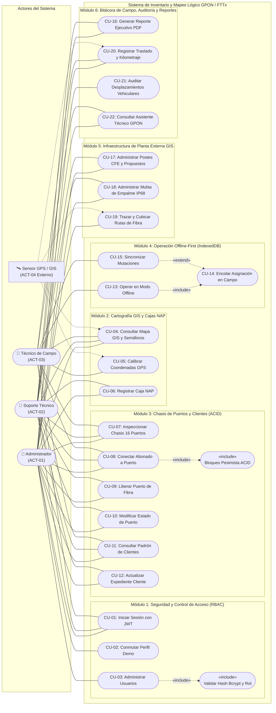

# Especificación y Diagrama General de Casos de Uso del Sistema
## Sistema de Inventario y Mapeo Lógico GPON / FTTx
**GPON TELECOM S.A. de C.V. — Residencia Profesional**

---

## 1. Justificación de la Actualización del Modelo de Casos de Uso

El modelo funcional original del sistema contemplaba exclusivamente la administración básica de cajas terminales NAP, la matriz de 16 puertos físicos, la vinculación 1:1 de abonados y el mecanismo de sincronización fuera de línea (*Offline-First*).

Con la maduración del software y la incorporación de los módulos de **Planta Externa GIS** (postes, cierres de empalme herméticos y cableado de fibra), la **Bitácora de Kilometraje de Cuadrillas** y el **Asistente Virtual Técnico**, los casos de uso del sistema se expanden formalmente de **16 a 22 casos de uso**, garantizando trazabilidad completa de los requerimientos funcionales frente al esquema de base de datos relacional (PostgreSQL) y las interfaces de usuario.

---

## 2. Actores del Sistema (Modelo RBAC)

| Código | Actor | Tipo | Rol y Nivel de Autorización |
| :--- | :--- | :---: | :--- |
| **ACT-01** | **Administrador del Sistema** | Humano | Privilegios totales e irrestrictos (NOC). Gestión de cuentas de usuario, catálogo de infraestructura troncal, auditoría de kilometraje vehicular y exportación de reportes globales. |
| **ACT-02** | **Soporte Técnico / Despacho** | Humano | Operación de mesa de ayuda y supervisión de planta externa. Autorizado para modificar estados de puertos (Dañado, En Mantenimiento, Libre), gestionar cierres de empalme, conciliar kilometrajes y resolver incidencias. |
| **ACT-03** | **Técnico de Campo (Móvil)** | Humano | Cuadrilla operativa en campo con teléfonos inteligentes. Autorizado para consultar el visor cartográfico, calibrar GPS en poste, registrar nuevos clientes en puertos libres y reportar lecturas de odómetro/traslados. *(Bloqueado por RBAC para eliminar o alterar puertos ocupados)*. |
| **ACT-04** | **Sensor GPS / API Cartográfica** | Externo | Módulo satelital del dispositivo móvil (`navigator.geolocation`) y servidor de teselas de OpenStreetMap / Leaflet para georreferenciación y cálculo geodésico de distancias. |

---

## 3. Diagrama General de Casos de Uso (Mermaid)

El siguiente diagrama representa los 22 casos de uso estructurados en 6 subsistemas funcionales, mostrando las asociaciones por rol y las relaciones estereotipadas `<<include>>` y `<<extend>>`:

---

## 4. Catálogo Detallado de Casos de Uso Actualizados

A continuación se formaliza el catálogo completo de los 22 casos de uso organizados por módulo:

### Módulo 1: Seguridad, Autenticación y Control de Acceso (RBAC)
- **`CU-01` Iniciar Sesión y Autenticación con JWT**: El usuario proporciona credenciales institucionales; el sistema verifica la firma criptográfica bcrypt y genera un token JWT con vigencia de 24 horas. *(Actores: ACT-01, ACT-02, ACT-03)*.
- **`CU-02` Conmutar Perfil de Evaluación (Role Switcher)**: Mecanismo de un solo clic en la barra de navegación para alternar instantáneamente la sesión entre Administrador, Soporte y Técnico para fines de demostración y auditoría. *(Actores: ACT-01)*.
- **`CU-03` Administrar Directorio de Cuentas de Usuario**: Alta, edición de roles y suspensión de accesos operativos de personal. *(Actor: ACT-01. Relación: «include» Validar rol Admin y hash bcrypt)*.

### Módulo 2: Cartografía GIS y Cajas Terminales NAP
- **`CU-04` Consultar Mapa GIS, Rutas y Semáforos de Saturación**: Visualización geoespacial interactiva de cajas NAP sobre mapa Leaflet, con cálculo automático del semáforo cromático de saturación (<80% verde, 80-99% amarillo, 100% rojo). *(Actores: ACT-01, ACT-02, ACT-03, ACT-04)*.
- **`CU-05` Calibrar Coordenadas GPS de NAP en Sitio**: Captura satelital de alta precisión mediante la API nativa `navigator.geolocation` para corregir la posición de la caja en el poste físico. *(Actores: ACT-03, ACT-04)*.
- **`CU-06` Registrar Nueva Caja NAP en Inventario**: Alta de un nuevo punto de acceso pasivo asociándolo al puerto PON emisor y configurando su identificador único. *(Actores: ACT-01, ACT-02)*.

### Módulo 3: Matriz Física de Puertos y Gestión de Clientes
- **`CU-07` Visualizar Matriz Isomórfica del Chasis de 16 Puertos**: Representación gráfica exacta de las dos filas de 8 conectores SC-APC con indicadores luminosos LED según su estado. *(Actores: ACT-01, ACT-02, ACT-03)*.
- **`CU-08` Asignar Abonado a Puerto Libre de Fibra**: Registro transaccional de un nuevo suscriptor y módem ONT en un puerto libre. *(Actores: ACT-01, ACT-02, ACT-03. Relación: «include» Bloqueo pesimista `SELECT ... FOR UPDATE` para impedir condiciones de carrera)*.
- **`CU-09` Liberar Puerto y Desvincular Abonado**: Rescisión de contrato o baja de servicio; el puerto retorna a estado 'Libre' y el cliente se desacopla de forma segura. *(Actores: ACT-01, ACT-02. Restringido por RBAC a ACT-03)*.
- **`CU-10` Modificar Estado Técnico de Puerto**: Marcado preventivo de puertos como 'Dañado' (atenuación excesiva) o 'En Mantenimiento'. *(Actores: ACT-01, ACT-02)*.
- **`CU-11` Consultar y Filtrar Padrón de Clientes**: Búsqueda dinámica de suscriptores por número de contrato, nombre, dirección física o dirección MAC de ONT. *(Actores: ACT-01, ACT-02, ACT-03)*.
- **`CU-12` Actualizar Expediente de Abonado**: Corrección de datos de contacto, potencia óptica estimada o reemplazo de módem ONT. *(Actores: ACT-01, ACT-02)*.

### Módulo 4: Operación Móvil Fuera de Línea (*Offline-First*)
- **`CU-13` Operar en Modo Offline con Caché Local**: Ante pérdida de señal celular, el sistema conmuta a almacenamiento local en `IndexedDB` a través de `Dexie.js`. *(Actor: ACT-03)*.
- **`CU-14` Encolar Asignaciones en Zonas Sin Cobertura**: Registro de órdenes de conexión pendientes en una cola persistente local (`pendingMutations`). *(Actor: ACT-03. Relación: «include» de CU-13)*.
- **`CU-15` Sincronizar Mutaciones Diferidas**: Envío secuencial atómico de órdenes encoladas hacia la API central una vez detectado el evento `window.online` o mediante pulsación manual. *(Actor: ACT-03. Relación: «extend» sobre CU-14)*.

### Módulo 5: Infraestructura Física de Planta Externa GIS *(Actualización)*
- **`CU-17` Administrar Postes de Infraestructura (CFE y Propuestos)**: Registro, catalogación de material (concreto de 12 m, madera, metálico), código de poste y georreferenciación en el mapa de planta externa. *(Actores: ACT-01, ACT-02)*.
- **`CU-18` Administrar Cierres de Empalme Óptico (Mufas Torpedo IP68)**: Inventario de cierres de empalme herméticos, supervisión de capacidad de fusión (48 hilos) y estado de operatividad. *(Actores: ACT-01, ACT-02)*.
- **`CU-19` Trazar y Cubicar Rutas de Fibra Óptica**: Dibujo vectorial y cálculo automático de longitud en metros y kilómetros para tramos troncales y ramales de distribución, registrando vértices GeoJSON y color normalizado. *(Actores: ACT-01, ACT-02, ACT-04)*.

### Módulo 6: Bitácora de Campo, Auditoría y Asistencia Técnica *(Actualización)*
- **`CU-16` Generar y Descargar Reportes Ejecutivos en PDF**: Compilación por flujos (*streaming*) de balances ejecutivos de ocupación, inventario pasivo y conciliación de cuadrillas técnicas. *(Actores: ACT-01, ACT-02)*.
- **`CU-20` Registrar Traslado y Kilometraje de Cuadrilla**: Captura de desplazamientos vehiculares asociados a órdenes de trabajo o visitas a cajas NAP, registrando kilometraje de odómetro inicial/final o cálculo geodésico de ruta. *(Actores: ACT-02, ACT-03, ACT-04)*.
- **`CU-21` Auditar Desplazamientos Vehiculares y Combustible**: Supervisión administrativa de kilómetros recorridos por unidad móvil y técnico para justificación de viáticos y costos de operación. *(Actor: ACT-01)*.
- **`CU-22` Consultar Asistente Técnico Virtual GPON**: Consulta contextual inmediata sobre código de colores normalizado TIA/EIA-598 (12 fibras), relaciones de división óptica pasiva (splitters 1:2 a 1:64) y tablas de presupuesto de potencia. *(Actores: ACT-02, ACT-03)*.

---

## 5. Matriz de Trazabilidad RBAC (Actores vs. Casos de Uso)

La siguiente matriz certifica el control de acceso y los privilegios funcionales asignados a cada perfil dentro de la arquitectura de software:

| Caso de Uso | Denominación Funcional | Administrador (ACT-01) | Soporte Técnico (ACT-02) | Técnico de Campo (ACT-03) |
| :---: | :--- | :---: | :---: | :---: |
| **CU-01** | Iniciar Sesión con JWT | ✔ | ✔ | ✔ |
| **CU-02** | Conmutar Perfil Demo | ✔ | ✖ | ✖ |
| **CU-03** | Administrar Directorio de Usuarios | ✔ | ✖ | ✖ |
| **CU-04** | Consultar Mapa GIS y Semáforos | ✔ | ✔ | ✔ |
| **CU-05** | Calibrar Coordenadas GPS en Sitio | ✖ | ✖ | ✔ |
| **CU-06** | Registrar Nueva Caja NAP | ✔ | ✔ | ✖ |
| **CU-07** | Inspeccionar Chasis de 16 Puertos | ✔ | ✔ | ✔ |
| **CU-08** | Conectar Abonado a Puerto Libre | ✔ | ✔ | ✔ |
| **CU-09** | Liberar Puerto y Desvincular Cliente | ✔ | ✔ | ✖ *(HTTP 403)* |
| **CU-10** | Modificar Estado Técnico de Puerto | ✔ | ✔ | ✖ *(HTTP 403)* |
| **CU-11** | Consultar y Filtrar Clientes | ✔ | ✔ | ✔ |
| **CU-12** | Actualizar Expediente de Abonado | ✔ | ✔ | ✖ *(HTTP 403)* |
| **CU-13** | Operar en Modo Offline (IndexedDB) | ✖ | ✖ | ✔ |
| **CU-14** | Encolar Asignaciones en Campo | ✖ | ✖ | ✔ |
| **CU-15** | Sincronizar Mutaciones Diferidas | ✖ | ✖ | ✔ |
| **CU-16** | Generar Reportes PDF en Streaming | ✔ | ✔ | ✖ |
| **CU-17** | Administrar Postes de Infraestructura | ✔ | ✔ | ✖ |
| **CU-18** | Administrar Mufas de Empalme IP68 | ✔ | ✔ | ✖ |
| **CU-19** | Trazar y Cubicar Rutas de Fibra | ✔ | ✔ | ✖ |
| **CU-20** | Registrar Kilometraje de Traslados | ✖ | ✔ | ✔ |
| **CU-21** | Auditar Kilometraje de Cuadrillas | ✔ | ✖ | ✖ |
| **CU-22** | Consultar Asistente Técnico GPON | ✖ | ✔ | ✔ |

---

## 6. Conclusión de la Actualización

La ampliación del modelo de casos de uso refleja con rigurosidad la totalidad de las 11 entidades de la base de datos PostgreSQL y las interfaces del sistema, asegurando coherencia metodológica entre el análisis de requerimientos (Capítulo III), el diseño de la arquitectura y la implementación de software.

