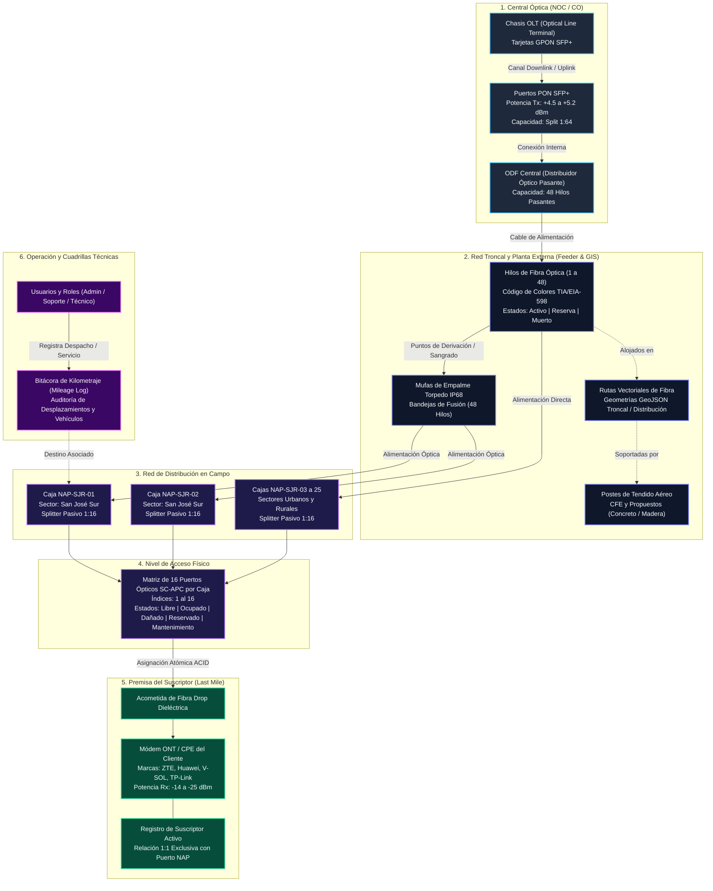
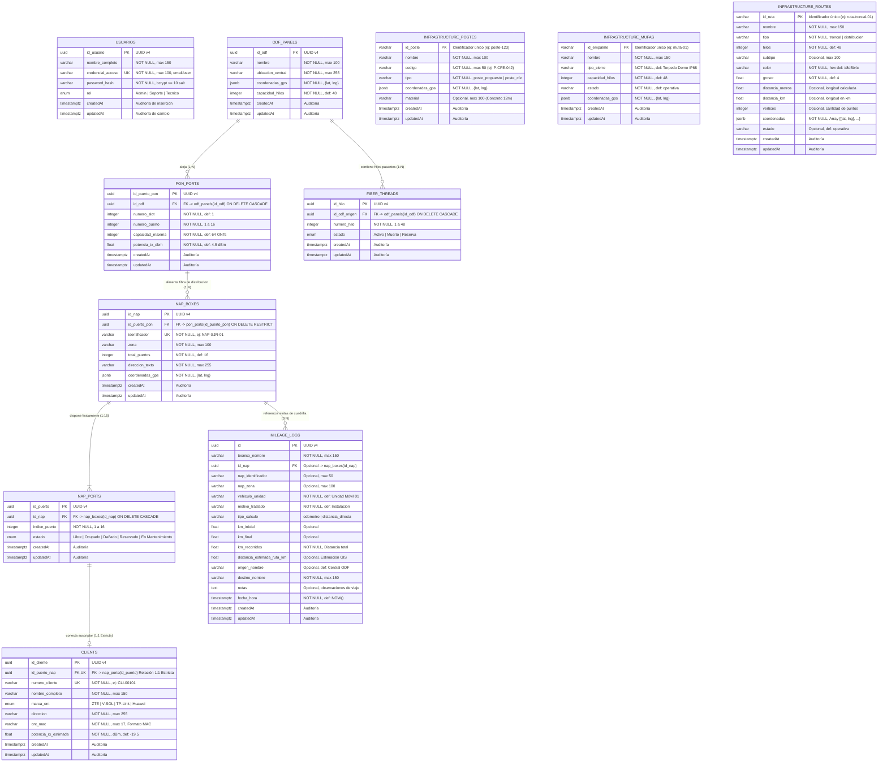

# Arquitectura, Diagrama Entidad-Relación y Diccionario de Datos
## Sistema de Inventario y Mapeo Lógico GPON / FTTx
**GPON TELECOM S.A. de C.V.**

---

## 1. Introducción

El presente documento técnico constituye la especificación formal del modelo de datos relacional (**PostgreSQL / Sequelize**), el diagrama Entidad-Relación (**ERD**), la jerarquía topológica de red y el diccionario exhaustivo de datos para el **Sistema de Inventario y Mapeo Lógico GPON / FTTx**.

El diseño del esquema modela rigurosamente los estándares de planta externa e interna para redes ópticas pasivas con capacidad gigabit (**ITU-T G.984**), integrando:
1. **Núcleo de Distribución GPON**: Desde la cabecera óptica (OLT/ODF) y los puertos PON hasta las cajas terminales de acceso (NAP), puertos pasivos SC-APC y la acometida del suscriptor (*drop cable* + módem ONT).
2. **Infraestructura Física y Cartográfica (GIS / Planta Externa)**: Postes CFE/propuestos, cierres de empalme herméticos (*mufas domo torpedo IP68*) y rutas vectoriales de cableado de fibra óptica (troncal y distribución).
3. **Gestión de Operaciones en Campo**: Bitácora y control de kilometraje de cuadrillas técnicas para auditoría de traslados a cajas NAP y centrales.

---

## 2. Jerarquía Lógica y Flujo Topológico de la Red GPON

El siguiente diagrama de flujo ilustra la propagación física y lógica de la señal óptica, las relaciones de derivación (*split ratio*) y la jerarquía de los elementos modelados en la base de datos:

---

## 3. Diagrama Entidad-Relación (ERD Completo)

El modelo relacional implementado en PostgreSQL garantiza integridad referencial estricta, restricciones compuestas de unicidad (`UNIQUE`) y soporte para operaciones concurrentes seguras:

---

## 4. Diccionario de Datos Exhaustivo

A continuación se detalla cada una de las 11 tablas del esquema físico en PostgreSQL, con sus tipos de datos nativos, llaves primarias/foráneas, restricciones de nulidad y reglas de validación de negocio.

---

### 4.1. Tabla: `usuarios`
Gestiona el personal operativo de la empresa y define el Control de Acceso Basado en Roles (**RBAC**).

- **Nombre físico en BD**: `usuarios`
- **Descripción**: Almacenamiento seguro de credenciales, autenticación JWT y roles operativos en la plataforma.

| Campo | Tipo de Dato | Nulidad | Clave | Valor por Defecto | Restricciones y Reglas de Negocio |
| :--- | :--- | :---: | :---: | :---: | :--- |
| `id_usuario` | `UUID` | NOT NULL | **PK** | `gen_random_uuid()` | Identificador universal único generado automáticamente (UUID v4). |
| `nombre_completo` | `VARCHAR(150)` | NOT NULL | | | Nombre y apellidos del operador, despachador o técnico. |
| `credencial_acceso` | `VARCHAR(100)` | NOT NULL | **UK** | | Correo electrónico corporativo único en el sistema. |
| `password_hash` | `VARCHAR(255)` | NOT NULL | | | Hash criptográfico unidireccional generado con **bcrypt** (mínimo 10 salt rounds). |
| `rol` | `ENUM` | NOT NULL | | `'Tecnico'` | Valores permitidos: `'Admin'`, `'Soporte'`, `'Tecnico'`. Define permisos en endpoints de la API REST. |
| `createdAt` | `TIMESTAMPTZ` | NOT NULL | | `NOW()` | Marca temporal UTC de alta de la cuenta. |
| `updatedAt` | `TIMESTAMPTZ` | NOT NULL | | `NOW()` | Marca temporal UTC de última modificación. |

---

### 4.2. Tabla: `odf_panels`
Modela el Distribuidor Óptico Central (*Optical Distribution Frame*) instalado en la cabecera / Centro de Operaciones de Red (NOC).

- **Nombre físico en BD**: `odf_panels`
- **Descripción**: Bastidor donde convergen los módulos de la OLT y salen los cables de fibra primaria hacia la planta externa.

| Campo | Tipo de Dato | Nulidad | Clave | Valor por Defecto | Restricciones y Reglas de Negocio |
| :--- | :--- | :---: | :---: | :---: | :--- |
| `id_odf` | `UUID` | NOT NULL | **PK** | `gen_random_uuid()` | Identificador universal único del distribuidor óptico. |
| `nombre` | `VARCHAR(100)` | NOT NULL | | | Nombre identificador (ej. *"ODF Central San José del Rincón"*). |
| `ubicacion_central` | `VARCHAR(255)` | NOT NULL | | | Dirección física, caseta o sala técnica del NOC. |
| `coordenadas_gps` | `JSONB` | NOT NULL | | | Objeto estructurado `{"lat": 19.665644, "lng": -100.153996}` para cartografía GIS. |
| `capacidad_hilos` | `INTEGER` | NOT NULL | | `48` | Número total de hilos de fibra pasantes soportados en el panel. |
| `createdAt` | `TIMESTAMPTZ` | NOT NULL | | `NOW()` | Auditoría de creación. |
| `updatedAt` | `TIMESTAMPTZ` | NOT NULL | | `NOW()` | Auditoría de actualización. |

---

### 4.3. Tabla: `pon_ports`
Modela las interfaces ópticas activas de bajada (*Downlink*) pertenecientes a las tarjetas de la OLT.

- **Nombre físico en BD**: `pon_ports`
- **Descripción**: Puertos transmisores láser GPON con transceptores SFP Clase B+ o C+.

| Campo | Tipo de Dato | Nulidad | Clave | Valor por Defecto | Restricciones y Reglas de Negocio |
| :--- | :--- | :---: | :---: | :---: | :--- |
| `id_puerto_pon` | `UUID` | NOT NULL | **PK** | `gen_random_uuid()` | Identificador universal único del puerto PON. |
| `id_odf` | `UUID` | NOT NULL | **FK** | | Referencia foránea a `odf_panels(id_odf)`. Eliminación en cascada (`ON DELETE CASCADE`). |
| `numero_slot` | `INTEGER` | NOT NULL | | `1` | Número de ranura de la tarjeta controladora OLT (ej. Slot 1 a 4). |
| `numero_puerto` | `INTEGER` | NOT NULL | | | Número físico de puerto en el módulo SFP (ej. 1 al 16). |
| `capacidad_maxima` | `INTEGER` | NOT NULL | | `64` | Relación de división (*Split Ratio*) máxima admisible (64 o 128 suscriptores). |
| `potencia_tx_dbm` | `FLOAT` | NOT NULL | | `4.5` | Potencia óptica transmitida (dBm) por el diodo láser (+3.0 dBm a +7.0 dBm). |
| `createdAt` | `TIMESTAMPTZ` | NOT NULL | | `NOW()` | Auditoría de creación. |
| `updatedAt` | `TIMESTAMPTZ` | NOT NULL | | `NOW()` | Auditoría de actualización. |

---

### 4.4. Tabla: `fiber_threads`
Administra el estado individual de continuidad y asignación de cada filamento dentro de los cables de fibra troncal.

- **Nombre físico en BD**: `fiber_threads`
- **Descripción**: Padrón de continuidad hilo por hilo organizado según el código cromático TIA/EIA-598.

| Campo | Tipo de Dato | Nulidad | Clave | Valor por Defecto | Restricciones y Reglas de Negocio |
| :--- | :--- | :---: | :---: | :---: | :--- |
| `id_hilo` | `UUID` | NOT NULL | **PK** | `gen_random_uuid()` | Identificador universal único del filamento de fibra. |
| `id_odf_origen` | `UUID` | NOT NULL | **FK** | | Referencia foránea a `odf_panels(id_odf)` con eliminación en cascada (`ON DELETE CASCADE`). |
| `numero_hilo` | `INTEGER` | NOT NULL | | | Posición física ordinal del hilo (1 a 48). |
| `estado` | `ENUM` | NOT NULL | | `'Reserva'` | Valores permitidos: `'Activo'` (con tráfico activo), `'Muerto'` (roto/atenuado), `'Reserva'` (disponible para ampliación). |
| `createdAt` | `TIMESTAMPTZ` | NOT NULL | | `NOW()` | Auditoría de creación. |
| `updatedAt` | `TIMESTAMPTZ` | NOT NULL | | `NOW()` | Auditoría de actualización. |

---

### 4.5. Tabla: `nap_boxes`
Cajas terminales de distribución en campo (*Network Access Point*) con divisores ópticos pasivos (*splitters* 1:16).

- **Nombre físico en BD**: `nap_boxes`
- **Descripción**: Envolvente hermética aérea para intemperie donde se realiza la desconcentración de señal óptica hacia los clientes.

| Campo | Tipo de Dato | Nulidad | Clave | Valor por Defecto | Restricciones y Reglas de Negocio |
| :--- | :--- | :---: | :---: | :---: | :--- |
| `id_nap` | `UUID` | NOT NULL | **PK** | `gen_random_uuid()` | Identificador universal único de la caja NAP. |
| `identificador` | `VARCHAR(50)` | NOT NULL | **UK** | | Código de rotulación de campo (ej. *"NAP-SJR-01"*). Restricción de unicidad estricta. |
| `zona` | `VARCHAR(100)` | NOT NULL | | | Sector geográfico o colonia de cobertura (ej. *"San José del Rincón - Sur"*). |
| `id_puerto_pon` | `UUID` | NOT NULL | **FK** | | Referencia foránea al puerto PON emisor en `pon_ports(id_puerto_pon)`. Restricción `ON DELETE RESTRICT`. |
| `total_puertos` | `INTEGER` | NOT NULL | | `16` | Capacidad nominal del divisor óptico pasivo instalado (estándar 16 puertos). |
| `direccion_texto` | `VARCHAR(255)` | NOT NULL | | | Referencia domiciliaria o poste de instalación en campo. |
| `coordenadas_gps` | `JSONB` | NOT NULL | | | Objeto estructurado `{"lat": Float, "lng": Float}` para renderizado cartográfico en Leaflet. |
| `createdAt` | `TIMESTAMPTZ` | NOT NULL | | `NOW()` | Auditoría de creación. |
| `updatedAt` | `TIMESTAMPTZ` | NOT NULL | | `NOW()` | Auditoría de actualización. |

---

### 4.6. Tabla: `nap_ports`
Representa cada uno de los 16 acopladores ópticos SC-APC individuales montados dentro de una caja NAP.

- **Nombre físico en BD**: `nap_ports`
- **Descripción**: Puerto de conexión donde se inserta la fibra *drop* que llega a la vivienda del suscriptor.

| Campo | Tipo de Dato | Nulidad | Clave | Valor por Defecto | Restricciones y Reglas de Negocio |
| :--- | :--- | :---: | :---: | :---: | :--- |
| `id_puerto` | `UUID` | NOT NULL | **PK** | `gen_random_uuid()` | Identificador universal único del puerto individual. |
| `id_nap` | `UUID` | NOT NULL | **FK** | | Clave foránea a `nap_boxes(id_nap)` con eliminación en cascada (`ON DELETE CASCADE`). |
| `indice_puerto` | `INTEGER` | NOT NULL | | | Posición rotulada del 1 al 16 en el bastidor de la caja. |
| `estado` | `ENUM` | NOT NULL | | `'Libre'` | Valores permitidos: `'Libre'`, `'Ocupado'`, `'Dañado'`, `'Reservado'`, `'En Mantenimiento'`. |
| `createdAt` | `TIMESTAMPTZ` | NOT NULL | | `NOW()` | Auditoría de creación. |
| `updatedAt` | `TIMESTAMPTZ` | NOT NULL | | `NOW()` | Auditoría de actualización. |

> **Índice de Integridad Compuesta**:
> `UNIQUE ("id_nap", "indice_puerto")` previene a nivel de motor de base de datos que dos puertos tengan el mismo número dentro de una misma caja.

---

### 4.7. Tabla: `clients`
Registra los datos contractuales, prediales y del módem óptico ONT (*Optical Network Terminal*) del suscriptor final.

- **Nombre físico en BD**: `clients`
- **Descripción**: Suscriptores residenciales o corporativos con servicio activo en la red óptica.

| Campo | Tipo de Dato | Nulidad | Clave | Valor por Defecto | Restricciones y Reglas de Negocio |
| :--- | :--- | :---: | :---: | :---: | :--- |
| `id_cliente` | `UUID` | NOT NULL | **PK** | `gen_random_uuid()` | Identificador universal único del abonado. |
| `numero_cliente` | `VARCHAR(50)` | NOT NULL | **UK** | | Código de cuenta de facturación único (ej. *"CLI-00105"*). |
| `nombre_completo` | `VARCHAR(150)` | NOT NULL | | | Nombre del titular del contrato. |
| `id_puerto_nap` | `UUID` | NOT NULL | **FK, UK** | | Clave foránea única a `nap_ports(id_puerto)`. **Garantiza relación 1:1 estricta**. |
| `marca_ont` | `ENUM` | NOT NULL | | `'ZTE'` | Valores permitidos: `'ZTE'`, `'V-SOL'`, `'TP-Link'`, `'Huawei'`. |
| `direccion` | `VARCHAR(255)` | NOT NULL | | | Dirección exacta donde se instaló la roseta óptica domiciliaria. |
| `ont_mac` | `VARCHAR(17)` | NOT NULL | | | Dirección MAC física de la interfaz WAN de la ONT (formato `XX:XX:XX:XX:XX:XX`). |
| `potencia_rx_estimada` | `FLOAT` | NOT NULL | | `-19.5` | Potencia óptica calculada en recepción (dBm). Rango óptimo admitido: `-14.0 dBm` a `-27.0 dBm`. |
| `createdAt` | `TIMESTAMPTZ` | NOT NULL | | `NOW()` | Auditoría de registro del contrato. |
| `updatedAt` | `TIMESTAMPTZ` | NOT NULL | | `NOW()` | Auditoría de actualización del suscriptor. |

---

### 4.8. Tabla: `mileage_logs`
Control operativo y bitácora de desplazamientos de cuadrillas técnicas para instalaciones, mantenimientos y visitas a cajas NAP.

- **Nombre físico en BD**: `mileage_logs`
- **Descripción**: Registro y conciliación de kilometraje (odómetro físico del vehículo vs. cálculo geodésico/GIS).

| Campo | Tipo de Dato | Nulidad | Clave | Valor por Defecto | Restricciones y Reglas de Negocio |
| :--- | :--- | :---: | :---: | :---: | :--- |
| `id` | `UUID` | NOT NULL | **PK** | `gen_random_uuid()` | Identificador universal único del traslado. |
| `tecnico_nombre` | `VARCHAR(150)` | NOT NULL | | | Nombre del técnico responsable de la unidad vehicular. |
| `id_nap` | `UUID` | NULL | **FK** | | Clave foránea opcional referenciando la caja NAP de destino en `nap_boxes(id_nap)`. |
| `nap_identificador` | `VARCHAR(50)` | NULL | | | Código de la caja visitada (ej. *"NAP-SJR-01"*). |
| `nap_zona` | `VARCHAR(100)` | NULL | | | Zona de cobertura de la caja atendida. |
| `vehiculo_unidad` | `VARCHAR(100)` | NOT NULL | | `'Unidad Móvil 01'` | Identificador o placa del vehículo de campo. |
| `motivo_traslado` | `VARCHAR(50)` | NOT NULL | | `'Instalacion'` | Motivo de la orden de trabajo (`'Instalacion'`, `'Mantenimiento'`, `'Revision'`). |
| `tipo_calculo` | `VARCHAR(30)` | NOT NULL | | `'odometro'` | Método de medición empleado (`'odometro'` o `'distancia_directa'`). |
| `km_inicial` | `FLOAT` | NULL | | | Lectura del odómetro al salir de la base/central. |
| `km_final` | `FLOAT` | NULL | | | Lectura del odómetro al finalizar el servicio. |
| `km_recorridos` | `FLOAT` | NOT NULL | | | Kilometraje neto total registrado en el traslado. |
| `distancia_estimada_ruta_km`| `FLOAT` | NULL | | | Distancia teórica estimada según trazado cartográfico en kilómetros. |
| `origen_nombre` | `VARCHAR(150)` | NULL | | `'Central ODF San José'` | Punto geográfico de partida. |
| `destino_nombre` | `VARCHAR(150)` | NOT NULL | | | Punto geográfico de destino o domicilio del cliente. |
| `notas` | `TEXT` | NULL | | | Observaciones de incidencias viales, tráfico o materiales. |
| `fecha_hora` | `TIMESTAMPTZ` | NOT NULL | | `NOW()` | Fecha y hora de ejecución del traslado. |
| `createdAt` | `TIMESTAMPTZ` | NOT NULL | | `NOW()` | Auditoría de creación. |
| `updatedAt` | `TIMESTAMPTZ` | NOT NULL | | `NOW()` | Auditoría de actualización. |

---

### 4.9. Tabla: `infrastructure_postes`
Inventario cartográfico de postes de tendido aéreo que sostienen los cables de fibra óptica en planta externa.

- **Nombre físico en BD**: `infrastructure_postes`
- **Descripción**: Elementos físicos de soporte aéreo (propiedad de CFE o colocación propia de la empresa).

| Campo | Tipo de Dato | Nulidad | Clave | Valor por Defecto | Restricciones y Reglas de Negocio |
| :--- | :--- | :---: | :---: | :---: | :--- |
| `id_poste` | `VARCHAR(100)` | NOT NULL | **PK** | | Identificador único alfanumérico del poste (ej. `poste-custom-171000` o código GIS). |
| `nombre` | `VARCHAR(100)` | NOT NULL | | | Nombre descriptivo del punto (ej. *"Poste Troncal CFE 04"*). |
| `codigo` | `VARCHAR(50)` | NOT NULL | | | Código rotulado en campo (ej. *"CFE-SJR-102"*). |
| `tipo` | `VARCHAR(50)` | NOT NULL | | `'poste_propuesto'` | Clasificación: `'poste_propuesto'` (instalación propia) o `'poste_cfe'` (arrendamiento CFE). |
| `coordenadas_gps` | `JSONB` | NOT NULL | | | Coordenadas cartográficas `{lat: Float, lng: Float}`. |
| `material` | `VARCHAR(100)` | NULL | | `'Concreto 12m'` | Especificación de construcción (ej. *"Concreto 12m"*, *"Madera creosotada"*, *"Metálico tubular"*). |
| `createdAt` | `TIMESTAMPTZ` | NOT NULL | | `NOW()` | Auditoría de creación. |
| `updatedAt` | `TIMESTAMPTZ` | NOT NULL | | `NOW()` | Auditoría de actualización. |

---

### 4.10. Tabla: `infrastructure_mufas`
Inventario de cierres de empalme óptico herméticos (*mufas domo torpedo IP68*) instalados en la planta externa.

- **Nombre físico en BD**: `infrastructure_mufas`
- **Descripción**: Puntos de sangrado de cable troncal, distribución y protección de fusiones por fusión de arco voltaico.

| Campo | Tipo de Dato | Nulidad | Clave | Valor por Defecto | Restricciones y Reglas de Negocio |
| :--- | :--- | :---: | :---: | :---: | :--- |
| `id_empalme` | `VARCHAR(100)` | NOT NULL | **PK** | | Identificador alfanumérico único del empalme (ej. `mufa-sjr-centro-01`). |
| `nombre` | `VARCHAR(150)` | NOT NULL | | | Nombre descriptivo del cierre óptico. |
| `tipo_cierre` | `VARCHAR(150)` | NOT NULL | | `'Cierre de Empalme Torpedo Domo (IP68)'` | Tipo y nivel de sellado hermético contra humedad y polvo. |
| `capacidad_hilos` | `INTEGER` | NOT NULL | | `48` | Capacidad máxima de empalmes por fusión alojados en bandejas. |
| `estado` | `VARCHAR(50)` | NOT NULL | | `'operativa'` | Estado operativo (`'operativa'`, `'en mantenimiento'`, `'dañada'`). |
| `coordenadas_gps` | `JSONB` | NOT NULL | | | Coordenadas cartográficas `{lat: Float, lng: Float}` para renderizado en mapa. |
| `createdAt` | `TIMESTAMPTZ` | NOT NULL | | `NOW()` | Auditoría de creación. |
| `updatedAt` | `TIMESTAMPTZ` | NOT NULL | | `NOW()` | Auditoría de actualización. |

---

### 4.11. Tabla: `infrastructure_routes`
Trazados vectoriales georreferenciados de las líneas de fibra óptica aéreas y canalizadas.

- **Nombre físico en BD**: `infrastructure_routes`
- **Descripción**: Polilíneas geográficas (GeoJSON) con la trayectoria exacta de los cables troncales y ramales de distribución.

| Campo | Tipo de Dato | Nulidad | Clave | Valor por Defecto | Restricciones y Reglas de Negocio |
| :--- | :--- | :---: | :---: | :---: | :--- |
| `id_ruta` | `VARCHAR(100)` | NOT NULL | **PK** | | Identificador alfanumérico único de la ruta (ej. `ruta-troncal-sjr-norte`). |
| `nombre` | `VARCHAR(150)` | NOT NULL | | | Denominación del tramo de cableado. |
| `tipo` | `VARCHAR(50)` | NOT NULL | | `'troncal'` | Nivel jerárquico del tramo (`'troncal'` o `'distribucion'`). |
| `hilos` | `INTEGER` | NOT NULL | | `48` | Número de fibras ópticas contenidas en el cable dieléctrico autosoportado ADSS. |
| `subtipo` | `VARCHAR(100)` | NULL | | | Detalle del cable (ej. *"Cable ADSS 48 Fibras Span 100"*). |
| `color` | `VARCHAR(20)` | NOT NULL | | `'#8d5b4c'` | Código hexadecimal para estilo de línea en el visor cartográfico. |
| `grosor` | `FLOAT` | NOT NULL | | `4` | Grosor visual de la línea en píxeles (weight de Leaflet/MapLibre). |
| `distancia_metros`| `FLOAT` | NULL | | | Longitud física calculada a partir de los vértices geográficos. |
| `distancia_km` | `FLOAT` | NULL | | | Longitud calculada en kilómetros para cubicación de cable. |
| `vertices` | `INTEGER` | NULL | | | Cantidad de puntos de inflexión que componen la polilínea. |
| `coordenadas` | `JSONB` | NOT NULL | | | Matriz de coordenadas geodésicas `[[lat1, lng1], [lat2, lng2], ...]`. |
| `estado` | `VARCHAR(50)` | NULL | | `'operativa'` | Condición operativa del tramo (`'operativa'`, `'en mantenimiento'`, `'proyectada'`). |
| `createdAt` | `TIMESTAMPTZ` | NOT NULL | | `NOW()` | Auditoría de creación. |
| `updatedAt` | `TIMESTAMPTZ` | NOT NULL | | `NOW()` | Auditoría de actualización. |

---

## 5. Reglas de Integridad, Concurrencia y Lógica de Negocio

1. **Relación 1:1 Estricta Puerto - Abonado**:
   - `clients.id_puerto_nap` posee una restricción de unicidad estricta (`UNIQUE`). Es físicamente imposible conectar dos fibras de cliente en el mismo puerto acoplador SC-APC de la caja NAP.
2. **Atomicidad en Asignaciones Concurrentes (Bloqueo Pesimista ACID)**:
   - Toda asignación de puerto para un nuevo cliente se ejecuta dentro de una transacción con `SELECT ... FOR UPDATE` (`Transaction.LOCK.UPDATE`). Esto impide condiciones de carrera (*race conditions*) si dos cuadrillas técnicas intentan aprovisionar el mismo puerto libre simultáneamente.
3. **Cálculo Dinámico de Saturación de Cajas NAP**:
   - La saturación no se almacena como dato estático redundante, sino que se computa en tiempo real según el estado de los 16 puertos:
     $$\text{Saturación (\%)} = \left(\frac{\text{Puertos Ocupados}}{\text{Total de Puertos}}\right) \times 100$$
     - $\text{Saturación} < 80\% \rightarrow$ **Disponible (Verde)**
     - $\text{Saturación} \ge 80\% \rightarrow$ **Alerta de Capacidad (Amarillo)**
     - $\text{Saturación} = 100\% \rightarrow$ **Saturada (Rojo)**
4. **Preservación Física de Puertos ante Bajas Contractuales**:
   - Al cancelar un contrato o liberar un suscriptor, la clave foránea en `clients` se desvincula de forma controlada (`ON DELETE SET NULL`), restableciendo el estado del puerto a `'Libre'`, preservando la integridad del hardware en la base de datos.
5. **Precisión de Ubicación con Almacenamiento JSONB**:
   - Los pares y polilíneas cartográficas se almacenan en formato binario indexable `JSONB` nativo de PostgreSQL, optimizando consultas espaciales sin sobrecoste de extensiones complejas.
