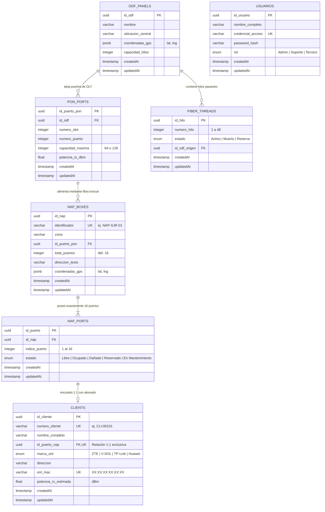

# Arquitectura, Diagrama Entidad-Relación y Diccionario de Datos
### Sistema de Inventario y Mapeo Lógico GPON / FTTx
**GPON TELECOM S.A. de C.V.**

Este documento describe formalmente la estructura de base de datos relacional (PostgreSQL), la jerarquía lógica de la red de fibra óptica, el diagrama Entidad-Relación (ER) y el diccionario detallado de datos para el sistema de inventario y asignación de puertos.

---

## 1. Jerarquía Lógica y Topológica de la Red GPON

La arquitectura de datos modela con fidelidad la topología física de una red óptica pasiva (PON):

```
┌────────────────────────────────────────────────────────┐
│              CENTRAL ÓPTICA (CO / NOC)                 │
│  ┌──────────────────────┐    ┌──────────────────────┐  │
│  │   ODF Central (48H)  │◄───┤ Tarjeta OLT (Slot 1) │  │
│  └──────────┬───────────┘    └──────────┬───────────┘  │
└─────────────┼───────────────────────────┼──────────────┘
              │                           │
              │  Fibra Troncal Primaria   │ (Puerto PON 1/1, 1/2)
              ▼                           ▼
┌────────────────────────────────────────────────────────┐
│              RED DE DISTRIBUCIÓN EN CAMPO              │
│  ┌──────────────────────────────────────────────────┐  │
│  │           Cajas NAP (Splitter 1:16)              │  │
│  │  - NAP-SJR-01 (Centro)        - NAP-SJR-02 (S.P) │  │
│  │  - NAP-SJR-03 (Guadalupe)     - NAP-SJR-04 (Rosas)│ │
│  └──────────────────────────┬───────────────────────┘  │
└─────────────────────────────┼──────────────────────────┘
                              │
                              │  Acometida Drop (Puertos 1 al 16)
                              ▼
┌────────────────────────────────────────────────────────┐
│                   PREMISA DEL ABONADO                  │
│  ┌──────────────────────────────────────────────────┐  │
│  │     Cliente / Abonado Activo (Relación 1:1)       │  │
│  │     Módem Óptico ONT (ZTE, Huawei, V-SOL)        │  │
│  └──────────────────────────────────────────────────┘  │
└────────────────────────────────────────────────────────┘
```

---

## 2. Diagrama Entidad-Relación (ERD)



---

## 3. Diccionario de Datos Exhaustivo

### 3.1. Tabla: `usuarios`
Almacena el personal operativo de la empresa y define el Control de Acceso Basado en Roles (RBAC).

| Campo | Tipo de Dato | Nulidad | Clave | Valor por Defecto | Descripción y Reglas de Negocio |
| :--- | :--- | :---: | :---: | :---: | :--- |
| `id_usuario` | `UUID` | NOT NULL | **PK** | `gen_random_uuid()` | Identificador universal único del usuario. |
| `nombre_completo` | `VARCHAR(150)` | NOT NULL | | | Nombre y apellidos del operador o ingeniero de campo. |
| `credencial_acceso` | `VARCHAR(100)` | NOT NULL | **UK** | | Correo electrónico corporativo o nombre de usuario único. |
| `password_hash` | `VARCHAR(255)` | NOT NULL | | | Hash criptográfico de la contraseña generado mediante Bcrypt (10 salt rounds). |
| `rol` | `ENUM` | NOT NULL | | `'Tecnico'` | Privilegios del sistema: `'Admin'` (acceso total), `'Soporte'` (gestión y corrección de puertos), `'Tecnico'` (solo lectura y asignación inicial). |
| `createdAt` | `TIMESTAMPTZ` | NOT NULL | | `NOW()` | Fecha y hora de alta del usuario en el sistema. |
| `updatedAt` | `TIMESTAMPTZ` | NOT NULL | | `NOW()` | Fecha y hora de la última modificación del registro. |

---

### 3.2. Tabla: `odf_panels`
Representa el Distribuidor Óptico Central (*Optical Distribution Frame*) ubicado en el Centro de Operaciones de Red (NOC).

| Campo | Tipo de Dato | Nulidad | Clave | Valor por Defecto | Descripción y Reglas de Negocio |
| :--- | :--- | :---: | :---: | :---: | :--- |
| `id_odf` | `UUID` | NOT NULL | **PK** | `gen_random_uuid()` | Identificador único del bastidor ODF. |
| `nombre` | `VARCHAR(100)` | NOT NULL | | | Nombre del panel (ej. *"ODF Central San José del Rincón"*). |
| `ubicacion_central` | `VARCHAR(255)` | NOT NULL | | | Domicilio o dirección física de la central de conmutación. |
| `coordenadas_gps` | `JSONB` | NOT NULL | | | Objeto JSON estructurado `{"lat": 19.6642, "lng": -100.1472}` para renderizado en mapa Leaflet. |
| `capacidad_hilos` | `INTEGER` | NOT NULL | | `48` | Número máximo de hilos pasantes de fibra óptica del panel. |
| `createdAt` | `TIMESTAMPTZ` | NOT NULL | | `NOW()` | Registro de fecha de creación. |
| `updatedAt` | `TIMESTAMPTZ` | NOT NULL | | `NOW()` | Registro de última actualización. |

---

### 3.3. Tabla: `pon_ports`
Modela los puertos ópticos de enlace (*Downlink*) de las tarjetas controladoras de la OLT (*Optical Line Terminal*).

| Campo | Tipo de Dato | Nulidad | Clave | Valor por Defecto | Descripción y Reglas de Negocio |
| :--- | :--- | :---: | :---: | :---: | :--- |
| `id_puerto_pon` | `UUID` | NOT NULL | **PK** | `gen_random_uuid()` | Identificador único del puerto PON. |
| `id_odf` | `UUID` | NOT NULL | **FK** | | Referencia a `odf_panels(id_odf)`. Clave foránea con `ON DELETE CASCADE`. |
| `numero_slot` | `INTEGER` | NOT NULL | | `1` | Número de ranura de la tarjeta dentro del chasis de la OLT. |
| `numero_puerto` | `INTEGER` | NOT NULL | | | Puerto físico de la tarjeta (ej. 1 al 16). |
| `capacidad_maxima` | `INTEGER` | NOT NULL | | `64` | Relación de división (*Split Ratio*) soportada por la interfaz (64 o 128 ONTs). |
| `potencia_tx_dbm` | `FLOAT` | NOT NULL | | `4.5` | Potencia óptica transmitida por el módulo óptico SFP transceptor (+3 a +7 dBm). |
| `createdAt` | `TIMESTAMPTZ` | NOT NULL | | `NOW()` | Auditoría de creación. |
| `updatedAt` | `TIMESTAMPTZ` | NOT NULL | | `NOW()` | Auditoría de actualización. |

---

### 3.4. Tabla: `fiber_threads`
Administra el estado individual de cada hilo de fibra óptica dentro de los cables de distribución primaria.

| Campo | Tipo de Dato | Nulidad | Clave | Valor por Defecto | Descripción y Reglas de Negocio |
| :--- | :--- | :---: | :---: | :---: | :--- |
| `id_hilo` | `UUID` | NOT NULL | **PK** | `gen_random_uuid()` | Identificador único del filamento de fibra. |
| `numero_hilo` | `INTEGER` | NOT NULL | | | Número identificador del hilo según código de colores (1 a 48). |
| `estado` | `ENUM` | NOT NULL | | `'Reserva'` | Condición física del hilo: `'Activo'` (con luz), `'Muerto'` (atenuación severa o corte), `'Reserva'` (disponible para ampliación). |
| `id_odf_origen` | `UUID` | NOT NULL | **FK** | | Referencia a `odf_panels(id_odf)` con `ON DELETE CASCADE`. |
| `createdAt` | `TIMESTAMPTZ` | NOT NULL | | `NOW()` | Auditoría de creación. |
| `updatedAt` | `TIMESTAMPTZ` | NOT NULL | | `NOW()` | Auditoría de actualización. |

---

### 3.5. Tabla: `nap_boxes`
Cajas terminales de distribución en campo (*Network Access Point*) instaladas en postes o acometidas aéreas con splitters de segundo nivel.

| Campo | Tipo de Dato | Nulidad | Clave | Valor por Defecto | Descripción y Reglas de Negocio |
| :--- | :--- | :---: | :---: | :---: | :--- |
| `id_nap` | `UUID` | NOT NULL | **PK** | `gen_random_uuid()` | Identificador único de la caja NAP. |
| `identificador` | `VARCHAR(50)` | NOT NULL | **UK** | | Código de identificación rotulado en campo (ej. *"NAP-SJR-01"*). |
| `zona` | `VARCHAR(100)` | NOT NULL | | | Sector geográfico o colonia de cobertura. |
| `id_puerto_pon` | `UUID` | NOT NULL | **FK** | | Puerto PON alimentador en `pon_ports(id_puerto_pon)`. `ON DELETE RESTRICT`. |
| `total_puertos` | `INTEGER` | NOT NULL | | `16` | Capacidad nominal del splitter pasivo instalado (estándar 16 puertos). |
| `direccion_texto` | `VARCHAR(255)` | NOT NULL | | | Referencia de campo (ej. *"Av. Morelos esq. Juárez, Poste CFE #45"*). |
| `coordenadas_gps` | `JSONB` | NOT NULL | | | Coordenadas exactas `{"lat": Float, "lng": Float}` para ubicar en mapa y calcular distancias. |
| `createdAt` | `TIMESTAMPTZ` | NOT NULL | | `NOW()` | Auditoría de creación. |
| `updatedAt` | `TIMESTAMPTZ` | NOT NULL | | `NOW()` | Auditoría de actualización. |

---

### 3.6. Tabla: `nap_ports`
Representa cada uno de los 16 acopladores ópticos SC-APC individuales de una caja NAP.

| Campo | Tipo de Dato | Nulidad | Clave | Valor por Defecto | Descripción y Reglas de Negocio |
| :--- | :--- | :---: | :---: | :---: | :--- |
| `id_puerto` | `UUID` | NOT NULL | **PK** | `gen_random_uuid()` | Identificador único del puerto individual. |
| `id_nap` | `UUID` | NOT NULL | **FK** | | Clave foránea hacia `nap_boxes(id_nap)` con `ON DELETE CASCADE`. |
| `indice_puerto` | `INTEGER` | NOT NULL | | | Posición física rotulada del 1 al 16 dentro de la caja. |
| `estado` | `ENUM` | NOT NULL | | `'Libre'` | Estado operativo: `'Libre'`, `'Ocupado'`, `'Dañado'`, `'Reservado'`, `'En Mantenimiento'`. |
| `createdAt` | `TIMESTAMPTZ` | NOT NULL | | `NOW()` | Auditoría de creación. |
| `updatedAt` | `TIMESTAMPTZ` | NOT NULL | | `NOW()` | Auditoría de actualización. |

> **Restricción de Integridad Compuesta**:  
> `UNIQUE ("id_nap", "indice_puerto")` garantiza que dentro de una misma caja jamás puedan existir dos puertos con el mismo número de posición.

---

### 3.7. Tabla: `clients`
Registra los datos del contrato, domicilio y equipo terminal ONT (*Optical Network Terminal*) del abonado final.

| Campo | Tipo de Dato | Nulidad | Clave | Valor por Defecto | Descripción y Reglas de Negocio |
| :--- | :--- | :---: | :---: | :---: | :--- |
| `id_cliente` | `UUID` | NOT NULL | **PK** | `gen_random_uuid()` | Identificador interno del abonado. |
| `numero_cliente` | `VARCHAR(50)` | NOT NULL | **UK** | | Código de cuenta de facturación del suscriptor (ej. *"CLI-00105"*). |
| `nombre_completo` | `VARCHAR(150)` | NOT NULL | | | Nombre y apellidos del suscriptor del servicio. |
| `id_puerto_nap` | `UUID` | NOT NULL | **FK, UK** | | Clave foránea única hacia `nap_ports(id_puerto)`. **Relación 1:1 estricta**. |
| `marca_ont` | `ENUM` | NOT NULL | | `'ZTE'` | Fabricante de la terminal óptica: `'ZTE'`, `'V-SOL'`, `'TP-Link'`, `'Huawei'`. |
| `direccion` | `VARCHAR(255)` | NOT NULL | | | Domicilio del predio donde se instala la acometida de fibra drop. |
| `ont_mac` | `VARCHAR(17)` | NOT NULL | **UK** | | Dirección física MAC del módem CPE (formato `48:2C:EA:XX:XX:XX`). |
| `potencia_rx_estimada` | `FLOAT` | NOT NULL | | `-19.5` | Potencia óptica recibida estimada en bajada (dBm). Umbral admisible: `-14` a `-27` dBm. |
| `createdAt` | `TIMESTAMPTZ` | NOT NULL | | `NOW()` | Registro de fecha de contratación. |
| `updatedAt` | `TIMESTAMPTZ` | NOT NULL | | `NOW()` | Registro de última modificación. |

---

## 4. Reglas de Integridad y Lógica de Negocio en Base de Datos

1. **Relación 1:1 Estricta Puerto - Cliente**:
   - `clients.id_puerto_nap` tiene restricción `UNIQUE`. Es físicamente imposible conectar dos fibras de abonado en el mismo puerto SC-APC del divisor.
2. **Atomicidad en Asignaciones Concurrentes (ACID)**:
   - Toda asignación de puerto se ejecuta bajo `Transaction.LOCK.UPDATE`. Si dos cuadrillas intentan tomar el mismo puerto libre en el mismo segundo, la base de datos bloquea la fila hasta que la primera confirma (`COMMIT`), rechazando la segunda con código HTTP `409 Conflict`.
3. **Cálculo Dinámico de Saturación de Cajas**:
   - El porcentaje de saturación de una NAP no se guarda como número estático, sino que se computa al vuelo:
     $$\text{Saturación (\%)} = \left(\frac{\text{Puertos Ocupados}}{\text{Total de Puertos}}\right) \times 100$$
     - $\text{Saturación} < 80\% \rightarrow$ **Disponible (Verde)**
     - $\text{Saturación} \ge 80\% \rightarrow$ **Alerta de Capacidad (Amarillo)**
     - $\text{Saturación} = 100\% \rightarrow$ **Saturada (Rojo)**
4. **Protección de Puertos contra Borrado Accidental**:
   - Si se elimina un registro de cliente, la clave foránea en `nap_ports` se desvincula de forma controlada (`ON DELETE SET NULL`) y el estado vuelve a `'Libre'`, preservando el inventario físico de la caja.
