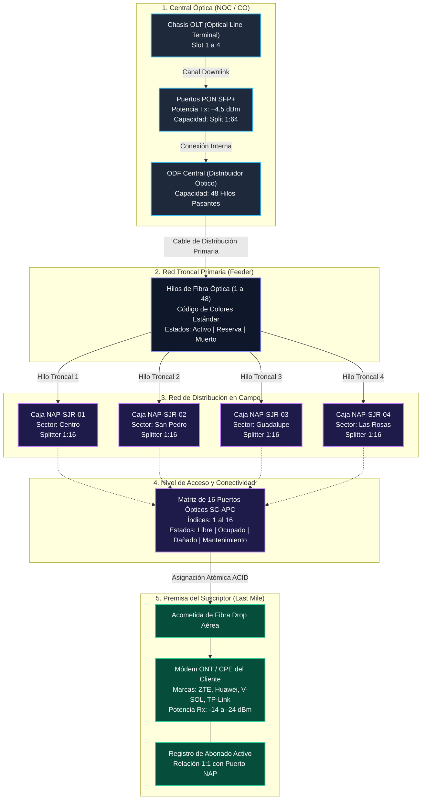
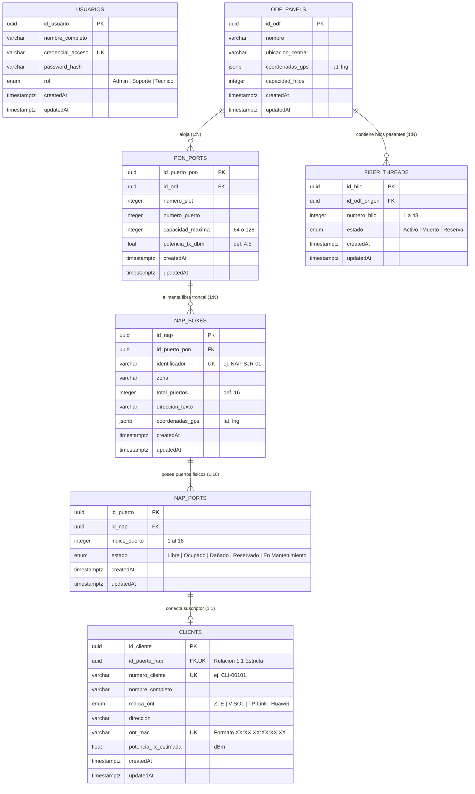

# Arquitectura, Diagrama Entidad-Relación y Diccionario de Datos
## Sistema de Inventario y Mapeo Lógico GPON / FTTx
**GPON TELECOM S.A. de C.V.**

---

## 1. Introducción

El presente documento técnico constituye la especificación formal del modelo de datos, la estructura relacional (PostgreSQL), el diagrama Entidad-Relación (ERD) y el diccionario exhaustivo de datos para el **Sistema de Inventario y Mapeo Lógico GPON / FTTx**. 

El diseño del esquema modela rigurosamente los estándares de planta externa e interna para redes ópticas pasivas con capacidad gigabit (**ITU-T G.984**), contemplando desde la cabecera óptica (OLT/ODF) hasta la acometida de fibra (*drop cable*) y la terminal de red óptica en la premisa del suscriptor (*ONT/CPE*).

---

## 2. Jerarquía Lógica y Flujo Topológico de la Red GPON

El siguiente diagrama de flujo ilustra la propagación física y lógica de la señal óptica, las relaciones de derivación (*split ratio*) y la jerarquía de los elementos modelados en la base de datos:

---

## 3. Diagrama Entidad-Relación (ERD)

El modelo entidad-relación implementado en PostgreSQL garantiza integridad referencial estricta, unicidad de equipos y bloqueo pesimista a nivel de fila:

---

## 4. Diccionario de Datos Exhaustivo

A continuación se detalla cada una de las tablas del esquema físico en PostgreSQL con sus restricciones de clave, tipos de datos nativos, valores por defecto y descripciones de dominio:

---

### 4.1. Tabla: `usuarios`
Gestiona el personal operativo de la empresa y define el Control de Acceso Basado en Roles (**RBAC**).

- **Nombre físico en BD**: `usuarios`
- **Descripción**: Credenciales cifradas, tokens y nivel de autorización operativa.

| Campo | Tipo de Dato | Nulidad | Clave | Valor por Defecto | Restricciones y Reglas de Negocio |
| :--- | :--- | :---: | :---: | :---: | :--- |
| `id_usuario` | `UUID` | NOT NULL | **PK** | `gen_random_uuid()` | Identificador universal único del usuario. |
| `nombre_completo` | `VARCHAR(150)` | NOT NULL | | | Nombre y apellidos del operador o ingeniero de campo. |
| `credencial_acceso` | `VARCHAR(100)` | NOT NULL | **UK** | | Correo electrónico corporativo o nombre de usuario único en el sistema. |
| `password_hash` | `VARCHAR(255)` | NOT NULL | | | Resumen criptográfico de la clave generado con **bcrypt** ($\ge 10$ salt rounds). |
| `rol` | `ENUM` | NOT NULL | | `'Tecnico'` | Valores permitidos: `'Admin'`, `'Soporte'`, `'Tecnico'`. Controla accesos en API REST. |
| `createdAt` | `TIMESTAMPTZ` | NOT NULL | | `NOW()` | Marca temporal de creación del registro. |
| `updatedAt` | `TIMESTAMPTZ` | NOT NULL | | `NOW()` | Marca temporal de última actualización. |

---

### 4.2. Tabla: `odf_panels`
Representa el Distribuidor Óptico Central (*Optical Distribution Frame*) ubicado en el Centro de Operaciones de Red (NOC/Cabecera).

- **Nombre físico en BD**: `odf_panels`
- **Descripción**: Punto de concentración donde convergen los módulos de la OLT y las fibras troncales de salida.

| Campo | Tipo de Dato | Nulidad | Clave | Valor por Defecto | Restricciones y Reglas de Negocio |
| :--- | :--- | :---: | :---: | :---: | :--- |
| `id_odf` | `UUID` | NOT NULL | **PK** | `gen_random_uuid()` | Identificador único del bastidor ODF. |
| `nombre` | `VARCHAR(100)` | NOT NULL | | | Nombre identificador (ej. *"ODF Central San José del Rincón"*). |
| `ubicacion_central` | `VARCHAR(255)` | NOT NULL | | | Dirección física o sala técnica de telecomunicaciones de la central. |
| `coordenadas_gps` | `JSONB` | NOT NULL | | | Objeto estructurado `{"lat": 19.6642, "lng": -100.1472}` para posicionamiento en mapa GIS. |
| `capacidad_hilos` | `INTEGER` | NOT NULL | | `48` | Cantidad total de casetes/bandejas de empalme pasantes. |
| `createdAt` | `TIMESTAMPTZ` | NOT NULL | | `NOW()` | Auditoría de creación. |
| `updatedAt` | `TIMESTAMPTZ` | NOT NULL | | `NOW()` | Auditoría de actualización. |

---

### 4.3. Tabla: `pon_ports`
Modela las interfaces ópticas de bajada (*Downlink*) de las tarjetas controladoras de la OLT (*Optical Line Terminal*).

- **Nombre físico en BD**: `pon_ports`
- **Descripción**: Puertos emisores de señal GPON con módulo transceptor SFP óptico Clase B+ o C+.

| Campo | Tipo de Dato | Nulidad | Clave | Valor por Defecto | Restricciones y Reglas de Negocio |
| :--- | :--- | :---: | :---: | :---: | :--- |
| `id_puerto_pon` | `UUID` | NOT NULL | **PK** | `gen_random_uuid()` | Identificador universal único del puerto PON. |
| `id_odf` | `UUID` | NOT NULL | **FK** | | Referencia a `odf_panels(id_odf)`. Eliminación en cascada (`ON DELETE CASCADE`). |
| `numero_slot` | `INTEGER` | NOT NULL | | `1` | Posición de la ranura de la tarjeta dentro del bastidor OLT (ej. Slot 1). |
| `numero_puerto` | `INTEGER` | NOT NULL | | | Puerto físico asignado en la tarjeta (ej. 1 al 16). |
| `capacidad_maxima` | `INTEGER` | NOT NULL | | `64` | Relación de división (*Split Ratio*) máxima soportada por la interfaz (64 o 128 ONTs). |
| `potencia_tx_dbm` | `FLOAT` | NOT NULL | | `4.5` | Potencia óptica transmitida (dBm) por el láser transceptor (+3 a +7 dBm). |
| `createdAt` | `TIMESTAMPTZ` | NOT NULL | | `NOW()` | Auditoría de creación. |
| `updatedAt` | `TIMESTAMPTZ` | NOT NULL | | `NOW()` | Auditoría de actualización. |

---

### 4.4. Tabla: `fiber_threads`
Administra el estado individual de cada hilo de fibra óptica dentro de los cables dieléctricos de distribución primaria.

- **Nombre físico en BD**: `fiber_threads`
- **Descripción**: Padrón de continuidad óptica hilo por hilo.

| Campo | Tipo de Dato | Nulidad | Clave | Valor por Defecto | Restricciones y Reglas de Negocio |
| :--- | :--- | :---: | :---: | :---: | :--- |
| `id_hilo` | `UUID` | NOT NULL | **PK** | `gen_random_uuid()` | Identificador universal del filamento de fibra. |
| `id_odf_origen` | `UUID` | NOT NULL | **FK** | | Referencia a `odf_panels(id_odf)` con eliminación en cascada (`ON DELETE CASCADE`). |
| `numero_hilo` | `INTEGER` | NOT NULL | | | Número identificador del hilo (1 a 48) según código internacional TIA/EIA-598. |
| `estado` | `ENUM` | NOT NULL | | `'Reserva'` | Valores permitidos: `'Activo'` (con tráfico), `'Muerto'` (roto/atenuado), `'Reserva'` (libre). |
| `createdAt` | `TIMESTAMPTZ` | NOT NULL | | `NOW()` | Auditoría de creación. |
| `updatedAt` | `TIMESTAMPTZ` | NOT NULL | | `NOW()` | Auditoría de actualización. |

---

### 4.5. Tabla: `nap_boxes`
Cajas terminales de distribución en campo (*Network Access Point*) instaladas en postes o fachadas aéreas con divisores ópticos pasivos (*splitters* 1:16).

- **Nombre físico en BD**: `nap_boxes`
- **Descripción**: Envolvente hermética para intemperie donde se realiza la derivación de fibra hacia los domicilios.

| Campo | Tipo de Dato | Nulidad | Clave | Valor por Defecto | Restricciones y Reglas de Negocio |
| :--- | :--- | :---: | :---: | :---: | :--- |
| `id_nap` | `UUID` | NOT NULL | **PK** | `gen_random_uuid()` | Identificador universal único de la caja NAP. |
| `identificador` | `VARCHAR(50)` | NOT NULL | **UK** | | Clave de rotulación visible en campo (ej. *"NAP-SJR-01"*). Restricción de unicidad. |
| `zona` | `VARCHAR(100)` | NOT NULL | | | Sector geográfico, barrio o colonia de cobertura. |
| `id_puerto_pon` | `UUID` | NOT NULL | **FK** | | Puerto PON alimentador en `pon_ports(id_puerto_pon)`. Restricción `ON DELETE RESTRICT`. |
| `total_puertos` | `INTEGER` | NOT NULL | | `16` | Capacidad nominal del divisor pasivo interno (estándar 16 puertos). |
| `direccion_texto` | `VARCHAR(255)` | NOT NULL | | | Referencia física del poste (ej. *"Av. Hidalgo esq. Morelos, Poste CFE #45"*). |
| `coordenadas_gps` | `JSONB` | NOT NULL | | | Par de coordenadas `{lat: Float, lng: Float}` para renderizado cartográfico en Leaflet. |
| `createdAt` | `TIMESTAMPTZ` | NOT NULL | | `NOW()` | Auditoría de creación. |
| `updatedAt` | `TIMESTAMPTZ` | NOT NULL | | `NOW()` | Auditoría de actualización. |

---

### 4.6. Tabla: `nap_ports`
Representa cada uno de los 16 acopladores ópticos SC-APC individuales disponibles en una caja NAP.

- **Nombre físico en BD**: `nap_ports`
- **Descripción**: Conector físico donde se enchufa el conector verde SC-APC de la fibra drop del suscriptor.

| Campo | Tipo de Dato | Nulidad | Clave | Valor por Defecto | Restricciones y Reglas de Negocio |
| :--- | :--- | :---: | :---: | :---: | :--- |
| `id_puerto` | `UUID` | NOT NULL | **PK** | `gen_random_uuid()` | Identificador universal único del puerto individual. |
| `id_nap` | `UUID` | NOT NULL | **FK** | | Referencia foránea hacia `nap_boxes(id_nap)` con `ON DELETE CASCADE`. |
| `indice_puerto` | `INTEGER` | NOT NULL | | | Posición física rotulada (1 al 16) dentro del panel de la caja. |
| `estado` | `ENUM` | NOT NULL | | `'Libre'` | Valores: `'Libre'`, `'Ocupado'`, `'Dañado'`, `'Reservado'`, `'En Mantenimiento'`. |
| `createdAt` | `TIMESTAMPTZ` | NOT NULL | | `NOW()` | Auditoría de creación. |
| `updatedAt` | `TIMESTAMPTZ` | NOT NULL | | `NOW()` | Auditoría de actualización. |

> **Restricción de Integridad Compuesta Estricta**:  
> `UNIQUE ("id_nap", "indice_puerto")` garantiza matemáticamente que dentro de una misma caja jamás puedan duplicarse números de puerto.

---

### 4.7. Tabla: `clients`
Registra los datos del contrato, predio y módem terminal de red óptica ONT (*Optical Network Terminal*) del suscriptor final.

- **Nombre físico en BD**: `clients`
- **Descripción**: Abonados en servicio activo conectados a un puerto físico de la red.

| Campo | Tipo de Dato | Nulidad | Clave | Valor por Defecto | Restricciones y Reglas de Negocio |
| :--- | :--- | :---: | :---: | :---: | :--- |
| `id_cliente` | `UUID` | NOT NULL | **PK** | `gen_random_uuid()` | Identificador universal único del cliente abonado. |
| `numero_cliente` | `VARCHAR(50)` | NOT NULL | **UK** | | Código de cuenta de facturación del suscriptor (ej. *"CLI-00105"*). |
| `nombre_completo` | `VARCHAR(150)` | NOT NULL | | | Nombre y apellidos del suscriptor del servicio. |
| `id_puerto_nap` | `UUID` | NOT NULL | **FK, UK** | | Clave foránea única hacia `nap_ports(id_puerto)`. **Garantiza relación 1:1 estricta**. |
| `marca_ont` | `ENUM` | NOT NULL | | `'ZTE'` | Valores permitidos: `'ZTE'`, `'V-SOL'`, `'TP-Link'`, `'Huawei'`. |
| `direccion` | `VARCHAR(255)` | NOT NULL | | | Domicilio del inmueble donde se instala la acometida de fibra drop. |
| `ont_mac` | `VARCHAR(17)` | NOT NULL | **UK** | | Dirección física MAC del módem ONT (formato regex `48:2C:EA:XX:XX:XX`). |
| `potencia_rx_estimada` | `FLOAT` | NOT NULL | | `-19.5` | Potencia óptica recibida calculada en bajada (dBm). Rango admisible: `-14` a `-27` dBm. |
| `createdAt` | `TIMESTAMPTZ` | NOT NULL | | `NOW()` | Auditoría de creación de contrato. |
| `updatedAt` | `TIMESTAMPTZ` | NOT NULL | | `NOW()` | Auditoría de modificación. |

---

## 5. Reglas de Integridad y Lógica de Negocio en Base de Datos

1. **Relación 1:1 Estricta Puerto - Suscriptor**:
   - `clients.id_puerto_nap` tiene una restricción de unicidad estricta (`UNIQUE`). Es físicamente imposible conectar dos fibras de abonado en el mismo puerto SC-APC del divisor óptico.
2. **Atomicidad en Asignaciones Concurrentes (ACID)**:
   - Toda asignación de puerto se ejecuta bajo `SELECT ... FOR UPDATE` (`Transaction.LOCK.UPDATE`). Si dos cuadrillas intentan tomar el mismo puerto libre en el mismo segundo, la base de datos bloquea la fila hasta que la primera confirma (`COMMIT`), rechazando la segunda con código HTTP `409 Conflict`.
3. **Cálculo Dinámico de Saturación de Cajas**:
   - El porcentaje de saturación de una NAP no se almacena como dato estático redundante, sino que se calcula dinámicamente:
     $$\text{Saturación (\%)} = \left(\frac{\text{Puertos Ocupados}}{\text{Total de Puertos}}\right) \times 100$$
     - $\text{Saturación} < 80\% \rightarrow$ **Disponible (Verde)**
     - $\text{Saturación} \ge 80\% \rightarrow$ **Alerta de Capacidad (Amarillo)**
     - $\text{Saturación} = 100\% \rightarrow$ **Saturada (Rojo)**
4. **Protección contra Borrado Accidental de Puertos**:
   - Si se da de baja un contrato o se libera un cliente, la clave foránea en `nap_ports` se desvincula de forma controlada (`ON DELETE SET NULL`) y el estado vuelve automáticamente a `'Libre'`, preservando la existencia física del puerto en la matriz.

