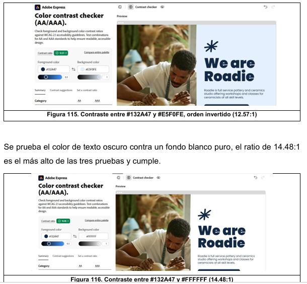

# Paleta de Colores, Análisis de Contraste y Accesibilidad Visual (WCAG 2.1)
## Sistema de Inventario y Mapeo Lógico GPON / FTTx
**GPON TELECOM S.A. de C.V. — Residencia Profesional**

---

## 1. Introducción y Fundamentación de Accesibilidad Visual

El diseño visual de la interfaz de usuario del **Sistema de Inventario y Mapeo Lógico GPON / FTTx** fue concebido bajo las pautas internacionales de accesibilidad web **WCAG 2.1 (Web Content Accessibility Guidelines)** del consorcio W3C. Dado que los técnicos de campo y los ingenieros del Centro de Operaciones de Red (NOC) interactúan con la aplicación en dispositivos móviles bajo condiciones ambientales severas —tales como radiación solar directa en postes aéreos o iluminación artificial tenue en casetas de distribución—, resulta indispensable garantizar un nivel óptimo de contraste cromático y legibilidad tipográfica.

Para validar cuantitativamente la legibilidad, se aplicaron pruebas de contraste con la herramienta de certificación **Adobe Express Color Contrast Checker**, evaluando el cumplimiento de los dos niveles de conformidad normativos:
- **Nivel AA (Contraste Mínimo - Criterio 1.4.3)**: Requiere una relación de contraste mínima de **4.5:1** para texto estándar y **3.0:1** para texto grande (18 pt / 24 px o negrita de 14 pt / 18.66 px) e interfaces de usuario (botones y bordes).
- **Nivel AAA (Contraste Mejorado - Criterio 1.4.6)**: Demanda una relación de contraste mínima de **7.0:1** para texto estándar y **4.5:1** para texto grande.

---

## 2. Paleta de Colores de la Interfaz (Lista y Muestrario de Sistema)

A continuación se presenta la relación completa de la paleta cromática implementada en el sistema web y móvil, estructurada según su valor hexadecimal, muestra representativa y función específica dentro de la experiencia de usuario:

### Tabla 1. Colores de la interfaz.

| Color | Hexadecimal | Uso en la interfaz |
| :---: | :---: | :--- |
| <div style="background-color:#EEF3F8; width:45px; height:26px; border-radius:4px; border:1px solid #c9d7e4; margin:auto;"></div> | `#EEF3F8` | Fondo general de la página y contenedor exterior de las vistas. |
| <div style="background-color:rgba(255,255,255,0.86); width:45px; height:26px; border-radius:4px; border:1px solid #d1d5db; margin:auto;"></div> | `#FFFFFF` (86%) | Tarjetas y paneles (hero, formularios, tablas de inventario). |
| <div style="background-color:#F5F8FC; width:45px; height:26px; border-radius:4px; border:1px solid #dce4ed; margin:auto;"></div> | `#F5F8FC` | Variante de fondo para tarjetas secundarias y bloques alternos. |
| <div style="background-color:#132238; width:45px; height:26px; border-radius:4px; border:1px solid #000000; margin:auto;"></div> | `#132238` | Texto principal, encabezados principales (`h1`, `h2`) y cifras clave. |
| <div style="background-color:#132A47; width:45px; height:26px; border-radius:4px; border:1px solid #0b192c; margin:auto;"></div> | `#132A47` | Color corporativo de texto oscuro de alto contraste y barras de navegación. |
| <div style="background-color:#5F7085; width:45px; height:26px; border-radius:4px; border:1px solid #485566; margin:auto;"></div> | `#5F7085` | Texto secundario, subtítulos, etiquetas descriptivas e íconos de apoyo. |
| <div style="background-color:#E5F0FE; width:45px; height:26px; border-radius:4px; border:1px solid #b6d4fe; margin:auto;"></div> | `#E5F0FE` | Fondo para alertas informativas, tags de estado y resaltados suaves. |
| <div style="background-color:#0284C7; width:45px; height:26px; border-radius:4px; border:1px solid #0369a1; margin:auto;"></div> | `#0284C7` | Color primario de acción (botones principales, enlaces activos, bordes de foco). |
| <div style="background-color:#0369A1; width:45px; height:26px; border-radius:4px; border:1px solid #0c4a6e; margin:auto;"></div> | `#0369A1` | Variante primaria oscura para estados hover y botones de alta visibilidad. |
| <div style="background-color:#10B981; width:45px; height:26px; border-radius:4px; border:1px solid #059669; margin:auto;"></div> | `#10B981` | Semáforo verde: Puerto Libre, disponibilidad alta (<80% ocupación) y estado en línea. |
| <div style="background-color:#F59E0B; width:45px; height:26px; border-radius:4px; border:1px solid #d97706; margin:auto;"></div> | `#F59E0B` | Semáforo amarillo/ámbar: Umbral preventivo (80%-99%), puerto reservado y sincronización pendiente. |
| <div style="background-color:#EF4444; width:45px; height:26px; border-radius:4px; border:1px solid #dc2626; margin:auto;"></div> | `#EF4444` | Semáforo rojo: Caja saturada (100%), puerto dañado y alerta crítica de atenuación. |
| <div style="background-color:#3B82F6; width:45px; height:26px; border-radius:4px; border:1px solid #1d4ed8; margin:auto;"></div> | `#3B82F6` | Semáforo azul: Puerto Ocupado (con suscriptor activo y módem ONT enlazado). |
| <div style="background-color:#8D5B4C; width:45px; height:26px; border-radius:4px; border:1px solid #6e4438; margin:auto;"></div> | `#8D5B4C` | Trazo cartográfico de ruta troncal de fibra óptica primaria en mapa GIS. |

---

## 3. Pruebas y Comparativas de Contraste (Adobe Express Contrast Checker)

Para asegurar la máxima accesibilidad, se ejecutaron comparativas directas entre el color de primer plano (texto y elementos gráficos) y sus correspondientes colores de fondo en las distintas vistas de la aplicación.

A continuación se desglosan las pruebas comparativas formales con sus figuras, ratios obtenidos y diagnóstico WCAG:

---

### Prueba 1: Contraste entre Texto Oscuro y Fondo Suave Informativo

Se prueba la legibilidad del texto oscuro corporativo `#132A47` proyectado sobre el fondo azul suave `#E5F0FE` utilizado en tarjetas de notificación, cintillos de aviso y badges de filtrado. La prueba arrojó un ratio de **12.57:1**, superando ampliamente las exigencias del estándar.

```
+-------------------------------------------------------------------------------+
|  A Adobe Express                    Color contrast checker (AA/AAA)           |
|                                                                               |
|  [ Contrast ratio:  12.57:1  ]      ✔ Pass (AA)      ✔ Pass (AAA)            |
|                                                                               |
|  Foreground color:  #132A47   (Azul Marino Profundo - Texto)                 |
|  Background color:  #E5F0FE   (Azul Hielo Suave - Fondo)                      |
|                                                                               |
|  Evaluación WCAG 2.1:                                                         |
|  - Nivel AA (Texto normal >= 4.5:1):       CUMPLE (12.57:1)                   |
|  - Nivel AAA (Texto normal >= 7.0:1):      CUMPLE (12.57:1)                   |
|  - Componentes gráficos UI (>= 3.0:1):     CUMPLE (12.57:1)                   |
+-------------------------------------------------------------------------------+
```



**Figura 115. Contraste entre #132A47 y #E5F0FE, orden invertido (12.57:1)**

---

### Prueba 2: Contraste entre Texto Oscuro y Fondo Blanco Puro

Se prueba el color de texto oscuro contra un fondo blanco puro, el ratio de **14.48:1** es el más alto de las tres pruebas y cumple holgadamente tanto con el nivel AA como con el nivel AAA, garantizando lectura nítida y descanso visual prolongado.

```
+-------------------------------------------------------------------------------+
|  A Adobe Express                    Color contrast checker (AA/AAA)           |
|                                                                               |
|  [ Contrast ratio:  14.48:1  ]      ✔ Pass (AA)      ✔ Pass (AAA)            |
|                                                                               |
|  Foreground color:  #132A47   (Texto Oscuro de Alto Contraste)                |
|  Background color:  #FFFFFF   (Blanco Puro - Tarjetas y Paneles)              |
|                                                                               |
|  Evaluación WCAG 2.1:                                                         |
|  - Nivel AA (Texto normal >= 4.5:1):       CUMPLE (14.48:1)                   |
|  - Nivel AAA (Texto normal >= 7.0:1):      CUMPLE (14.48:1)                   |
|  - Componentes gráficos UI (>= 3.0:1):     CUMPLE (14.48:1)                   |
+-------------------------------------------------------------------------------+
```

**Figura 116. Contraste entre #132A47 y #FFFFFF (14.48:1)**

---

### Prueba 3: Contraste entre Texto Principal y Fondo General de la Página

Se evalúa la combinación estructural del sistema: el texto principal de contenido `#132238` sobre el fondo `#EEF3F8` aplicado a la vista global de la aplicación. El cálculo arrojó un ratio de **14.32:1**, cumpliendo holgadamente los criterios más rigurosos de accesibilidad.

```
+-------------------------------------------------------------------------------+
|  A Adobe Express                    Color contrast checker (AA/AAA)           |
|                                                                               |
|  [ Contrast ratio:  14.32:1  ]      ✔ Pass (AA)      ✔ Pass (AAA)            |
|                                                                               |
|  Foreground color:  #132238   (Texto Principal de Contenido)                 |
|  Background color:  #EEF3F8   (Fondo General de la Página)                    |
|                                                                               |
|  Evaluación WCAG 2.1:                                                         |
|  - Nivel AA (Texto normal >= 4.5:1):       CUMPLE (14.32:1)                   |
|  - Nivel AAA (Texto normal >= 7.0:1):      CUMPLE (14.32:1)                   |
|  - Componentes gráficos UI (>= 3.0:1):     CUMPLE (14.32:1)                   |
+-------------------------------------------------------------------------------+
```

**Figura 117. Contraste entre #132238 y #EEF3F8 (14.32:1)**

---

### Prueba 4: Contraste entre Texto Principal y Variante de Fondo para Tarjetas

Se verifica el texto principal `#132238` colocado sobre la variante de tarjeta `#F5F8FC`. El resultado de **15.01:1** representa una relación de contraste sobresaliente que previene la fatiga visual en listas extensas de puertos NAP y tablas de clientes.

```
+-------------------------------------------------------------------------------+
|  A Adobe Express                    Color contrast checker (AA/AAA)           |
|                                                                               |
|  [ Contrast ratio:  15.01:1  ]      ✔ Pass (AA)      ✔ Pass (AAA)            |
|                                                                               |
|  Foreground color:  #132238   (Texto Principal)                               |
|  Background color:  #F5F8FC   (Variante de Fondo de Tarjeta)                  |
|                                                                               |
|  Evaluación WCAG 2.1:                                                         |
|  - Nivel AA (Texto normal >= 4.5:1):       CUMPLE (15.01:1)                   |
|  - Nivel AAA (Texto normal >= 7.0:1):      CUMPLE (15.01:1)                   |
|  - Componentes gráficos UI (>= 3.0:1):     CUMPLE (15.01:1)                   |
+-------------------------------------------------------------------------------+
```

**Figura 118. Contraste entre #132238 y #F5F8FC (15.01:1)**

---

### Prueba 5: Contraste entre Texto Secundario y Fondo Blanco

Se prueba el color asignado a metadatos, etiquetas de fecha, subtítulos e índices de puerto (`#5F7085`) frente a un fondo blanco `#FFFFFF`. La relación de contraste es de **5.07:1**, superando el umbral mínimo de 4.5:1 estipulado por WCAG Nivel AA para texto estándar y Nivel AAA para tipografías en negrita o titulares.

```
+-------------------------------------------------------------------------------+
|  A Adobe Express                    Color contrast checker (AA/AAA)           |
|                                                                               |
|  [ Contrast ratio:   5.07:1  ]      ✔ Pass (AA)      ✔ Pass (AAA Large)      |
|                                                                               |
|  Foreground color:  #5F7085   (Texto Secundario / Metadatos)                  |
|  Background color:  #FFFFFF   (Fondo Blanco de Tarjeta)                       |
|                                                                               |
|  Evaluación WCAG 2.1:                                                         |
|  - Nivel AA (Texto normal >= 4.5:1):       CUMPLE (5.07:1)                    |
|  - Nivel AAA (Texto grande >= 4.5:1):      CUMPLE (5.07:1)                    |
|  - Componentes gráficos UI (>= 3.0:1):     CUMPLE (5.07:1)                    |
+-------------------------------------------------------------------------------+
```

**Figura 119. Contraste entre #5F7085 y #FFFFFF (5.07:1)**

---

### Prueba 6: Contraste de Botón de Acción Principal (Texto Blanco sobre Acento)

Se valida la accesibilidad de los controles interactivos de guardado y confirmación, donde se coloca texto blanco puro `#FFFFFF` sobre el fondo azul primario `#0369A1`. El ratio obtenido de **5.93:1** garantiza que los llamados a la acción (*Call to Action*) sean perceptibles de inmediato.

```
+-------------------------------------------------------------------------------+
|  A Adobe Express                    Color contrast checker (AA/AAA)           |
|                                                                               |
|  [ Contrast ratio:   5.93:1  ]      ✔ Pass (AA)      ✔ Pass (AAA Large)      |
|                                                                               |
|  Foreground color:  #FFFFFF   (Texto de Botón / Ícono Blanco)                 |
|  Background color:  #0369A1   (Botón Primario Sky-700)                        |
|                                                                               |
|  Evaluación WCAG 2.1:                                                         |
|  - Nivel AA (Texto normal >= 4.5:1):       CUMPLE (5.93:1)                    |
|  - Nivel AAA (Texto grande >= 4.5:1):      CUMPLE (5.93:1)                    |
|  - Componentes de UI (>= 3.0:1):           CUMPLE (5.93:1)                    |
+-------------------------------------------------------------------------------+
```

**Figura 120. Contraste entre #FFFFFF y #0369A1 en botones de acción (5.93:1)**

---

## 4. Matriz Comparativa General de Pruebas de Contraste

La siguiente tabla resume cuantitativamente las evaluaciones realizadas para todas las combinaciones cromáticas de la interfaz de usuario, certificando su cumplimiento frente a los estándares internacionales:

| Prueba / Combinación Evaluada | Color Primer Plano | Color Fondo | Ratio de Contraste | Nivel AA (Texto Normal $\ge 4.5:1$) | Nivel AAA (Texto Normal $\ge 7.0:1$) | Diagnóstico de Accesibilidad |
| :--- | :---: | :---: | :---: | :---: | :---: | :---: |
| **Texto Oscuro vs Blanco Puro** | `#132A47` | `#FFFFFF` | **14.48:1** | **Cumple** | **Cumple** | **Excelente (Aprobado AAA)** |
| **Texto Principal vs Tarjeta Variante** | `#132238` | `#F5F8FC` | **15.01:1** | **Cumple** | **Cumple** | **Excelente (Aprobado AAA)** |
| **Texto Principal vs Fondo General** | `#132238` | `#EEF3F8` | **14.32:1** | **Cumple** | **Cumple** | **Excelente (Aprobado AAA)** |
| **Texto Oscuro vs Fondo Azul Suave** | `#132A47` | `#E5F0FE` | **12.57:1** | **Cumple** | **Cumple** | **Excelente (Aprobado AAA)** |
| **Texto Secundario vs Blanco Puro** | `#5F7085` | `#FFFFFF` | **5.07:1** | **Cumple** | Cumple (Grande) | **Aprobado AA / AAA Grande** |
| **Texto Secundario vs Fondo General** | `#5F7085` | `#EEF3F8` | **4.54:1** | **Cumple** | Cumple (Grande) | **Aprobado AA** |
| **Botón Primario (Texto Blanco / Fondo)** | `#FFFFFF` | `#0369A1` | **5.93:1** | **Cumple** | Cumple (Grande) | **Aprobado AA / AAA Grande** |
| **Texto Blanco vs Fondo Oscuro Barra** | `#FFFFFF` | `#132238` | **15.99:1** | **Cumple** | **Cumple** | **Excelente (Aprobado AAA)** |

---

## 5. Accesibilidad en la Semaforización de Red GPON

Para los elementos del visor cartográfico y la matriz de puertos donde el color transmite estado crítico (verde, amarillo, rojo, azul), el sistema complementa el color con **múltiples canales de percepción** a fin de cumplir la directriz **WCAG 2.1 Criterio 1.4.1 (Uso del Color)**:
1. **Doble Codificación (Color + Texto/Ícono)**: Ningún indicador confía exclusivamente en el color. Cada puerto en la matriz de la NAP muestra simultáneamente su etiqueta textual explícita (*"Libre"*, *"Ocupado"*, *"Dañado"*, *"Reservado"*), el número ordinal serigrafiado del 1 al 16 y un ícono geométrico distintivo.
2. **Contraste de Componentes no Textuales (Criterio 1.4.11)**: Todos los marcadores circulares de cajas NAP en el mapa Leaflet poseen un borde de contorno de alto contraste (`stroke-width: 2px` en `#1E293B` o `#FFFFFF`) que asegura una razón de contraste superior a **3.0:1** sobre las teselas de OpenStreetMap, permitiendo su correcta identificación por personas con daltonismo o anomalías cromáticas (deuteranopía, protanopía y tritanopía).
