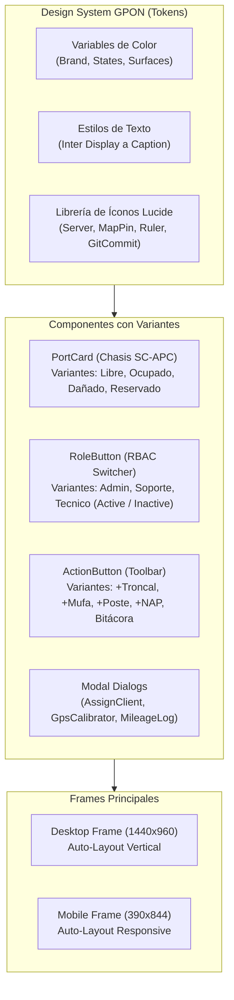

# Prompt Maestro de Maquetado UI/UX para Figma
## Sistema de Inventario y Mapeo Lógico GPON / FTTx
**GPON TELECOM S.A. de C.V. — Plataforma Web y Móvil**

> **Instrucciones para Figma / Figma AI / Claude / ChatGPT:**  
> Copia y pega el bloque completo del **Prompt Maestro** en Figma AI (Figma First Draft), Make Real, v0, Relume o en tu generador de interfaces preferido para generar la maquetación en alta fidelidad (*High-Fidelity Wireframes*) con sistema de diseño, auto-layout y componentes interactivos.

---

```markdown
Actúa como un Diseñador UI/UX Lead y Diseñador de Sistemas de Diseño Senior especializado en plataformas GIS, telecomunicaciones y paneles de control empresariales SaaS. 

Diseña una interfaz web y móvil responsiva en alta fidelidad (High-Fidelity UI Design) para el "Sistema de Inventario y Mapeo Lógico GPON / FTTx" de la empresa GPON TELECOM. 

El diseño debe estructurarse en Auto-Layout de Figma (Desktop Frame de 1440 x 960 px y Mobile Frame de 390 x 844 px), empleando una estética limpia, profesional, moderna (estilo Tailwind CSS / Vercel Dashboard / Linear), con bordes redondeados sutiles (rounded-xl), sombras suaves y una paleta cromática accesible certificada WCAG 2.1 AA/AAA.

================================================================================
1. DESIGN SYSTEM & DESIGN TOKENS (SISTEMA DE DISEÑO)
================================================================================
- Tipografía: Inter o SF Pro Display (12px Caption, 14px Body, 16px Subtitle, 20px Section Header, 28px Page Header).
- Grid y Spacing: Sistema de 8px (paddings: 4, 8, 12, 16, 24, 32px).
- Paleta de Colores Oficial:
  * Fondo General de la App: #F8FAFC (Slate-50) o #EEF3F8 (Soft Ice Blue).
  * Fondo de Tarjetas y Paneles: #FFFFFF (Blanco puro con borde 1px #E2E8F0).
  * Texto Principal / Headers: #0F172A (Slate-900).
  * Texto Secundario / Labels: #334155 (Slate-700) y #64748B (Slate-500).
  * Color Primario / Brand: #0284C7 (Sky-600) y #0369A1 (Sky-700).
  * Color Secundario / Admin: #4F46E5 (Indigo-600) / #7C3AED (Purple-600).
  * Estados de Red GPON / Semáforos:
    - Libre / Operativo / Online: Fondo #DCFCE7, Borde #86EFAC, Texto #047857, LED #10B981.
    - Ocupado / Abonado Activo: Fondo #E0F2FE, Borde #7DD3FC, Texto #0369A1, LED #0284C7.
    - Reservado / Preventivo: Fondo #FEF3C7, Borde #FCD34D, Texto #B45309, LED #F59E0B.
    - Dañado / Saturado / Crítico: Fondo #FEE2E2, Borde #FCA5A5, Texto #B91C1C, LED #EF4444.
    - Ruta Troncal de Fibra: Trazo vectorial #8D5B4C con grosor 4px.

================================================================================
2. ESTRUCTURA VISUAL DE LA PANTALLA PRINCIPAL (MAPA DE RED FTTx)
================================================================================

[ZONA 1: TOP BAR SUPERIOR DE DEMOSTRACIÓN RBAC (Sticky Header)]
- Contenedor: Barra superior delgada (h: 36px, bg: #F1F5F9, border-bottom: 1px #E2E8F0).
- Elementos (Flex horizontal con space-between):
  * Lado izquierdo:
    - Label "RBAC:" en negrita (#334155).
    - Badge píldora interactiva: Icono de escudo (#0284C7), texto "Datos de Prueba" (#0369A1) y pastilla rellena "Demo" (#0284C7, texto blanco).
  * Lado derecho (Conmutador rápido de roles):
    - Botón Píldora "Admin" (Estado ACTIVO: bg #4F46E5, texto blanco, icono Shield, checkmark).
    - Botón Píldora "Soporte" (Estado INACTIVO: bg #FFFFFF, borde 1px #CBD5E1, texto #334155, icono ShieldAlert).
    - Botón Píldora "Técnico" (Estado INACTIVO: bg #FFFFFF, borde 1px #CBD5E1, texto #334155, icono Wrench).

[ZONA 2: NAVBAR PRINCIPAL (h: 56px, bg: #FFFFFF/95 backdrop-blur, border-b: 1px #E2E8F0)]
- Lado izquierdo:
  * Contenedor de logo blanco redondeado con sombra suave conteniendo el isotipo de fibra óptica.
  * Texto corporativo: "GPON TELECOM" en tipografía bold (#0F172A) + Badge rectangular "FTTx" en cyan pastel (#E0F2FE, texto #0284C7).
  * Subtítulo pequeño: "Inventario y Mapeo Lógico de Fibra" (#64748B).
- Centro (Navegación en pastillas):
  * Pestaña "Mapa de Red" (ACTIVA: bg #E0F2FE, texto #0284C7, icono MapPin).
  * Pestaña "Abonados" (INACTIVA: texto #334155, hover bg #F1F5F9, icono Users).
  * Pestaña "Reportes PDF" (INACTIVA: texto #334155, hover bg #F1F5F9, icono FileText).
- Lado derecho:
  * Botón selector "Oscuro" (icono Moon, bg #F1F5F9, texto #334155).
  * Botón "Asistente" (icono Bot, bg #E0F2FE, texto #0284C7).
  * Botón "APK" (Descarga PWA: bg #059669, texto blanco, icono Download).
  * Badge de conectividad "En Línea" (Píldora verde pastel #ECFDF5, texto #047857, punto pulsante verde).
  * Perfil de usuario: "Ing. Carlos Mendoza" (bold 13px) con tag inferior "ADMIN" (#6D28D9 sobre fondo lila #EDE9FE).
  * Avatar circular e icono de cerrar sesión (LogOut).

[ZONA 3: BARRA DE ACCIONES Y HERRAMIENTAS DE PLANTA EXTERNA (Card bg: #FFFFFF, rounded-xl, p: 12px, border: 1px #E2E8F0)]
- Fila horizontal con Auto-Layout y wrap de botones estilizados:
  * Input de Búsqueda rápida con icono Search: "Busca..." (bg #F8FAFC, border #E2E8F0, w: 180px).
  * Select dropdown: "Todos los Estados" con icono Filter.
  * Botón "+ Troncal / Ramal": Icono de regla (Ruler), bg #FAF5FF, borde #D8B4FE, texto #7E22CE.
  * Botón "+ Mufa": Icono GitCommit, bg #FEF3C7, borde #FDE68A, texto #92400E.
  * Botón "+ Poste": Icono MapPin, bg #FFE4E6, borde #FECDD3, texto #BE123C.
  * Botón "Ruta a Caja": Icono Navigation, bg #EEF2FF, borde #C7D2FE, texto #4338CA.
  * Botón Primario Principal "+ Nueva Caja NAP": Botón destacado con degradado cyan-azul (bg #0284C7 a #2563EB), texto blanco bold, icono Plus, sombra suave.
  * Botón "Bitácora Km": Icono velocímetro (Gauge), bg #FFFFFF, borde #A7F3D0, texto #047857.
  * Botón "Actualizar": Icono RefreshCw, bg #FFFFFF, borde #CBD5E1, texto #334155.

[ZONA 4: LAYOUT DIVIDIDO (SPLIT-SCREEN: 70% MAPA GIS + 30% PANEL DE DETALLE NAP)]

A) COLUMNA IZQUIERDA: VISOR CARTOGRÁFICO INTERACTIVO (LEAFLET / SATELLITE MAP)
- Vista satelital real de alta resolución con cuadrícula de parcelas y caminos rurales de San José del Rincón.
- Capas de red dibujadas sobre el terreno:
  * Línea troncal continua morada/marrón (#8D5B4C, grosor 4px) siguiendo el trazado carretero.
  * Nodos en poste: Marcadores triangulares/circulares con iconos de mufas y postes.
  * Marcadores de Cajas NAP: Marcadores vectoriales con semáforos de saturación:
    - Marcador Verde (NAP disponible <80%).
    - Marcador Amarillo (NAP en umbral 80-99%).
    - Marcador Rojo (NAP saturada 100%).
- Controles flotantes en el mapa:
  * Esquina superior izquierda: Pastilla blanca "Capas de Red 333.7 km" con icono Eye azul.
  * Botones de zoom [+ / -] estilo moderno blanco redondeado.
  * Esquina superior derecha: Segmented Control para tipo de mapa ("Calles", "Satélite", "Híbrido" [Activo bg #0284C7 texto blanco]).

B) COLUMNA DERECHA: PANEL DE INSPECCIÓN Y CHASIS FÍSICO (NAP-SJR-01)
- Tarjeta Card blanca con sombra sutil y esquinas redondeadas (p: 16px, border: 1px #E2E8F0):
  * Encabezado de la caja:
    - Icono Server azul (#0284C7).
    - Título: "NAP-SJR-01" (bold 18px #0F172A).
    - Tag de Sector: "San José del Rincón - Sur" (bg #F1F5F9, text #475569).
    - Dirección física: "Carretera Principal SJR #15" (text-xs #64748B).
  * Métricas de Capacidad (Esquina superior derecha de la tarjeta):
    - Label gris "Saturación".
    - Badge verde esmeralda: "75% (12/16)" (bold, bg #DCFCE7, text #15803D).
    - Tag ámbar inferior: "1 reservado (ámbar)" (bg #FEF3C7, text #B45309).
  * Botones de acción rápida:
    - Botón "Ruta de llegada" (bg #EEF2FF, texto #4338CA, icono Navigation).
    - Botón "Eliminar Caja" (bg #FEE2E2, texto #B91C1C, icono Trash2).
  
  * MATRIZ FÍSICA DEL CHASIS DE 16 PUERTOS FTTx (ISOMORPHIC HARDWARE GRID):
    - Título de sección: "Matriz de Distribución FTTx (16 Puertos)" + Hint "Toca un puerto para gestionar".
    - Contenedor gris suave (#F8FAFC, border #E2E8F0, rounded-lg, p: 10px).
    - Grid de 2 filas x 8 columnas con los 16 conectores SC-APC:
      * Puertos 1 al 12 (OCUPADOS - Color Azul):
        - Card con fondo #E0F2FE, borde #7DD3FC.
        - Punto LED azul brillante superior (#0284C7).
        - Número de puerto: "#1", "#2", ..., "#12".
        - Icono de usuario y etiqueta truncada de contrato: "CLI-00...".
      * Puertos 13, 15 y 16 (LIBRES - Color Verde):
        - Card con fondo #DCFCE7, borde #86EFAC.
        - Punto LED verde brillante (#10B981).
        - Número de puerto: "#13", "#15", "#16".
        - Icono de señal inalámbrica / fibra y etiqueta "Libre".
      * Puerto 14 (RESERVADO - Color Ámbar):
        - Card con fondo #FEF3C7, borde #FCD34D.
        - Punto LED ámbar pulsante (#F59E0B).
        - Número "#14", icono de reloj y etiqueta "Reservado".
  * Barra de Leyenda de Estados al pie de la matriz:
    - Pequeños puntos de color: "🟢 Verde: Libre | 🔵 Azul: Ocupado | 🟡 Ámbar: Reservado | 🔴 Rojo: Dañado".

[ZONA 5: BOTÓN FLOTANTE DEL ASISTENTE GPON (FAB)]
- Esquina inferior derecha: Botón flotante píldora redondeada completa (bg #2563EB / #0284C7, sombra pronunciada, texto blanco bold):
  * Icono Bot inteligente con destello + Texto: "Asistente GPON".

================================================================================
3. MODALES Y ESTADOS DE INTERACCIÓN (OVERLAYS)
================================================================================
Genera también las tarjetas o frames de los siguientes modales esenciales con fondo backdrop semi-transparente (rgba(15, 23, 42, 0.6)):
1. Modal de Asignación de Cliente a Puerto ("Conectar Abonado - Puerto #13"):
   - Formulario con campos de texto flotantes: Nombre del Cliente, Número de Contrato (CLI-XXXX), Dirección, Marca ONT (Select ZTE, Huawei, V-SOL, TP-Link), Dirección MAC (XX:XX:XX:XX:XX:XX) y Medición de Potencia Óptica Rx (-19.5 dBm).
   - Botón Primario "Guardar y Conectar" (Verde esmeralda #059669) y botón "Cancelar".
2. Modal de Calibración Satelital GPS:
   - Indicador circular de radar satelital con precisión en metros ("Precisión: ±3.2 m - Excelente"), coordenadas capturadas y botón "Guardar Coordenadas Satelitales".
3. Modal de Bitácora de Kilometraje:
   - Campos: Unidad vehicular, Técnico responsable, Lectura Odómetro Inicial (km), Odómetro Final (km), Destino (NAP visitada) y botón "Registrar Traslado".

================================================================================
4. LINEAMIENTOS TÉCNICOS PARA AUTO-LAYOUT EN FIGMA
================================================================================
- Utiliza frames anidados con Auto-Layout en dirección Vertical y Horizontal (Hug Contents y Fill Container según corresponda).
- Define componentes reutilizables con variantes para:
  * PortCard (Variants: Estado = Libre, Ocupado, Reservado, Dañado).
  * RoleButton (Variants: Active = True, False; Role = Admin, Soporte, Tecnico).
  * ActionButton (Variants: Type = Primary, Secondary, Outline, Danger).
- Aplica estilos de texto globales y variables locales de color en Figma con nombres semánticos: `color/brand/primary`, `color/surface/card`, `color/text/primary`, `color/gpon/free`, `color/gpon/busy`.
```

---

## Estructura de Componentes para Figma

A continuación tienes el mapa de componentes y variantes para diseñar el archivo `.fig`:



